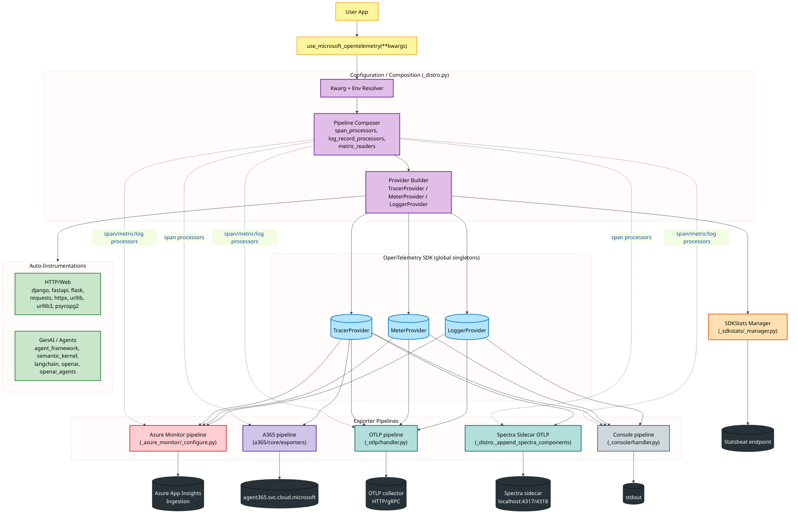
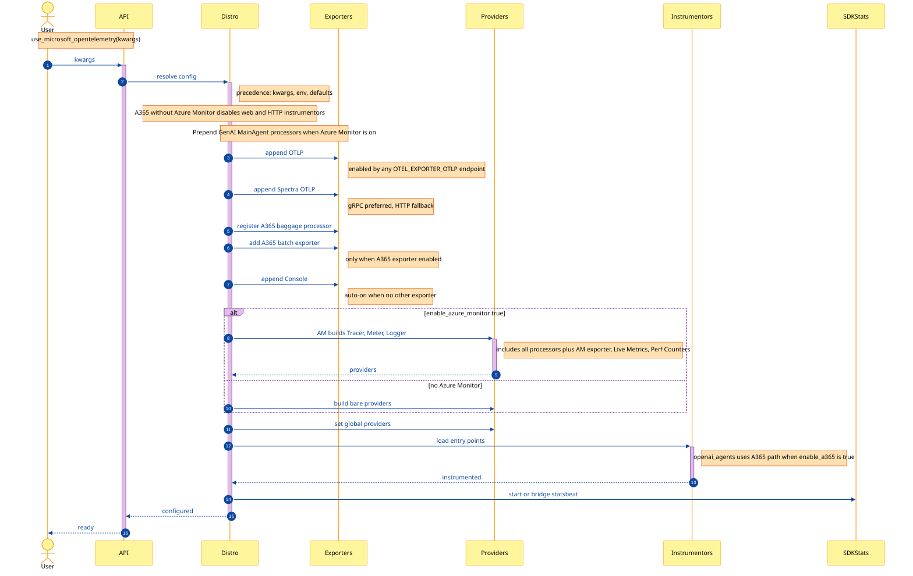
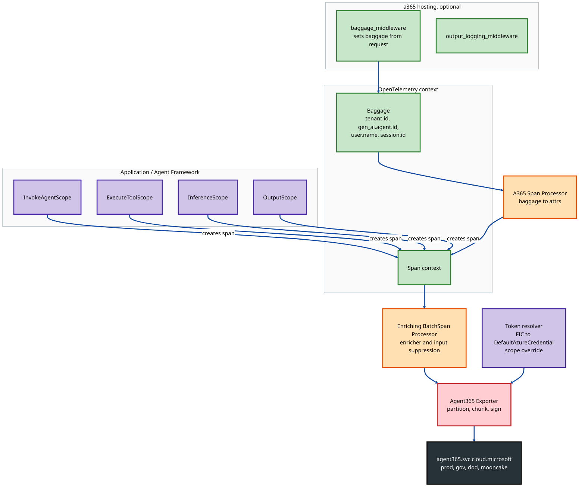
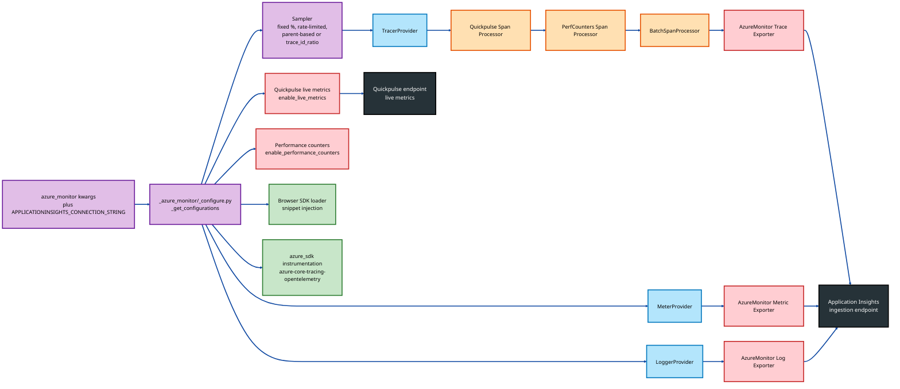
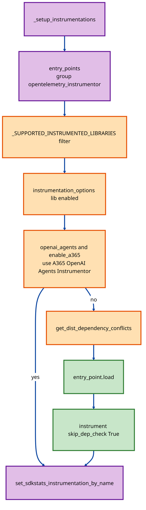
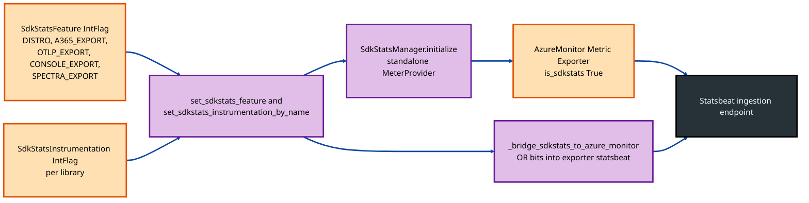
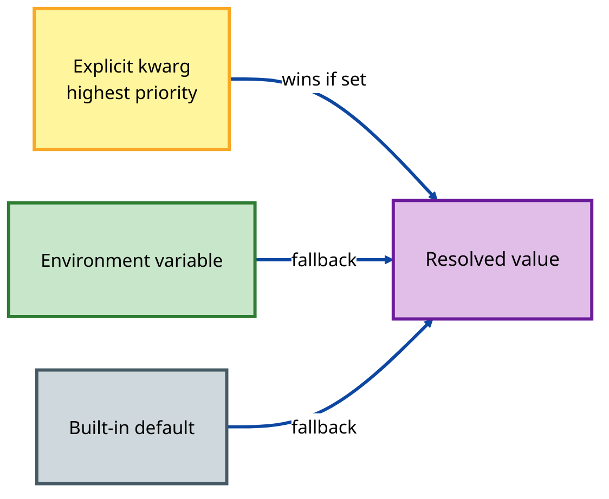
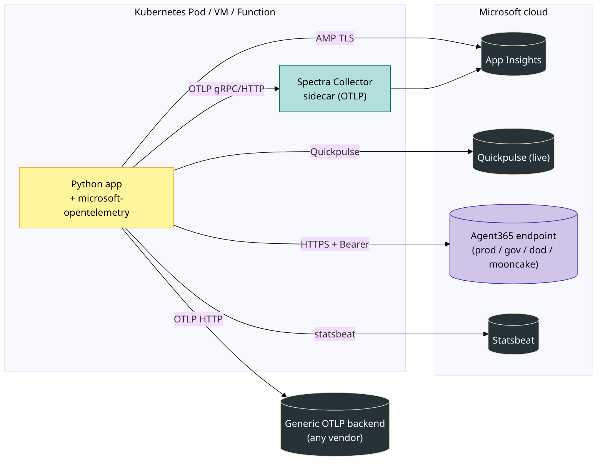

# Architecture — `microsoft-opentelemetry` Python Distro

This document describes the architecture of the `microsoft-opentelemetry` Python distribution: a single‑onboarding OpenTelemetry distro that fans out telemetry to **Azure Monitor**, **Agent 365 (A365)**, **OTLP**, **Spectra (sidecar OTLP)** and **Console** exporters, with first‑class GenAI / Agent instrumentations (Agent Framework, Semantic Kernel, LangChain, OpenAI, OpenAI Agents).

---

## 1. High‑Level Architecture

The distro is composed of five layers:

1. **Entry Point** — `use_microsoft_opentelemetry(**kwargs)` (single onboarding API).
2. **Configuration / Composition Layer** — `_distro.py` resolves kwargs ↔ env vars, assembles span processors / log record processors / metric readers per exporter, and wires the global OTel providers.
3. **Exporter Pipelines** — Azure Monitor, A365, OTLP, Spectra (sidecar OTLP), Console. Each pipeline is independent and additive.
4. **Instrumentations** — Auto‑discovered via `opentelemetry_instrumentor` entry points; A365‑specific flavours for OpenAI Agents and GenAI platforms (Agent Framework, Semantic Kernel, LangChain).
5. **Self‑Telemetry (SDKStats)** — A standalone meter pipeline reporting feature / instrumentation bitmask flags to the Application Insights statsbeat endpoint.



**Color legend**

| Color | Meaning |
|---|---|
| 🟡 Yellow | Public API surface |
| 🟣 Purple | Distro composition / configuration |
| 🟢 Green | Auto‑instrumentations |
| 🔵 Light blue | OpenTelemetry SDK providers |
| 🔴 Red | Azure Monitor pipeline |
| 🟪 Deep purple | Agent 365 pipeline |
| 🟦 Teal | OTLP / Spectra pipelines |
| ⚪ Grey | Console (dev) pipeline |
| 🟠 Orange | SDKStats self‑telemetry |
| ⚫ Dark | External backends |

---

## 2. Source Layout

```
src/microsoft/opentelemetry/
├── __init__.py                  # exports use_microsoft_opentelemetry
├── _distro.py                   # ENTRY POINT — provider/pipeline composition
├── _constants.py                # kwarg names, env var names, AM kwarg map
├── _utils.py                    # _append_* helpers for OTLP/Console/AM
├── _instrumentation.py          # dependency conflict detection
├── _otlp/                       # OTLP (HTTP) exporters factory
├── _console/                    # Console exporters factory
├── _azure_monitor/              # Azure Monitor pipeline (vendored configure)
│   ├── _configure.py            #   tracer/meter/logger setup + AM exporter
│   ├── _autoinstrumentation/    #   AM autoinstrumentation entry-points
│   ├── _browser_sdk_loader/     #   JS SDK snippet injection
│   └── _diagnostics/            #   diagnostic logging
├── _sdkstats/                   # SDK self-telemetry (statsbeat)
│   ├── _manager.py              #   standalone MeterProvider
│   ├── _metrics.py              #   feature/instrumentation gauges
│   └── _state.py                #   IntFlag bitmasks (process-global)
├── _agent_framework/            # MS Agent Framework instrumentor + enricher
├── _semantic_kernel/            # Semantic Kernel instrumentor + enricher
├── _genai/
│   ├── main_agent/              # main-agent attribute propagation
│   │   └── _processor.py        #   SpanProcessor + LogRecordProcessor
│   ├── _langchain/              # LangChain tracer + instrumentor
│   └── _openai_agents/          # A365-flavoured OpenAI Agents tracer
└── a365/                        # Agent 365 SDK (vendored)
    ├── constants.py
    ├── core/
    │   ├── exporters/
    │   │   ├── agent365_exporter.py            # HTTPS POST exporter
    │   │   ├── enriching_span_processor.py     # batch + enricher
    │   │   ├── span_processor.py               # baggage -> attributes
    │   │   └── utils.py                        # partitioning, chunking, tokens
    │   ├── opentelemetry_scope.py              # base "scope" lifecycle class
    │   ├── invoke_agent_scope.py               # high-level instrumentation
    │   ├── execute_tool_scope.py
    │   ├── inference_scope.py
    │   └── spans_scopes/output_scope.py
    ├── hosting/                # Hosting middleware (baggage, output logging)
    └── runtime/                # Runtime environment / Power Platform discovery
```

---

## 3. Configuration & Composition Flow

`use_microsoft_opentelemetry(**kwargs)` in `_distro.py` orchestrates everything. The composition order matters: processors prepended earliest see spans first and contribute attributes that later batch‑exporters serialize.



### Pipeline composition rules

| Rule | Source |
|---|---|
| Kwargs always take precedence over environment variables. | `_distro.py` `_env_bool`, `_get_configurations` |
| Console auto‑enables when **none** of Azure Monitor / A365 / OTLP are active. | `_distro.use_microsoft_opentelemetry` |
| `enable_a365=True` without Azure Monitor → web/HTTP instrumentations disabled by default. | `_A365_DISABLED_INSTRUMENTATIONS` |
| GenAI main‑agent processors are **prepended** when Azure Monitor is enabled, so attributes are visible to the AM batch exporter. | `_distro.use_microsoft_opentelemetry` |
| A365 always registers `A365SpanProcessor` (baggage → attributes) — even when the A365 HTTP exporter is **off** — so attributes appear in *other* exporters. | `_append_a365_components` |
| OpenTelemetry providers are created **once**; all exporter processors are added to the same provider. | `_setup_tracing/_setup_metrics/_setup_logging` |

---

## 4. Component View

```mermaid
%%{init: {"theme":"base","themeVariables":{"fontFamily":"Segoe UI","fontSize":"18px","lineColor":"#0D47A1","edgeLabelBackground":"#FFFFFF","primaryTextColor":"#000000","clusterBkg":"#FAFAFA","clusterBorder":"#90A4AE"}}}%%
flowchart LR
    classDef api fill:#FFF59D,stroke:#F9A825,stroke-width:3px,color:#000,font-size:18px,padding:14px
    classDef cfg fill:#E1BEE7,stroke:#6A1B9A,stroke-width:3px,color:#000,font-size:17px,padding:12px
    classDef sdk fill:#B3E5FC,stroke:#0277BD,stroke-width:3px,color:#000,font-size:17px,padding:12px
    classDef proc fill:#FFE0B2,stroke:#E65100,stroke-width:3px,color:#000,font-size:17px,padding:12px
    classDef expAM fill:#FFCDD2,stroke:#C62828,stroke-width:3px,color:#000,font-size:17px,padding:12px
    classDef expA365 fill:#D1C4E9,stroke:#4527A0,stroke-width:3px,color:#000,font-size:17px,padding:12px
    classDef expOTLP fill:#B2DFDB,stroke:#00695C,stroke-width:3px,color:#000,font-size:17px,padding:12px
    classDef expCon fill:#CFD8DC,stroke:#455A64,stroke-width:3px,color:#000,font-size:17px,padding:12px
    classDef instr fill:#C8E6C9,stroke:#2E7D32,stroke-width:3px,color:#000,font-size:17px,padding:12px

    Entry["use_microsoft_opentelemetry"]:::api

    subgraph Composition ["_distro.py"]
      Resolver["Resolve kwargs and env"]:::cfg
      AppendOTLP["_append_otlp_components"]:::cfg
      AppendSpec["_append_spectra_components"]:::cfg
      AppendA365["_append_a365_components"]:::cfg
      AppendCon["_append_console_components"]:::cfg
      AppendAM["_append_azure_monitor_components"]:::cfg
      SetupTrace["_setup_tracing<br/>_setup_metrics<br/>_setup_logging"]:::cfg
      SetupInst["_setup_instrumentations"]:::cfg
    end

    subgraph TraceProvider ["TracerProvider"]
      direction TB
      GenAIMain["GenAI MainAgent Span Processor<br/>prepended when AM on"]:::proc
      A365Baggage["A365 Span Processor<br/>baggage to attributes"]:::proc
      QPSP["Quickpulse Span Processor<br/>AM live metrics"]:::proc
      PCSP["PerfCounters Span Processor<br/>AM perf counters"]:::proc
      A365Batch["Enriching BatchSpan Processor<br/>plus span enricher"]:::proc
      OTLPBSP["BatchSpanProcessor to OTLP HTTP"]:::proc
      SpecBSP["BatchSpanProcessor to Spectra OTLP"]:::proc
      ConBSP["SimpleSpanProcessor to Console"]:::proc
      AMBSP["BatchSpanProcessor to AM Trace Exporter"]:::proc
    end

    subgraph Exporters
      AMExp["AzureMonitor Trace Exporter<br/>Metric and Log exporters"]:::expAM
      A365Exp["Agent365 Exporter<br/>HTTPS POST plus Bearer"]:::expA365
      OTLPExp["OTLP HTTP exporters"]:::expOTLP
      SpecExp["OTLP gRPC or HTTP sidecar"]:::expOTLP
      ConExp["Console exporters"]:::expCon
    end

    subgraph Instrumentations
      GenAIAF["AgentFramework Instrumentor"]:::instr
      GenAISK["SemanticKernel Instrumentor"]:::instr
      GenAILC["LangChain Instrumentor"]:::instr
      GenAIOAI["OpenAI v2 and OpenAI Agents"]:::instr
      Web["Web, HTTP, DB instrumentors"]:::instr
    end

    Entry ==> Resolver
    Resolver ==> AppendOTLP
    AppendOTLP ==> AppendSpec
    AppendSpec ==> AppendA365
    AppendA365 ==> AppendCon
    AppendCon ==> AppendAM
    AppendAM ==> SetupTrace
    SetupTrace ==> SetupInst

    SetupInst ==> GenAIAF
    SetupInst ==> GenAISK
    SetupInst ==> GenAILC
    SetupInst ==> GenAIOAI
    SetupInst ==> Web

    SetupTrace ==> GenAIMain
    GenAIMain ==> A365Baggage
    A365Baggage ==> QPSP
    QPSP ==> PCSP
    PCSP ==> A365Batch
    A365Batch ==> OTLPBSP
    OTLPBSP ==> SpecBSP
    SpecBSP ==> ConBSP
    ConBSP ==> AMBSP

    A365Batch ==> A365Exp
    OTLPBSP ==> OTLPExp
    SpecBSP ==> SpecExp
    ConBSP ==> ConExp
    AMBSP ==> AMExp

    linkStyle default stroke:#0D47A1,stroke-width:3px,fill:none
```



> The vertical chain inside `TracerProvider` shows **registration order**, not a strict invocation pipeline — every processor receives every span; ordering only matters for attribute‑enrichment processors that run before batch exporters serialize.

---

## 5. Data Flow — A Span From Code → Backends

```mermaid
%%{init: {"theme":"base","themeVariables":{"fontFamily":"Segoe UI","fontSize":"15px","lineColor":"#0D47A1","edgeLabelBackground":"#FFFFFF","primaryTextColor":"#000000"}}}%%
flowchart LR
    classDef src fill:#FFF59D,stroke:#F9A825,stroke-width:2px,color:#000
    classDef enrich fill:#FFE0B2,stroke:#E65100,stroke-width:2px,color:#000
    classDef batch fill:#B3E5FC,stroke:#0277BD,stroke-width:2px,color:#000
    classDef expAM fill:#FFCDD2,stroke:#C62828,stroke-width:2px,color:#000
    classDef expA365 fill:#D1C4E9,stroke:#4527A0,stroke-width:2px,color:#000
    classDef expOTLP fill:#B2DFDB,stroke:#00695C,stroke-width:2px,color:#000
    classDef expCon fill:#CFD8DC,stroke:#455A64,stroke-width:2px,color:#000
    classDef be fill:#263238,stroke:#000,stroke-width:2px,color:#FFF

    App["Application code<br/>Agent, API or DB call"]:::src
    Lib["Instrumented library<br/>LangChain, AF, SK, OpenAI, HTTP"]:::src
    Scope["A365 Scope or<br/>SDK auto-instrumentor"]:::src
    Span["OTel Span<br/>start and end"]:::src

    P1["GenAI MainAgent Span Processor<br/>main_agent propagation"]:::enrich
    P2["A365 Span Processor<br/>baggage to gen_ai, user, tenant attrs"]:::enrich
    P3["Quickpulse and PerfCounter processors<br/>AM only"]:::enrich
    P4["Enriching BatchSpan Processor<br/>platform enricher,<br/>input suppression"]:::enrich

    Batch["BatchSpanProcessors fan-out"]:::batch

    AME["AzureMonitor Trace Exporter"]:::expAM
    A365E["Agent365 Exporter<br/>partition by tenantId, agentId<br/>chunk by 1MB<br/>Bearer token via FIC or DAC"]:::expA365
    OTLPE["OTLP HTTP"]:::expOTLP
    SpecE["OTLP sidecar gRPC or HTTP"]:::expOTLP
    ConE["Console exporter"]:::expCon

    AI["App Insights"]:::be
    A365B["agent365.svc.cloud.microsoft"]:::be
    Coll["OTel Collector"]:::be
    Sidecar["Spectra sidecar"]:::be
    Out["stdout"]:::be

    App ==> Lib
    Lib ==> Scope
    Scope ==> Span
    Span ==> P1
    P1 ==> P2
    P2 ==> P3
    P3 ==> P4
    P4 ==> Batch
    Batch ==> AME
    AME ==> AI
    Batch ==> A365E
    A365E ==> A365B
    Batch ==> OTLPE
    OTLPE ==> Coll
    Batch ==> SpecE
    SpecE ==> Sidecar
    Batch ==> ConE
    ConE ==> Out

    linkStyle default stroke:#0D47A1,stroke-width:3px,fill:none
```



Key transformations applied while a span travels the pipeline:

| Stage | Transformation |
|---|---|
| `GenAIMainAgentSpanProcessor.on_start` | Copies `microsoft.gen_ai.main_agent.{id,name,version,conversation_id}` from parent span (or its `gen_ai.agent.*`) to the new span. |
| `GenAIMainAgentSpanProcessor.on_end` | If the span itself is an `invoke_agent` and has no main_agent.* yet, self‑copies `gen_ai.agent.*` → `microsoft.gen_ai.main_agent.*`. |
| `A365SpanProcessor.on_start` | Pulls baggage entries (`tenant.id`, `gen_ai.agent.id`, `user.name`, `session.id`, …) and sets them as span attributes (never overwrites existing). |
| Span enricher (`_agent_framework._span_enricher`, `_semantic_kernel._span_enricher`, langchain tracer) | Platform‑specific attribute normalization to the A365 schema. |
| `_EnrichingBatchSpanProcessor.on_end` | Applies enricher, optionally strips `gen_ai.input.messages` from `invoke_agent` spans (`a365_suppress_invoke_agent_input`), forwards to BatchSpanProcessor. |
| `_Agent365Exporter.export` | Filters non‑genAI spans, partitions by `(tenantId, agentId)`, builds OTLP‑like JSON `resourceSpans → scopeSpans → spans`, chunks by payload byte budget, POSTs to per‑category endpoint with `Bearer` token from `token_resolver(agent_id, tenant_id)`. Retries on transient errors using `Retry-After`. |

---

## 6. Agent 365 Subsystem



**A365 scopes** (`a365/core/*_scope.py`) are lifecycle helpers that start/end well‑known span shapes (`InvokeAgent`, `ExecuteTool`, `InferenceCall`). They are gated on `ENABLE_OBSERVABILITY` (or `OpenTelemetryScope._enabled_by_distro = True`, set by the distro when `enable_a365=True`).

**Endpoint discovery** is governed by `a365_cluster_category` (`prod` / `gov` / `dod` / `mooncake`) and `a365_use_s2s_endpoint`, computed in `a365/core/exporters/utils.py:build_export_url`.

---

## 7. Azure Monitor Subsystem



The Azure Monitor pipeline is invoked from `_distro._append_azure_monitor_components`, which delegates to the vendored `_azure_monitor/_configure.py`. The function returns fully configured providers that already contain **all** previously appended processors (OTLP, A365, Console, Spectra, GenAI main‑agent), avoiding double provider creation.

---

## 8. Instrumentation Discovery



Distro entry points declared in `pyproject.toml`:

```toml
[project.entry-points.opentelemetry_instrumentor]
langchain        = "microsoft.opentelemetry._genai._langchain._tracer_instrumentor:LangChainInstrumentor"
semantic_kernel  = "microsoft.opentelemetry._semantic_kernel._trace_instrumentor:SemanticKernelInstrumentor"
agent_framework  = "microsoft.opentelemetry._agent_framework._trace_instrumentor:AgentFrameworkInstrumentor"
```

The Agent Framework / Semantic Kernel / LangChain instrumentors **also** register a `span_enricher` callback (via `register_span_enricher`) that is later invoked by `_EnrichingBatchSpanProcessor.on_end` to normalize span attributes to the A365 schema.

---

## 9. SDKStats (Self‑Telemetry)



**Two operating modes:**

* **Azure Monitor active** → the exporter package already runs its own `StatsbeatManager`. The distro *bridges* its `feature` / `instrumentation` bit flags into the exporter's class‑level metric attributes (`_StatsbeatMetrics._FEATURE_ATTRIBUTES`) and bit mask (`_INSTRUMENTATIONS_BIT_MASK`) so the same observation carries the distro flags.
* **No Azure Monitor** (A365‑only / OTLP‑only / Console‑only) → `SdkStatsManager` stands up an independent `MeterProvider` + `AzureMonitorMetricExporter(is_sdkstats=True)` pointed at the well‑known statsbeat endpoint.

SDKStats can be disabled with `MICROSOFT_OTEL_SDKSTATS_DISABLED=true` or `APPLICATIONINSIGHTS_STATSBEAT_DISABLED_ALL=true`.

---

## 10. Configuration Resolution



Examples:

| Kwarg | Env var | Default |
|---|---|---|
| `azure_monitor_connection_string` | `APPLICATIONINSIGHTS_CONNECTION_STRING` | — |
| `a365_cluster_category` | `A365_CLUSTER_CATEGORY` | `"prod"` |
| `a365_enable_observability_exporter` | `ENABLE_A365_OBSERVABILITY_EXPORTER` | `false` |
| `a365_use_s2s_endpoint` | `A365_USE_S2S_ENDPOINT` | `false` |
| `a365_observability_scope_override` | `A365_OBSERVABILITY_SCOPE_OVERRIDE` | unset |
| `spectra_endpoint` | `SPECTRA_ENDPOINT` | `localhost:4317` / `4318` |
| OTLP enablement | any `OTEL_EXPORTER_OTLP_*_ENDPOINT` | off |
| `OTEL_TRACES_SAMPLER` / `OTEL_TRACES_SAMPLER_ARG` | env‑only | parent‑based always_on |

---

## 11. Deployment Topology



---

## 12. Public Surface Summary

| Symbol | Location | Purpose |
|---|---|---|
| `use_microsoft_opentelemetry` | `microsoft.opentelemetry` | Single onboarding API |
| `LangChainInstrumentor` | `microsoft.opentelemetry._genai._langchain._tracer_instrumentor` | LangChain entry‑point instrumentor |
| `SemanticKernelInstrumentor` | `microsoft.opentelemetry._semantic_kernel._trace_instrumentor` | Semantic Kernel entry‑point instrumentor |
| `AgentFrameworkInstrumentor` | `microsoft.opentelemetry._agent_framework._trace_instrumentor` | Agent Framework entry‑point instrumentor |
| A365 scope classes | `microsoft.opentelemetry.a365.core.*_scope` | Manual A365 span lifecycle |

Everything under leading‑underscore packages (`_distro`, `_azure_monitor`, `_otlp`, `_console`, `_sdkstats`, `_utils`, `_constants`, `_agent_framework`, `_semantic_kernel`, `_genai`) and the `a365/core/exporters/_Agent365Exporter` class are private implementation details.

---

## 13. Key Design Choices

1. **Single OpenTelemetry provider** — all exporter pipelines attach processors/readers to the same provider, avoiding double instrumentation and conflicting global state.
2. **Additive exporters** — Azure Monitor, A365, OTLP, Spectra and Console are mutually independent; any combination is valid. Console auto‑enables only when nothing else is on.
3. **Kwargs > env > default** — predictable for programmatic callers, friendly to ops via env vars.
4. **Baggage propagation as a first‑class concern** — `A365SpanProcessor` runs even when the A365 exporter is off, so A365 attributes still appear in Azure Monitor / OTLP / Console output.
5. **GenAI main‑agent attribution** — `GenAIMainAgentSpanProcessor` ensures every span in a multi‑agent system carries `microsoft.gen_ai.main_agent.*`, so backends can roll up by the *top‑level* agent the user actually invoked.
6. **Single span enricher slot** — only one platform instrumentor (AF / SK / LangChain) can register its enricher; this matches real deployments and avoids ordering ambiguity.
7. **Self‑telemetry isolation** — SDKStats uses its own MeterProvider when AM is off; when AM is on it bridges flags into the exporter's existing statsbeat so a single statsbeat observation is sent.
8. **Vendored A365 SDK** — `microsoft.opentelemetry.a365` ships the A365 observability primitives inside the distro so no extra package install is needed.
