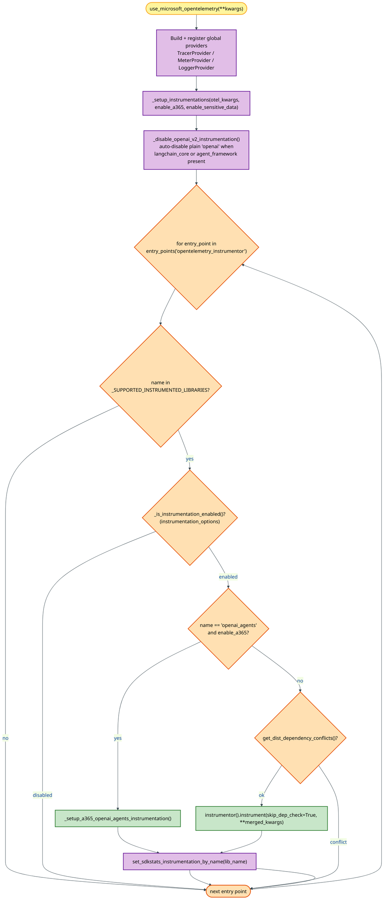
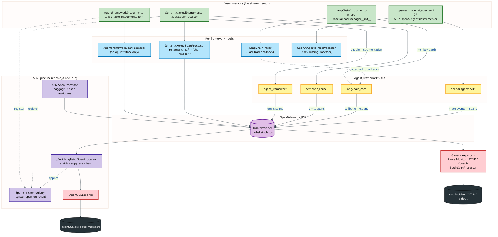
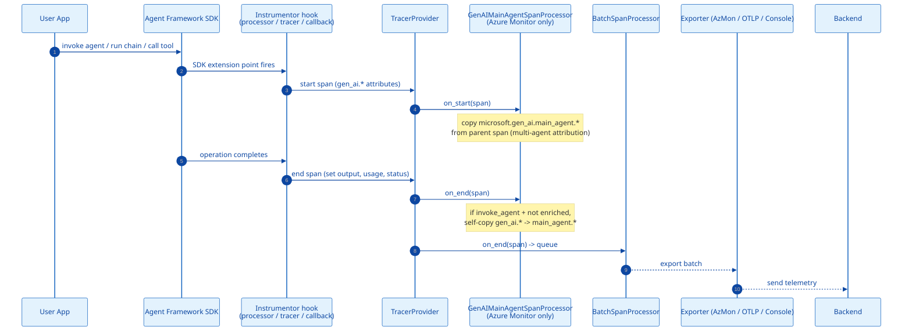
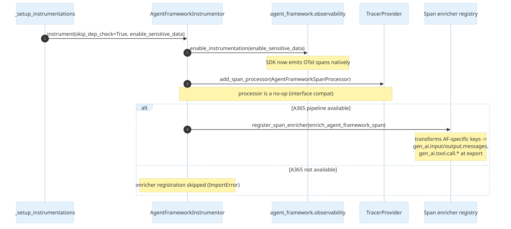
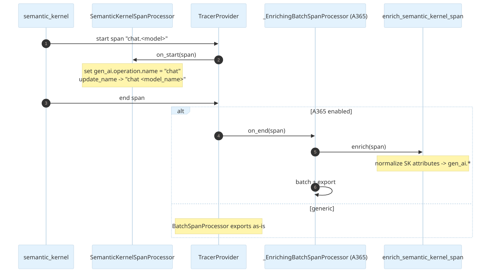
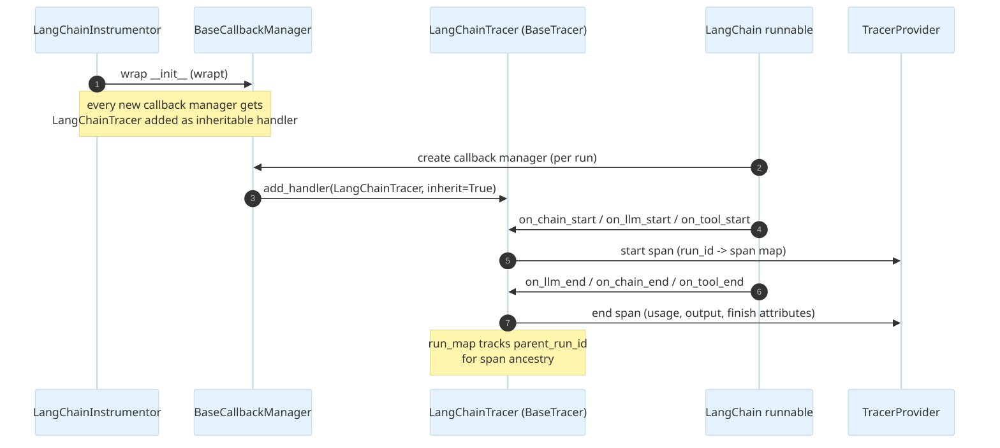
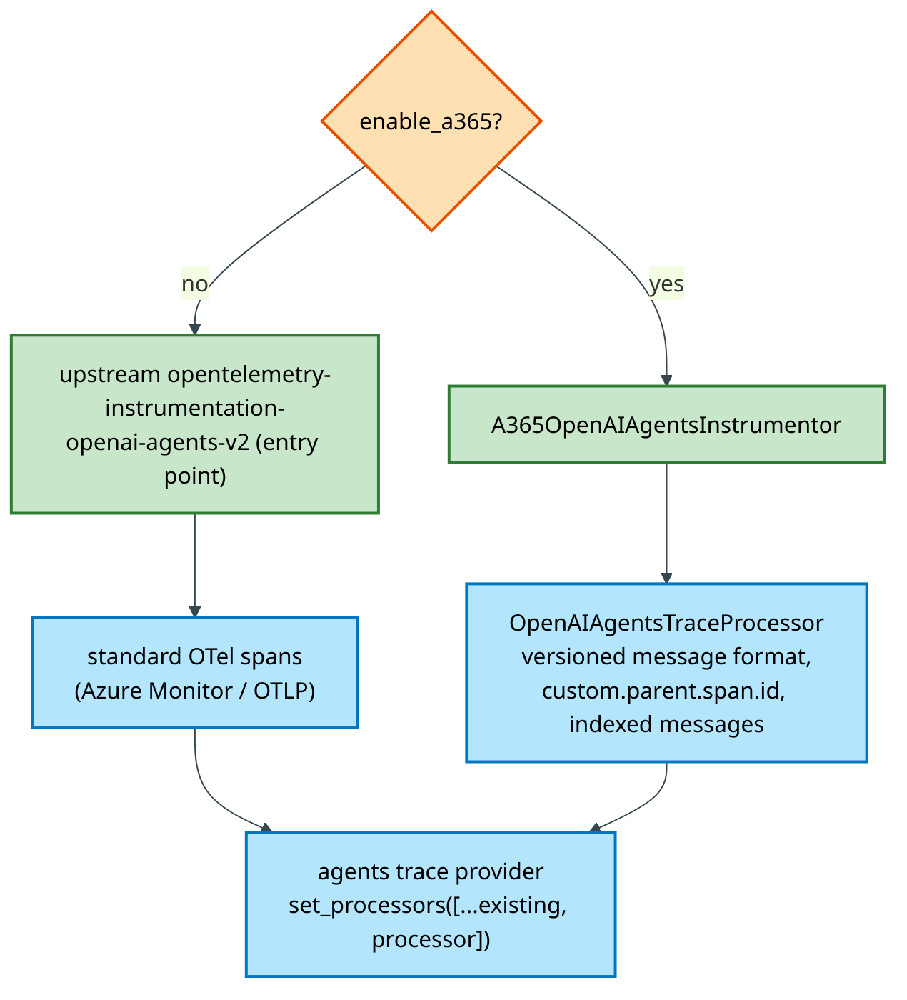
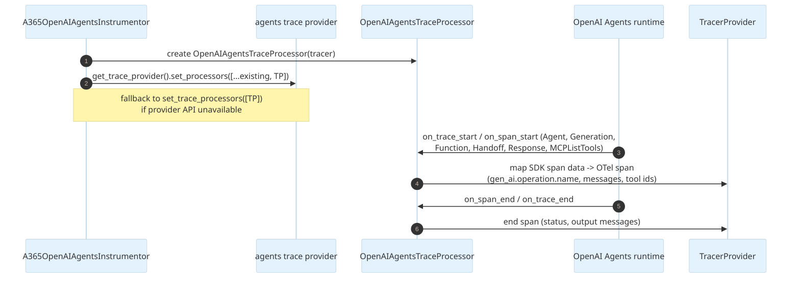
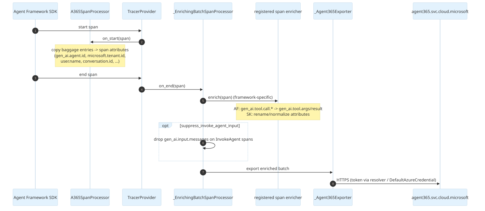

# Auto-Instrumentation Architecture — GenAI Agent Frameworks

This document describes how **auto-instrumentation** works end-to-end in the
`microsoft-opentelemetry` Python distro for the four supported GenAI agent
frameworks:

| Framework | Instrumentor | Entry-point name |
|---|---|---|
| Agent Framework (MAF) | `AgentFrameworkInstrumentor` | `agent_framework` |
| Semantic Kernel | `SemanticKernelInstrumentor` | `semantic_kernel` |
| LangChain | `LangChainInstrumentor` | `langchain` |
| OpenAI Agents SDK | upstream `openai-agents-v2` **or** A365 `A365OpenAIAgentsInstrumentor` | `openai_agents` |

The goal is to explain how a single call to `use_microsoft_opentelemetry(...)`
discovers, activates, and wires each framework's instrumentation so that the
framework emits OpenTelemetry spans — and how those spans are normalized and
exported, including the divergence between the **generic** (Azure Monitor / OTLP)
path and the **A365** path.

> Scope: GenAI agent frameworks only. Web/HTTP/DB instrumentations
> (`django`, `fastapi`, `flask`, `requests`, `httpx`, `urllib`, `urllib3`,
> `psycopg2`) and plain `openai` chat instrumentation are intentionally out of
> scope here — see [Architecture.md](Architecture.md) for the full distro view.

---

## 1. How auto-instrumentation is triggered

Auto-instrumentation is **not** a separate process or a `sitecustomize` hook in
this distro. It is driven explicitly from the single onboarding call:

```python
from microsoft.opentelemetry import use_microsoft_opentelemetry

use_microsoft_opentelemetry(
    enable_azure_monitor=True,        # or enable_a365=True, enable_console, ...
    enable_sensitive_data=False,
)
```

Inside [`_distro.py`](src/microsoft/opentelemetry/_distro.py), after the
exporter pipelines and global providers are built,
`_setup_instrumentations(...)` runs the discovery + activation loop. The key
function is `_setup_instrumentations` ([src/microsoft/opentelemetry/_distro.py](src/microsoft/opentelemetry/_distro.py#L712)).



### Discovery and gating rules

1. **Entry-point discovery** — `entry_points(group="opentelemetry_instrumentor")`
   enumerates every installed instrumentor (both this distro's GenAI
   instrumentors declared in [`pyproject.toml`](pyproject.toml#L82) and any
   upstream contrib instrumentors).
2. **Allow-list filter** — only names in `_SUPPORTED_INSTRUMENTED_LIBRARIES`
   ([src/microsoft/opentelemetry/_constants.py](src/microsoft/opentelemetry/_constants.py#L31))
   are eligible.
3. **Per-library enable check** — `instrumentation_options={"<lib>": {"enabled": False}}`
   can disable any library.
4. **OpenAI Agents routing** — when `enable_a365=True`, the loop **skips** the
   upstream `openai_agents` entry point and instead activates the A365-specific
   `A365OpenAIAgentsInstrumentor` (versioned message format for A365 consumers).
5. **Dependency-conflict check** — `get_dist_dependency_conflicts()`
   ([src/microsoft/opentelemetry/_instrumentation.py](src/microsoft/opentelemetry/_instrumentation.py#L67))
   verifies the instrumented library's installed version satisfies the
   instrumentor's `instruments` / `instruments-any` requirements before
   activation.
6. **`openai` auto-suppression** — `_disable_openai_v2_instrumentation()`
   ([src/microsoft/opentelemetry/_utils.py](src/microsoft/opentelemetry/_utils.py#L157))
   disables the plain `openai` instrumentation when `langchain_core` or
   `agent_framework` is present, to avoid double-instrumenting the same LLM
   calls. (Out of scope here, but relevant to agent workloads.)
7. **SDKStats** — each activated library is recorded via
   `set_sdkstats_instrumentation_by_name(lib_name)` for self-telemetry.

---

## 2. Component architecture

Each GenAI instrumentor is a `BaseInstrumentor` whose `_instrument()` does two
things: (a) make the underlying framework emit spans, and (b) register
attribute-normalization hooks. The mechanism differs per framework because each
SDK exposes a different extension point.



### Instrumentation mechanism per framework

| Framework | How spans get created | Normalization hook |
|---|---|---|
| **Agent Framework** | Instrumentor calls `agent_framework.observability.enable_instrumentation(enable_sensitive_data=...)`; the **SDK itself** emits OTel spans. | `enrich_agent_framework_span` enricher (A365 only) + no-op `AgentFrameworkSpanProcessor`. |
| **Semantic Kernel** | SK emits its own `chat.*` spans; instrumentor adds `SemanticKernelSpanProcessor` to rename them and set `gen_ai.operation.name`. | `SemanticKernelSpanProcessor.on_start` (always) + `enrich_semantic_kernel_span` enricher (A365 only). |
| **LangChain** | Instrumentor monkey-patches `BaseCallbackManager.__init__` (via `wrapt`) to attach a `LangChainTracer` (a `BaseTracer`) to every callback manager; LangChain run callbacks drive span creation. | `LangChainTracer` builds spans directly with normalized `gen_ai.*` attributes. |
| **OpenAI Agents** | A `TracingProcessor` is registered with the OpenAI Agents SDK trace provider; SDK trace/span events are translated to OTel spans. | A365 `OpenAIAgentsTraceProcessor` emits versioned message format; upstream emits standard format. |

---

## 3. End-to-end runtime flow (generic path)

This is the common runtime path when exporting to **Azure Monitor**, **OTLP**,
or **Console** (i.e. `enable_a365=False`). A365-specific steps are added in
[§5](#5-a365-divergence).



> `GenAIMainAgentSpanProcessor` / `GenAIMainAgentLogRecordProcessor`
> ([src/microsoft/opentelemetry/_genai/main_agent/_processor.py](src/microsoft/opentelemetry/_genai/main_agent/_processor.py))
> are **prepended** to the processor lists only when `enable_azure_monitor=True`.
> They attribute all child telemetry in a multi-agent system to the top-level
> ("main") agent by propagating `microsoft.gen_ai.main_agent.*` attributes.

---

## 4. Per-framework sequence flows

### 4.1 Agent Framework (MAF)

The instrumentor delegates span creation entirely to the Agent Framework SDK.



Key files:
- [src/microsoft/opentelemetry/_agent_framework/_trace_instrumentor.py](src/microsoft/opentelemetry/_agent_framework/_trace_instrumentor.py)
- [src/microsoft/opentelemetry/_agent_framework/_span_enricher.py](src/microsoft/opentelemetry/_agent_framework/_span_enricher.py)

### 4.2 Semantic Kernel

The SK SDK already emits spans; the instrumentor adds a processor that
**renames** `chat.*` spans at `on_start` and an enricher applied at export.



Key files:
- [src/microsoft/opentelemetry/_semantic_kernel/_trace_instrumentor.py](src/microsoft/opentelemetry/_semantic_kernel/_trace_instrumentor.py)
- [src/microsoft/opentelemetry/_semantic_kernel/_span_processor.py](src/microsoft/opentelemetry/_semantic_kernel/_span_processor.py)

### 4.3 LangChain

LangChain has no span API; instead the instrumentor injects a `BaseTracer`
callback handler into **every** callback manager via a `wrapt` monkey-patch of
`BaseCallbackManager.__init__`. LangChain's run lifecycle callbacks then drive
span creation inside `LangChainTracer`.



Key files:
- [src/microsoft/opentelemetry/_genai/_langchain/_tracer_instrumentor.py](src/microsoft/opentelemetry/_genai/_langchain/_tracer_instrumentor.py)
- [src/microsoft/opentelemetry/_genai/_langchain/_tracer.py](src/microsoft/opentelemetry/_genai/_langchain/_tracer.py)

> Note: LangChain uses **no** span enricher. The `LangChainTracer` writes
> normalized `gen_ai.*` attributes directly when building each span, so both the
> generic and A365 paths consume the same span shape.

### 4.4 OpenAI Agents SDK

The OpenAI Agents SDK has its own tracing system. A `TracingProcessor` is
registered with its trace provider. Which processor depends on `enable_a365`:





Key files:
- [src/microsoft/opentelemetry/_genai/_openai_agents/_trace_instrumentor.py](src/microsoft/opentelemetry/_genai/_openai_agents/_trace_instrumentor.py)
- [src/microsoft/opentelemetry/_genai/_openai_agents/_trace_processor.py](src/microsoft/opentelemetry/_genai/_openai_agents/_trace_processor.py)

---

## 5. A365 divergence

When `enable_a365=True`, three additional mechanisms apply on top of the generic
flow. All are wired in `_append_a365_components`
([src/microsoft/opentelemetry/_distro.py](src/microsoft/opentelemetry/_distro.py#L407)).



### A365-specific behaviors

1. **Baggage propagation** — `A365SpanProcessor.on_start`
   ([src/microsoft/opentelemetry/a365/core/exporters/span_processor.py](src/microsoft/opentelemetry/a365/core/exporters/span_processor.py))
   copies documented baggage keys (tenant/user/agent/conversation identifiers)
   onto each new span without overwriting existing attributes. Registered
   whenever `enable_a365=True`.
2. **Single span enricher** — only **one** enricher may be registered at a time
   (`register_span_enricher` raises `RuntimeError` on a second registration),
   because auto-instrumentation is platform-specific. Agent Framework and
   Semantic Kernel register enrichers; LangChain and OpenAI Agents do not (they
   emit normalized attributes directly). The enricher runs inside
   `_EnrichingBatchSpanProcessor.on_end` just before batching.
3. **Input suppression** — when `a365_suppress_invoke_agent_input=True` (or
   `A365_SUPPRESS_INVOKE_AGENT_INPUT=true`), `gen_ai.input.messages` is stripped
   from `InvokeAgent` spans via an `EnrichedReadableSpan` wrapper before export.
4. **Web/HTTP suppression** — when `enable_a365=True` and Azure Monitor is
   **off**, the distro disables `django`, `fastapi`, `flask`, `httpx`,
   `psycopg2`, `requests`, `urllib`, `urllib3`, `azure_sdk` by default
   (`_A365_DISABLED_INSTRUMENTATIONS`,
   [src/microsoft/opentelemetry/_constants.py](src/microsoft/opentelemetry/_constants.py#L50)),
   since agent workloads typically only need GenAI spans. Users can re-enable
   any library via `instrumentation_options`.
5. **OpenAI Agents routing** — the A365 instrumentor replaces the upstream
   entry point so spans carry the versioned message format A365 consumers
   expect (see [§4.4](#44-openai-agents-sdk)).

---

## 6. Attribute normalization summary

All four frameworks converge on the standard `gen_ai.*` semantic-convention
attributes, but each starts from a different source shape:

| Framework | Source span shape | Normalization point | Notable target attributes |
|---|---|---|---|
| Agent Framework | SDK-native OTel spans with AF-specific keys (`gen_ai.tool.call.arguments`, `gen_ai.tool.call.result`) | `enrich_agent_framework_span` at export (A365) | `gen_ai.input.messages`, `gen_ai.output.messages`, `gen_ai.tool.args`, `gen_ai.tool.call.result` |
| Semantic Kernel | `chat.*` spans | `SemanticKernelSpanProcessor.on_start` + enricher | `gen_ai.operation.name`, renamed span `chat <model>` |
| LangChain | run callbacks (no spans) | `LangChainTracer` at span build time | `gen_ai.operation.name`, `gen_ai.input/output.messages`, `gen_ai.usage.*`, `gen_ai.request.model` |
| OpenAI Agents | SDK trace/span data objects | `OpenAIAgentsTraceProcessor` at translation | `gen_ai.operation.name`, `gen_ai.input/output.messages`, `gen_ai.tool.call.id`, `custom.parent.span.id` |

Common operation names: `invoke_agent`, `chat`, `execute_tool`.

---

## 7. Key takeaways

- Auto-instrumentation is **explicitly orchestrated** by
  `use_microsoft_opentelemetry(...)` via entry-point discovery — not by an
  implicit Python startup hook.
- Each framework is instrumented through its **own** extension point:
  SDK enablement (Agent Framework), span processor (Semantic Kernel), callback
  monkey-patch (LangChain), or a tracing processor (OpenAI Agents).
- The **generic** path (Azure Monitor / OTLP / Console) and the **A365** path
  share span creation but diverge at export: A365 adds baggage propagation, a
  single framework-specific enricher, optional input suppression, web
  instrumentation suppression, and a dedicated OpenAI Agents processor.
- All frameworks normalize to the standard `gen_ai.*` semantic conventions so
  downstream consumers see a consistent schema regardless of the originating
  SDK.
