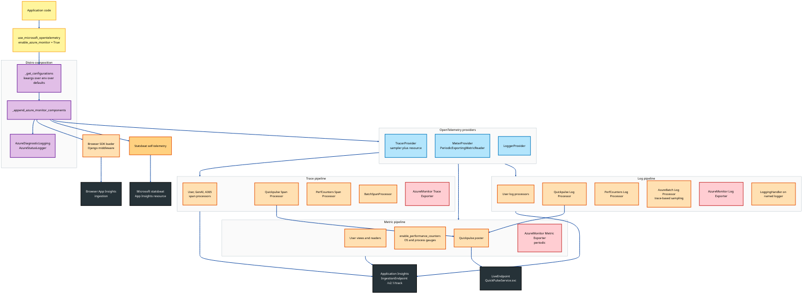
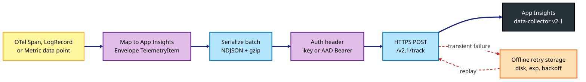
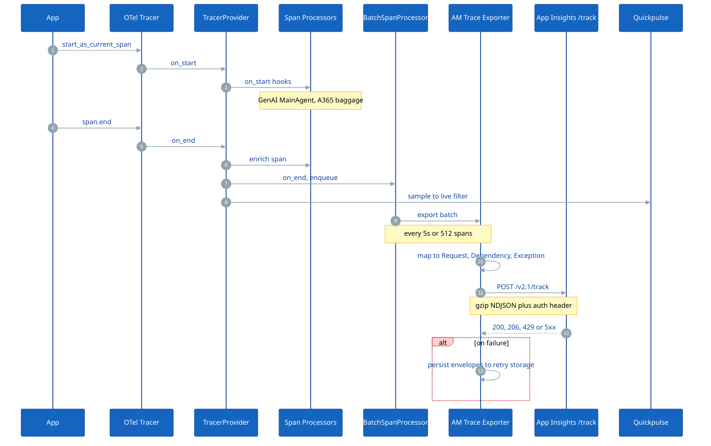
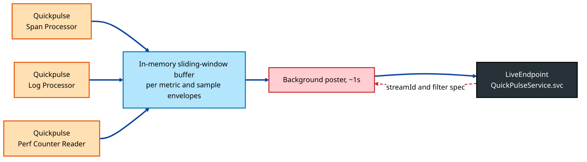
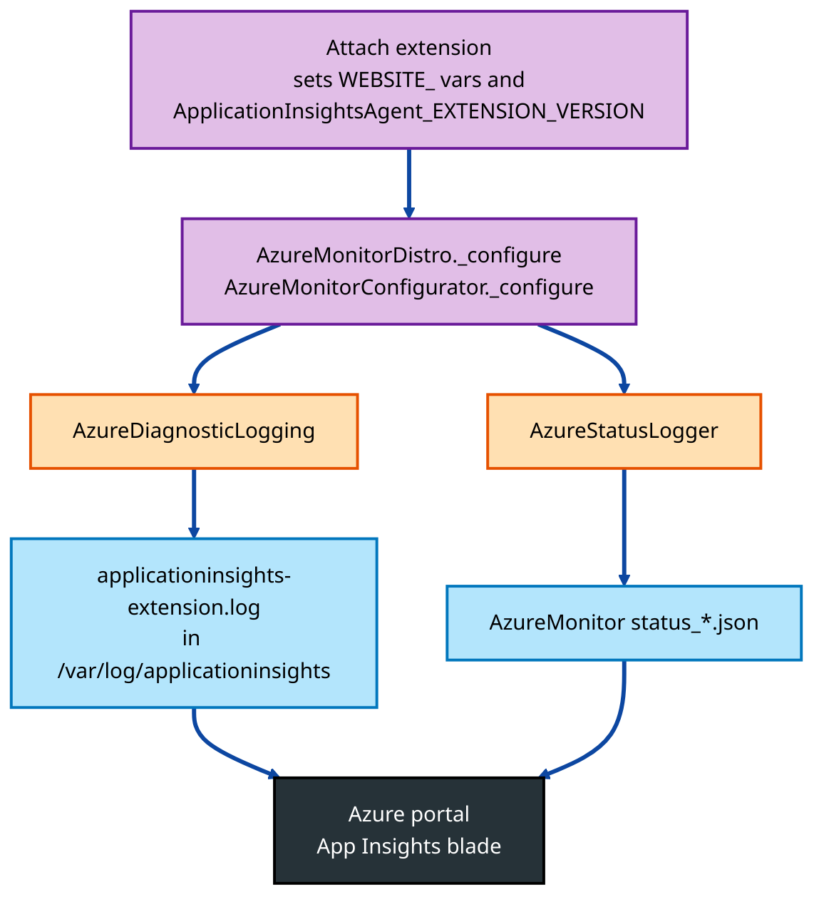
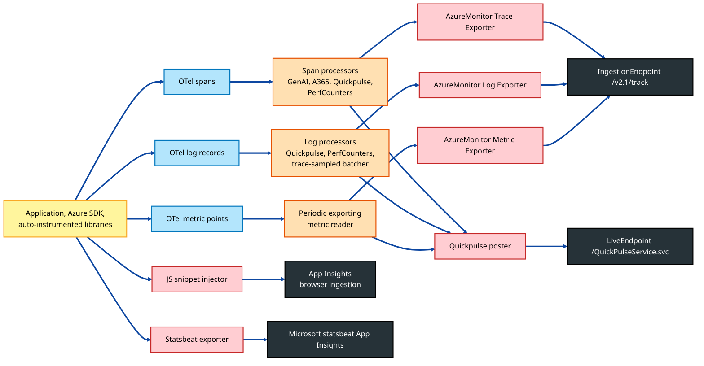

# Design — Azure Monitor / Application Insights Integration

This document is a deep dive into how the `microsoft-opentelemetry` distro integrates with **Azure Monitor / Application Insights**. It explains the protocol used to ship data, every endpoint the SDK talks to, the per‑signal pipelines (traces, metrics, logs, live metrics, statsbeat, diagnostic logs), and the configuration surface (kwargs ↔ environment variables).

For the broader distro topology see [Architecture.md](Architecture.md). This document focuses **exclusively** on the Azure Monitor path.

---

## 1. Scope of the Integration

The Azure Monitor integration is delivered by:

| Module | Responsibility |
|---|---|
| [src/microsoft/opentelemetry/_distro.py](src/microsoft/opentelemetry/_distro.py) | Public entry point `use_microsoft_opentelemetry`; appends GenAI main-agent processors and delegates to `_append_azure_monitor_components`. |
| [src/microsoft/opentelemetry/_utils.py](src/microsoft/opentelemetry/_utils.py#L97) | `_append_azure_monitor_components` — bridges generic distro kwargs to Azure Monitor `_configure`. |
| [src/microsoft/opentelemetry/_azure_monitor/_configure.py](src/microsoft/opentelemetry/_azure_monitor/_configure.py) | Builds `TracerProvider`, `MeterProvider`, `LoggerProvider` with Azure Monitor exporters, live metrics, performance counters, browser SDK loader, Azure SDK tracing. |
| [src/microsoft/opentelemetry/_azure_monitor/_utils/configurations.py](src/microsoft/opentelemetry/_azure_monitor/_utils/configurations.py) | Resolves kwargs ↔ env vars (`_get_configurations`); resource detector defaults; sampler selection. |
| [src/microsoft/opentelemetry/_azure_monitor/_browser_sdk_loader/](src/microsoft/opentelemetry/_azure_monitor/_browser_sdk_loader) | Server-side JS snippet injection (Django middleware) so browser clients also report to App Insights. |
| [src/microsoft/opentelemetry/_azure_monitor/_diagnostics/](src/microsoft/opentelemetry/_azure_monitor/_diagnostics) | On-host JSON diagnostic logs + status file for App Service / Functions auto-attach. |
| [src/microsoft/opentelemetry/_azure_monitor/_autoinstrumentation/](src/microsoft/opentelemetry/_azure_monitor/_autoinstrumentation) | `opentelemetry-instrument` distro + configurator entry points used when auto-attach is enabled (App Service / Functions / AKS attach). |
| [src/microsoft/opentelemetry/_sdkstats/](src/microsoft/opentelemetry/_sdkstats) | SDK self-telemetry (statsbeat) — sent to a Microsoft-owned App Insights resource (independent of the customer pipeline). |

The actual wire-protocol exporters (`AzureMonitorTraceExporter`, `AzureMonitorMetricExporter`, `AzureMonitorLogExporter`, statsbeat, quickpulse) are reused from the upstream **`azure-monitor-opentelemetry-exporter`** package (declared in [pyproject.toml](pyproject.toml#L24)). The distro wires those exporters into OpenTelemetry providers and adds the supporting plumbing (configuration, attach detection, browser loader, diagnostics).

---

## 2. End‑to‑End Architecture



**Color legend**

| Color | Meaning |
|---|---|
| 🟡 Yellow | Application surface / public API |
| 🟣 Purple | Distro configuration / composition |
| 🔵 Blue | OpenTelemetry SDK providers |
| 🟠 Orange | Span / log / metric processors and pipeline plumbing |
| 🔴 Red | Azure Monitor exporters (wire-protocol) |
| ⚫ Dark | Microsoft cloud endpoints |

---

## 3. Onboarding Modes

The integration supports three onboarding modes:

| Mode | How it activates | Entry point |
|---|---|---|
| **Manual code-based** | `use_microsoft_opentelemetry(enable_azure_monitor=True, azure_monitor_connection_string=...)` | [_distro.py](src/microsoft/opentelemetry/_distro.py) |
| **OpenTelemetry auto‑instrumentation** (`opentelemetry-instrument`) | Entry points `opentelemetry_distro = AzureMonitorDistro` and `opentelemetry_configurator = AzureMonitorConfigurator` | [_autoinstrumentation/distro.py](src/microsoft/opentelemetry/_azure_monitor/_autoinstrumentation/distro.py), [configurator.py](src/microsoft/opentelemetry/_azure_monitor/_autoinstrumentation/configurator.py) |
| **Service-side attach** (App Service, Azure Functions, AKS code‑less attach) | The attach extension sets `APPLICATIONINSIGHTS_CONNECTION_STRING` + `ApplicationInsightsAgent_EXTENSION_VERSION`; the distro detects via `_is_attach_enabled()` and emits diagnostic logs | [_diagnostics/diagnostic_logging.py](src/microsoft/opentelemetry/_azure_monitor/_diagnostics/diagnostic_logging.py) |

All three modes converge on `_azure_monitor/_configure.py:configure_azure_monitor(**configurations)`.

---

## 4. Configuration Surface

### 4.1 Public kwargs (from `use_microsoft_opentelemetry`)

| Public kwarg | Mapped to AM key | Env var fallback | Notes |
|---|---|---|---|
| `enable_azure_monitor` | — | — | Master switch (off by default). |
| `azure_monitor_connection_string` | `connection_string` | `APPLICATIONINSIGHTS_CONNECTION_STRING` | Parsed by exporter to derive ingestion endpoint, ikey, AAD audience, live-metrics endpoint. |
| `azure_monitor_exporter_credential` | `credential` | — | `azure.core.credentials.TokenCredential` for AAD auth. |
| `azure_monitor_enable_live_metrics` | `enable_live_metrics` | — | Default `True`. |
| `azure_monitor_enable_performance_counters` | `enable_performance_counters` | — | Default `True`. |
| `azure_monitor_exporter_disable_offline_storage` | `disable_offline_storage` | — | Disables retry queue on disk. |
| `azure_monitor_exporter_storage_directory` | `storage_directory` | — | Custom retry storage folder. |
| `azure_monitor_browser_sdk_loader_config` | `browser_sdk_loader_config` | — | Dict, see [§9](#9-browser-sdk-loader). |
| `enable_trace_based_sampling_for_logs` | — | — | Drives `_AzureBatchLogRecordProcessor`. |
| `logger_name` | — | `PYTHON_APPLICATIONINSIGHTS_LOGGER_NAME` | Name of the Python logger to attach `LoggingHandler` to. |
| `logging_formatter` | — | `PYTHON_APPLICATIONINSIGHTS_LOGGING_FORMAT` | Formatter applied on the attached handler. |

The mapping from `azure_monitor_*` ↔ AM internal keys is in `_AZURE_MONITOR_KWARG_MAP` in [_constants.py](src/microsoft/opentelemetry/_constants.py).

### 4.2 Sampling

Resolved from `OTEL_TRACES_SAMPLER` / `OTEL_TRACES_SAMPLER_ARG` env vars by `_get_configurations`:

| `OTEL_TRACES_SAMPLER` | Implementation |
|---|---|
| `microsoft.fixed_percentage` | `ApplicationInsightsSampler(sampling_ratio=arg)` — the only Azure-Monitor-aware sampler that preserves backend cardinality math. |
| `microsoft.rate_limited` | `RateLimitedSampler(target_spans_per_second_limit=arg)` (default 5). |
| `always_on` / `always_off` | OTel built-ins. |
| `trace_id_ratio` | `TraceIdRatioBased(arg)`. |
| `parentbased_always_on` / `parentbased_always_off` / `parentbased_trace_id_ratio` | `ParentBased` wrappers. |

Default (no env var): `ApplicationInsightsSampler(1.0)` (fixed 100%).

### 4.3 Resource Detection

`_default_resource` in [configurations.py](src/microsoft/opentelemetry/_azure_monitor/_utils/configurations.py) seeds `OTEL_EXPERIMENTAL_RESOURCE_DETECTORS` with:

- `azure_app_service` — detects `WEBSITE_*` env vars, sets `cloud.provider=azure`, `cloud.platform=azure_app_service`, etc.
- `azure_vm` — Instance Metadata Service (IMDS) → VM resource attributes.

These come from `opentelemetry-resource-detector-azure`.

---

## 5. Connection String → Endpoints

The `azure-monitor-opentelemetry-exporter` parses the connection string into a typed structure. The relevant pieces:

```
InstrumentationKey=00000000-0000-0000-0000-000000000000;
IngestionEndpoint=https://westus2-1.in.applicationinsights.azure.com/;
LiveEndpoint=https://westus2.livediagnostics.monitor.azure.com/;
AADAudience=https://monitor.azure.com  # optional, used with AAD credential
```

| Key | Purpose | Default if absent |
|---|---|---|
| `InstrumentationKey` | Identifies the App Insights resource. | required |
| `IngestionEndpoint` | Where trace / metric / log payloads are POSTed. | `https://dc.services.visualstudio.com/` |
| `LiveEndpoint` | Quickpulse base URL for live metrics. | derived from region |
| `AADAudience` | OAuth2 scope when AAD credential is used. | `https://monitor.azure.com//.default` |
| `ProfilerEndpoint`, `SnapshotEndpoint` | Not used by this distro. | — |

The connection string can also be supplied per‑destination (e.g. `azure_monitor_browser_sdk_loader_config["connection_string"]`) to send browser telemetry to a different resource than server-side traces.

---

## 6. The Wire Protocol — How Telemetry Reaches App Insights



### 6.1 Envelope mapping

Each OpenTelemetry signal is mapped to a corresponding **Application Insights envelope type** (`name` field):

| OTel signal / span kind | App Insights envelope | `name` |
|---|---|---|
| Server span (HTTP, RPC, messaging consumer) | `RequestData` | `Microsoft.ApplicationInsights.Request` |
| Client span (HTTP client, DB, outbound RPC, messaging producer) | `RemoteDependencyData` | `Microsoft.ApplicationInsights.RemoteDependency` |
| Internal span | `RemoteDependencyData` (with type `InProc`) | same |
| Exception event on span | `ExceptionData` (linked via `operation_Id`) | `Microsoft.ApplicationInsights.Exception` |
| Other span event | `MessageData` | `Microsoft.ApplicationInsights.Message` |
| Log record (severity ≥ trace) | `MessageData` | `Microsoft.ApplicationInsights.Message` |
| Log record with exception attributes | `ExceptionData` | `Microsoft.ApplicationInsights.Exception` |
| Metric data point | `MetricData` | `Microsoft.ApplicationInsights.Metric` |

All envelopes share common metadata: `iKey`, `time`, `tags` (operation id, role name, role instance from resource), and `data.baseData` with the typed payload.

### 6.2 HTTP transport

| Aspect | Behavior |
|---|---|
| Endpoint | `POST {IngestionEndpoint}/v2.1/track` |
| Body | NDJSON — one envelope per line, optionally `Content-Encoding: gzip`. |
| Auth (ikey only) | The `iKey` field inside each envelope identifies the resource; no header secret. |
| Auth (AAD) | `Authorization: Bearer <token>` from the supplied `TokenCredential`, audience = AAD audience from connection string (or `https://monitor.azure.com//.default`). |
| Success | HTTP 200 with `itemsReceived`/`itemsAccepted` JSON. Partial acceptance: 206 returns per-item errors. |
| Throttling | HTTP 429 / 439 → exponential backoff. |
| Transient failures | HTTP 408 / 500 / 502 / 503 / 504, network errors → envelope persisted to disk for retry. |

### 6.3 Offline retry storage

Controlled by:

- `azure_monitor_exporter_disable_offline_storage=True` → disables retry queue.
- `azure_monitor_exporter_storage_directory=<path>` → custom directory; default is `<tempdir>/Microsoft/AzureMonitor/opentelemetry-python-<ikey>/`.

The exporter writes failed envelopes as files in that directory; a background thread retries them with exponential backoff. Files are deleted on success or after `OTEL_BLRP_MAX_QUEUE_SIZE` / retention TTL.

---

## 7. The Trace Pipeline



`_setup_tracing` in [_configure.py](src/microsoft/opentelemetry/_azure_monitor/_configure.py#L145) does:

1. Build `TracerProvider(resource, sampler)` with the chosen sampler.
2. Add **all** user / distro span processors that were appended upstream (`GenAIMainAgentSpanProcessor`, `A365SpanProcessor`, `_EnrichingBatchSpanProcessor`, OTLP `BatchSpanProcessor`, Spectra, Console — anything the distro placed in `span_processors`).
3. Add `_QuickpulseSpanProcessor` (when live metrics on).
4. Add `_PerformanceCountersSpanProcessor` (when perf counters on) so request counts feed performance metrics.
5. Add `BatchSpanProcessor(AzureMonitorTraceExporter(**configurations))` — the actual exporter to App Insights.

`AzureMonitorTraceExporter` is constructed with the full configuration bundle, so it picks up the connection string, credential, storage directory, etc.

---

## 8. The Metric and Log Pipelines

### 8.1 Metrics

`_setup_metrics`:

1. Read user `metric_readers` and `views`.
2. Append a `PeriodicExportingMetricReader(AzureMonitorMetricExporter(**configurations))` — default 60 s interval.
3. Build `MeterProvider(readers, resource, views)`.
4. If `enable_performance_counters=True`, call `enable_performance_counters(meter_provider=meter_provider)` — registers gauges for **process CPU %**, **process private bytes**, **available memory**, **request rate**, **exception rate**, etc. directly on the same MeterProvider.

### 8.2 Logs

`_setup_logging`:

1. Build `LoggerProvider(resource)`.
2. Add user log record processors.
3. Add `_QuickpulseLogRecordProcessor` (live metrics).
4. Add `_PerformanceCountersLogRecordProcessor` (perf counter sourcing from logs).
5. Add `_AzureBatchLogRecordProcessor(AzureMonitorLogExporter(**configurations), {"enable_trace_based_sampling_for_logs": <bool>})`.
6. Attach an OpenTelemetry `LoggingHandler` to the Python logger named `logger_name` (so calls like `logging.getLogger("myapp").warning("...")` get exported).

`_AzureBatchLogRecordProcessor` is a custom batcher from the exporter package. When `enable_trace_based_sampling_for_logs=True` it inspects the active span's trace state to decide whether to forward a log record, so logs are sampled in lock-step with the parent trace (preventing orphan log spam from sampled-out traces).

---

## 9. Live Metrics (Quickpulse)

Live metrics is a **separate** REST channel that streams a sliding-window sample of recent telemetry directly to the Application Insights "Live Metrics Stream" pane (~1 Hz).



Key behaviors:

- POST is to `{LiveEndpoint}QuickPulseService.svc/ping` then `/post`.
- The server replies with `x-ms-qps-subscribed: true|false` and optional **filter spec** (server-side filtering pushed back to the client) so only the matching telemetry is sent during a live session.
- When `enable_live_metrics=True` the distro calls `enable_live_metrics(**configurations)` which installs the poster thread.

---

## 10. Performance Counters

When `enable_performance_counters=True`, `enable_performance_counters(meter_provider=...)` registers a set of **`MetricData` envelopes** with the well-known Application Insights names (e.g. `\Process\Private Bytes`, `\Process\% Processor Time`, `\Memory\Available Bytes`, `\ASP.NET Applications(??APP_W3SVC_PROC??)\Requests/Sec`). They are pushed through the same `AzureMonitorMetricExporter` and so reach the same App Insights resource, but appear in the **Performance** blade and **performanceCounters** schema rather than `customMetrics`.

`_PerformanceCountersSpanProcessor` and `_PerformanceCountersLogRecordProcessor` add hooks on the trace/log paths so that request counts and exception counts (derived from spans/logs) feed the corresponding counters.

---

## 11. Browser SDK Loader

When the customer also serves HTML responses (Django / FastAPI etc.), the distro can inject the Application Insights **JavaScript SDK snippet** into HTML responses so end‑user browser telemetry also flows to App Insights.

```mermaid
%%{init: {"theme":"base","themeVariables":{"fontFamily":"Segoe UI","fontSize":"15px","lineColor":"#0D47A1","edgeLabelBackground":"#FFFFFF","primaryTextColor":"#000000"}}}%%
flowchart LR
    classDef cfg fill:#E1BEE7,stroke:#6A1B9A,stroke-width:2px,color:#000
    classDef mw fill:#FFE0B2,stroke:#E65100,stroke-width:2px,color:#000
    classDef browser fill:#FFF59D,stroke:#F9A825,stroke-width:2px,color:#000
    classDef be fill:#263238,stroke:#000,stroke-width:2px,color:#FFF

    Cfg["browser_sdk_loader_config<br/>enabled, connection_string, ..."]:::cfg
    DjMW["Django middleware<br/>snippet_injector"]:::mw
    Resp["HTML response<br/>decompress gzip, br, deflate"]:::mw
    Inj["Inject script tag<br/>before closing head"]:::mw

    Page["End-user page in browser"]:::browser
    AIJS["applicationinsights-web<br/>SDK loader"]:::browser

    AppInsights["App Insights<br/>browser ingestion"]:::be

    Cfg ==> DjMW
    DjMW ==> Resp
    Resp ==> Inj
    Inj ==> Page
    Page ==> AIJS
    AIJS ==> AppInsights

    linkStyle default stroke:#0D47A1,stroke-width:3px,fill:none
```



Highlights from [snippet_injector.py](src/microsoft/opentelemetry/_azure_monitor/_browser_sdk_loader/snippet_injector.py):

- Detects HTML by `Content-Type` and presence of `</head>`.
- Decompresses gzip / brotli / deflate responses (via optional `brotli` and built-in `zlib`), injects the snippet, re-compresses if needed.
- Snippet is the standard App Insights JS SDK loader configured with the browser-side connection string (falls back to the server-side connection string).
- Records `SdkStatsFeature.AZURE_MONITOR_BROWSER_SDK_LOADER` in self-telemetry (and the exporter's statsbeat) so adoption can be tracked.

Per‑request configuration (CSP nonce, etc.) flows through `BrowserSDKConfig` in [_config.py](src/microsoft/opentelemetry/_azure_monitor/_browser_sdk_loader/_config.py).

---

## 12. Azure SDK Tracing Bridge

`_setup_azure_instrumentations` flips the **Azure SDK** tracing switch:

```python
azure.core.settings.settings.tracing_implementation = OpenTelemetrySpan
```

After this, every `azure-*` SDK call (Storage, Service Bus, Cosmos, Key Vault, Search, etc.) emits OpenTelemetry spans that the distro's exporter sends to App Insights — without any per-SDK instrumentation library. The bridge is provided by `azure-core-tracing-opentelemetry` (declared in pyproject.toml).

Additionally, the distro discovers and instruments the Azure AI Foundry libraries when present:

- `azure.ai.inference.tracing.AIInferenceInstrumentor`
- `azure.ai.agents.telemetry.AIAgentsInstrumentor`
- `azure.ai.projects.telemetry.AIProjectInstrumentor`

These produce GenAI-flavored spans (model name, token usage, prompt/completion attributes).

---

## 13. Auto‑Attach Detection & Diagnostic Logging

When the App Service / Functions / AKS attach extension auto-injects the distro, `_is_attach_enabled()` returns `True`. The distro:

1. Emits a warning when the customer **also** appears to be configuring AM manually (`_send_attach_warning`) — to prevent double-export.
2. Writes structured JSON diagnostic logs to a well-known path so the platform can surface SDK status in the portal.



Diagnostic log fields per record: `time, level, logger, message, properties.{operation, siteName, ikey, extensionVersion, sdkVersion, subscriptionId, msgId, language}`. Each event has a stable `msgId` (e.g. `4200 = AttachSuccessDistro`, `4400 = AttachFailureDistro`) consumed by Azure portal tooling.

---

## 14. SDK Self‑Telemetry (Statsbeat)

The distro tracks its own usage and ships it to a **separate Microsoft-owned App Insights resource** (the statsbeat resource) so feature adoption and SDK health can be monitored.

| When Azure Monitor is **enabled** | When Azure Monitor is **disabled** |
|---|---|
| The exporter package's own `StatsbeatManager` already runs. The distro **bridges** its bits (`SdkStatsFeature.DISTRO`, `OTLP_EXPORT`, `A365_EXPORT`, `CONSOLE_EXPORT`, `SPECTRA_EXPORT`, etc.) into `_StatsbeatMetrics._FEATURE_ATTRIBUTES["feature"]` and `_INSTRUMENTATIONS_BIT_MASK`. | The distro stands up its own `MeterProvider` (`SdkStatsManager`) with `AzureMonitorMetricExporter(is_sdkstats=True)` and points it at the statsbeat resource. |

Disabled by `MICROSOFT_OTEL_SDKSTATS_DISABLED=true` or `APPLICATIONINSIGHTS_STATSBEAT_DISABLED_ALL=true`.

---

## 15. End‑to‑End Data Flow



---

## 16. Failure & Resilience

| Failure mode | Behavior |
|---|---|
| Ingestion HTTP 429 / 5xx / network error | Envelope persisted to **offline retry storage**; retried with exponential backoff. |
| Ingestion HTTP 206 partial | Per-item errors logged; only failed items go to retry storage. |
| Connection string missing | Exporter constructor raises early — distro logs at WARN level and continues with other exporters (A365, OTLP, Console) so observability is not silently lost. |
| AAD token failure | `Authorization` header missing → 401 from ingestion → treated as transient (retried). |
| Disk full / storage error | Disk retry disabled gracefully; in-memory queue drops oldest envelopes once full. |
| Quickpulse endpoint unreachable | Live posting backs off; does **not** affect main `/track` channel. |
| Performance counter collection failure (psutil missing) | Logs DEBUG; specific counters disabled but pipeline continues. |
| Auto-attach + manual init conflict | `_send_attach_warning()` emits a warning and a `4100` diagnostic event so the operator can resolve duplicate exporters. |

---

## 17. Security Considerations

- **Connection strings** include the instrumentation key, which is treated as a low-trust identifier (not a secret). For higher assurance, use AAD authentication via `azure_monitor_exporter_credential`.
- **AAD audience** is read from the connection string (`AADAudience`) to keep token requests scoped to the correct cloud (Public, Gov, China).
- **Browser SDK loader** injects HTML — the snippet content is generated server-side from `BrowserSDKConfig`; CSP nonces are forwarded when the framework supplies them.
- **Diagnostic log files** are written under `/var/log/applicationinsights` (Linux) or `%HOME%\LogFiles\ApplicationInsights` (Windows). Owners of those paths in the host control read access.
- **Statsbeat** is sent to a Microsoft-owned resource. Customers can disable it via `MICROSOFT_OTEL_SDKSTATS_DISABLED=true` or the legacy `APPLICATIONINSIGHTS_STATSBEAT_DISABLED_ALL=true`.
- **PII**: the distro never adds PII automatically. Sensitive GenAI data (prompts / tool args / results) is gated behind `enable_sensitive_data=True`.

---

## 18. Quick Reference

| Want to… | Do this |
|---|---|
| Onboard with code | `use_microsoft_opentelemetry(enable_azure_monitor=True, azure_monitor_connection_string="…")` |
| Use AAD instead of ikey | Pass `azure_monitor_exporter_credential=DefaultAzureCredential()` |
| Disable Live Metrics | `azure_monitor_enable_live_metrics=False` |
| Disable Performance Counters | `azure_monitor_enable_performance_counters=False` |
| Custom retry directory | `azure_monitor_exporter_storage_directory="/var/lib/myapp/aiqueue"` |
| Disable retry storage | `azure_monitor_exporter_disable_offline_storage=True` |
| Sample 10 % of traces | `OTEL_TRACES_SAMPLER=microsoft.fixed_percentage`, `OTEL_TRACES_SAMPLER_ARG=0.1` |
| Sample logs with parent trace | `enable_trace_based_sampling_for_logs=True` |
| Inject browser SDK | `azure_monitor_browser_sdk_loader_config={"enabled": True}` |
| Disable Azure SDK tracing | `instrumentation_options={"azure_sdk": {"enabled": False}}` |
| Disable distro statsbeat | `MICROSOFT_OTEL_SDKSTATS_DISABLED=true` |
| Auto-instrument via `opentelemetry-instrument` | Install the distro; the `opentelemetry_distro` + `opentelemetry_configurator` entry points handle setup. |

---

## 19. Related Documents

- High-level distro topology: [Architecture.md](Architecture.md)
- General onboarding & options: [README.md](README.md)
- A365-specific behaviors: [A365_DOCUMENTATION.md](A365_DOCUMENTATION.md)
- Migrating from previous distros: [MIGRATION_A365.md](MIGRATION_A365.md)
