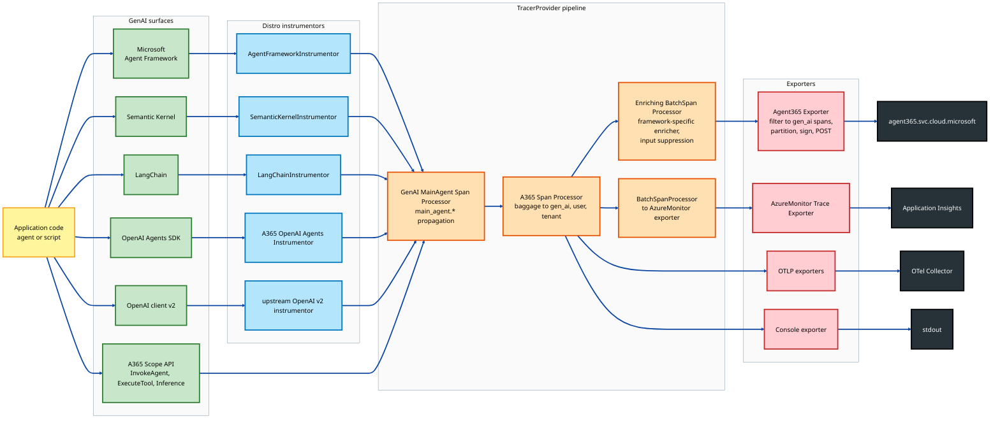
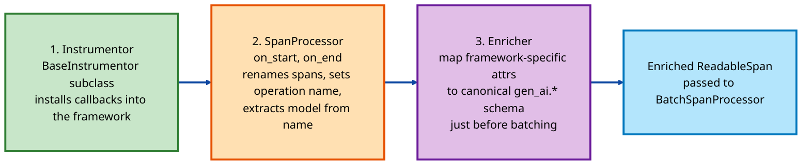
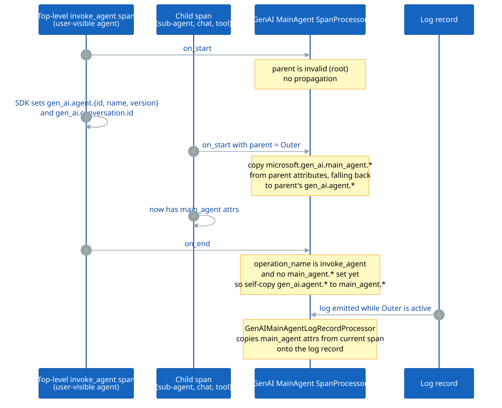
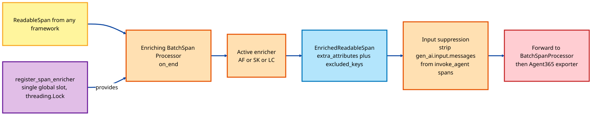
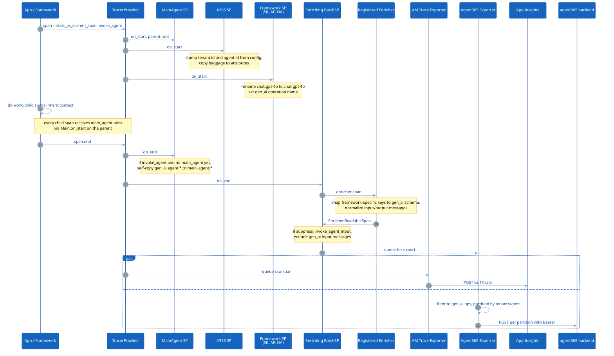

# GenAI / Agent Framework Integration — Detailed Design

> **Companion documents**
>
> - [Architecture.md](Architecture.md) — high-level distro architecture, all pipelines.
> - [AzureMonitor_Integration-Design.md](AzureMonitor_Integration-Design.md) — deep dive on the Azure Monitor / Application Insights wire protocol.
>
> This document focuses on **how `microsoft-opentelemetry` instruments, enriches, and exports telemetry for AI agents and agent frameworks**: how `LangChain`, `Semantic Kernel`, `Microsoft Agent Framework`, `OpenAI Agents SDK`, and the native `OpenAI v2` client are turned into a single, semantically consistent stream of GenAI spans and log records that flow to Application Insights, Agent 365, OTLP, and Spectra back-ends.

---

## Table of Contents

1. [Scope and Goals](#1-scope-and-goals)
2. [Conceptual Model — Agents, Tools, Inferences, Messages](#2-conceptual-model--agents-tools-inferences-messages)
3. [Supported Agent Frameworks](#3-supported-agent-frameworks)
4. [End-to-End Architecture of the GenAI Pipeline](#4-end-to-end-architecture-of-the-genai-pipeline)
5. [The Three Pillars: Instrumentor, Enricher, Processor](#5-the-three-pillars-instrumentor-enricher-processor)
6. [GenAI Semantic Conventions Used by the Distro](#6-genai-semantic-conventions-used-by-the-distro)
7. [Main-Agent Attribute Propagation](#7-main-agent-attribute-propagation)
8. [Per-Framework Instrumentation Details](#8-per-framework-instrumentation-details)
9. [Manual Tracing — The A365 Scope API](#9-manual-tracing--the-a365-scope-api)
10. [Span Enricher Pipeline (single-registration)](#10-span-enricher-pipeline-single-registration)
11. [Filtering & Partitioning Before Export](#11-filtering--partitioning-before-export)
12. [End-to-End Data Flow of an Agent Invocation](#12-end-to-end-data-flow-of-an-agent-invocation)
13. [Configuration Surface for GenAI Workloads](#13-configuration-surface-for-genai-workloads)
14. [Sensitive Data, Content Capture, and Suppression](#14-sensitive-data-content-capture-and-suppression)
15. [Key Design Choices](#15-key-design-choices)
16. [Related Documents](#16-related-documents)

---

## 1. Scope and Goals

This integration provides:

- **One-line onboarding** (`use_microsoft_opentelemetry(enable_a365=True, enable_azure_monitor=True)`) that turns on agent-framework instrumentation, GenAI attribute enrichment, and the Agent 365 + Azure Monitor exporters in a single call.
- **Framework-agnostic semantics** — every supported framework produces spans whose `gen_ai.*` attributes obey a single schema (operation name, agent identity, message format, tool args/results, token usage).
- **Multi-agent context propagation** — when one agent invokes another, the top-level (user-facing) agent's identity (`microsoft.gen_ai.main_agent.*`) flows onto every child span and log record so dashboards can correlate every internal call back to the user-visible agent.
- **Per-backend output shaping** — Azure Monitor receives raw OTel attributes; Agent 365 receives a normalized, filtered, partitioned view; OTLP and Console see the raw enriched span.
- **Pluggable sensitivity controls** — content capture flags, input-message suppression for `invoke_agent` spans, and per-framework "enable_sensitive_data" knobs.

Out of scope (covered elsewhere):

- The Azure Monitor wire protocol and live-metrics channel — see [AzureMonitor_Integration-Design.md](AzureMonitor_Integration-Design.md).
- A365 endpoint resolution, payload chunking, and Bearer-token acquisition — see Section 6 of [Architecture.md](Architecture.md).
- Hosting middlewares for Django/FastAPI to inject A365 baggage — see Section 6 of [Architecture.md](Architecture.md).

---

## 2. Conceptual Model — Agents, Tools, Inferences, Messages

Every supported agent framework boils down to a small set of nested operations. The distro normalizes each framework's spans to **four canonical operation names** so dashboards and exporters can reason about them uniformly:

| Operation name (`gen_ai.operation.name`) | Meaning | Typical span name |
|---|---|---|
| `invoke_agent` | One agent turn — receives user input, returns assistant output. Top-level span of the trace. | `invoke_agent <agent_name>` |
| `execute_tool` | A function/tool call performed by the agent (calculator, retrieval, MCP tool, code interpreter). | `execute_tool <tool_name>` |
| `chat` | One inference call to an LLM. Carries model name, token usage, request/response. | `chat <model_name>` |
| `output_messages` | A terminal step that materializes the agent's user-facing reply. | `output_messages` |

A canonical trace shape:

```
invoke_agent  weather-bot                  (operation = invoke_agent)
├── chat   gpt-4o                          (operation = chat)
├── execute_tool  get_weather              (operation = execute_tool)
├── chat   gpt-4o                          (operation = chat)
└── output_messages                        (operation = output_messages)
```

Every span carries a uniform set of `gen_ai.*` attributes (next sections) regardless of which framework produced it.

---

## 3. Supported Agent Frameworks

Five GenAI surfaces are instrumented out of the box. Three are auto-discovered via OpenTelemetry entry points, and two are vendored upstream instrumentors that the distro forwards to:

| Framework | Library | Entry point name | Instrumentor class | Source path | Activation |
|---|---|---|---|---|---|
| **Microsoft Agent Framework** | `agent-framework >= 1.0.0` | `agent_framework` | `AgentFrameworkInstrumentor` | [`_agent_framework/_trace_instrumentor.py`](src/microsoft/opentelemetry/_agent_framework/_trace_instrumentor.py) | Auto (entry point) |
| **Semantic Kernel** | `semantic-kernel >= 1.0.0` | `semantic_kernel` | `SemanticKernelInstrumentor` | [`_semantic_kernel/_trace_instrumentor.py`](src/microsoft/opentelemetry/_semantic_kernel/_trace_instrumentor.py) | Auto (entry point) |
| **LangChain** | `langchain-core >= 0.2.0` | `langchain` | `LangChainInstrumentor` | [`_genai/_langchain/_tracer_instrumentor.py`](src/microsoft/opentelemetry/_genai/_langchain/_tracer_instrumentor.py) | Auto (entry point) |
| **OpenAI Agents SDK** | `openai-agents >= 0.0.7` | `openai_agents` | `A365OpenAIAgentsInstrumentor` (A365 mode) **or** upstream `opentelemetry-instrumentation-openai-agents-v2` (AM/OTLP mode) | [`_genai/_openai_agents/_trace_instrumentor.py`](src/microsoft/opentelemetry/_genai/_openai_agents/_trace_instrumentor.py) | Switched in `_setup_instrumentations` when `enable_a365=True` |
| **OpenAI client v2** | `openai >= 1.0` | `openai` | upstream `opentelemetry-instrumentation-openai-v2` | (third-party) | Auto (entry point); disabled by distro if the user is already on `agent_framework`/`semantic_kernel` to avoid duplicate inference spans |

Plus the **A365 scope API** (next section) which lets application code emit canonical agent spans **without any framework** — useful for custom agents, hosted runtimes, or unit tests.

Discovery is driven by `_setup_instrumentations` in [`_distro.py`](src/microsoft/opentelemetry/_distro.py) and gated by `_SUPPORTED_INSTRUMENTED_LIBRARIES` from [`_constants.py`](src/microsoft/opentelemetry/_constants.py):

```python
_SUPPORTED_INSTRUMENTED_LIBRARIES = (
    "django", "fastapi", "flask", "httpx", "psycopg2",
    "requests", "urllib", "urllib3",
    # GENAI
    "langchain", "openai", "openai_agents",
    "semantic_kernel", "agent_framework",
)
```

When `enable_a365=True`, the distro additionally disables the web/HTTP/DB instrumentations (via `_A365_DISABLED_INSTRUMENTATIONS`) since agent workloads typically don't need framework auto-instrumentation noise on top of the GenAI spans.

---

## 4. End-to-End Architecture of the GenAI Pipeline



**Color legend**

| Color | Meaning |
|---|---|
| 🟡 Yellow | Application surface |
| 🟢 Green | Agent framework / Scope API (span sources) |
| 🔵 Blue | Distro instrumentors (attach hooks to framework callbacks) |
| 🟠 Orange | Enrichment & batch processors (TracerProvider pipeline) |
| 🔴 Red | Exporters (per back-end serializers) |
| ⚫ Dark | Telemetry backends |

---

## 5. The Three Pillars: Instrumentor, Enricher, Processor

Each supported framework follows the same three-piece pattern. Understanding this pattern is the key to the whole subsystem:



| Layer | Responsibility | Runs in |
|---|---|---|
| **Instrumentor** (`BaseInstrumentor._instrument`) | Hooks into the framework's tracing extension point: `enable_instrumentation()` for Agent Framework, callback-manager wrapping for LangChain, `set_processors()` for OpenAI Agents SDK, plain processor registration for Semantic Kernel. Creates the framework's `SpanProcessor`, adds it to the active `TracerProvider`, and registers the framework's `enricher` via `register_span_enricher`. | One-time, at distro startup. |
| **SpanProcessor** | Light per-span work — usually only `on_start`: rename span (`chat.gpt-4o` → `chat gpt-4o`), set `gen_ai.operation.name`. Some frameworks do nothing here because the upstream SDK already emits well-named spans. | Synchronously on every span. |
| **Enricher** | Pure function `ReadableSpan -> ReadableSpan`. Runs inside `_EnrichingBatchSpanProcessor.on_end` (the **A365 batch processor**). Maps framework-specific attribute keys (e.g. AF's `gen_ai.tool.call.arguments`) onto the canonical A365 schema (`gen_ai.tool.args`). Returns an `EnrichedReadableSpan` overlay that adds attributes without mutating the original. | Synchronously on the export thread, **once per span just before batching**. |

The enricher slot is **single-registration**: `register_span_enricher` raises `RuntimeError` if one is already installed. This is intentional — auto-instrumentation is platform-specific (an app uses LangChain *or* Semantic Kernel *or* Agent Framework, not all three at once), so a single registered enricher per process is sufficient and keeps the export path branch-free.

---

## 6. GenAI Semantic Conventions Used by the Distro

The distro tracks the OpenTelemetry **GenAI semantic conventions** (`gen_ai.*`) and adds a Microsoft-specific extension (`microsoft.gen_ai.main_agent.*`) for multi-agent correlation. Source of truth: [`a365/core/constants.py`](src/microsoft/opentelemetry/a365/core/constants.py) and [`_constants.py`](src/microsoft/opentelemetry/_constants.py).

### 6.1 Operation taxonomy

| Constant | Value | Set by |
|---|---|---|
| `INVOKE_AGENT_OPERATION_NAME` | `"invoke_agent"` | `InvokeAgentScope`, framework span processors when span name starts with `invoke_agent` |
| `EXECUTE_TOOL_OPERATION_NAME` | `"execute_tool"` | `ExecuteToolScope`, AF/SK/LC enrichers |
| `OUTPUT_MESSAGES_OPERATION_NAME` | `"output_messages"` | `OutputScope`, AF |
| `CHAT_OPERATION_NAME` / `InferenceOperationType.CHAT.value` | `"chat"` / `"Chat"` | `SemanticKernelSpanProcessor.on_start`, OpenAI Agents processor for inference spans |

### 6.2 Identity attributes (set by scopes, processors, baggage, or the user)

| Attribute | Description |
|---|---|
| `gen_ai.agent.id` | Stable identifier of the agent (UUID or human key). Required for Agent 365 export. |
| `gen_ai.agent.name` | Display name. |
| `gen_ai.agent.version` | Optional version string. |
| `gen_ai.agent.description` | Optional. |
| `gen_ai.conversation.id` | Conversation/session correlation. |
| `gen_ai.provider.name` | `openai`, `azure_openai`, `anthropic`, etc. |
| `tenant.id` | Tenant scope. Required (with `agent.id`) for A365 export. |
| `gen_ai.caller.agent.*` | Set when one agent calls another (A2A). |
| `user.id`, `user.name`, `user.email`, `session.id` | End-user attribution; pulled from baggage by `A365SpanProcessor`. |

### 6.3 Main-agent attributes (Microsoft extension, [`_constants.py`](src/microsoft/opentelemetry/_constants.py))

| Attribute | Set by |
|---|---|
| `microsoft.gen_ai.main_agent.id` | `GenAIMainAgentSpanProcessor` (on_start from parent; on_end self-copy for the top-level invoke_agent span) |
| `microsoft.gen_ai.main_agent.name` | same |
| `microsoft.gen_ai.main_agent.version` | same |
| `microsoft.gen_ai.main_agent.conversation_id` | same |

These propagate onto every child span and onto every log record (via `GenAIMainAgentLogRecordProcessor`) so the Azure Monitor / Application Insights dashboards can attribute internal calls back to the top-level (user-visible) agent.

### 6.4 Message & tool attributes

| Attribute | Description |
|---|---|
| `gen_ai.input.messages` | JSON-serialized list of `{role, content}` messages sent to the model/agent. |
| `gen_ai.output.messages` | JSON-serialized list of `{role, content}` returned. |
| `gen_ai.tool.args` | Canonical key for tool input arguments (enriched from `gen_ai.tool.call.arguments`). |
| `gen_ai.tool.call.result` | Canonical key for tool output. |
| `gen_ai.request.model` | Model id sent to the provider. |
| `gen_ai.response.model` | Model id returned by the provider. |
| `gen_ai.usage.input_tokens` / `gen_ai.usage.output_tokens` | Token accounting. |
| `server.address` / `server.port` | Inference endpoint. |

### 6.5 OpenAI Agents extensions ([`_openai_agents/_constants.py`](src/microsoft/opentelemetry/_genai/_openai_agents/_constants.py))

For trace topology compatibility with the OpenAI Agents SDK's own dashboards:

| Attribute | Purpose |
|---|---|
| `custom.parent.span.id` | The agent-workflow root span id stamped onto generation-span exports so consumers can link tool calls back to the originating workflow. |
| `message_role`, `message_content`, `message_tool_calls`, `tool_json_schema` | Per-message indexed attributes for OpenAI Agents response/input data. |
| `llm_token_count_total`, `llm_token_count_prompt_details_cached_read`, ... | Detailed token telemetry. |

---

## 7. Main-Agent Attribute Propagation

In multi-agent systems, a single user request can fan out into many internal LLM calls — sub-agents, orchestrators, tool calls — and each of these produces its own `invoke_agent`/`chat`/`execute_tool` span with its own `gen_ai.agent.*` identity. Without correlation, dashboards see dozens of unrelated agents.

`GenAIMainAgentSpanProcessor` ([`_genai/main_agent/_processor.py`](src/microsoft/opentelemetry/_genai/main_agent/_processor.py)) solves this with two hooks:



**Propagation table** (from [`_processor.py`](src/microsoft/opentelemetry/_genai/main_agent/_processor.py)):

| Target attribute on child | Primary source on parent | Fallback source on parent |
|---|---|---|
| `microsoft.gen_ai.main_agent.name` | `microsoft.gen_ai.main_agent.name` | `gen_ai.agent.name` |
| `microsoft.gen_ai.main_agent.id` | `microsoft.gen_ai.main_agent.id` | `gen_ai.agent.id` |
| `microsoft.gen_ai.main_agent.version` | `microsoft.gen_ai.main_agent.version` | `gen_ai.agent.version` |
| `microsoft.gen_ai.main_agent.conversation_id` | `microsoft.gen_ai.main_agent.conversation_id` | `gen_ai.conversation.id` |

Net effect: every span and every log record in the trace carries the **top-level** agent's identity, enabling per-main-agent dashboards in Application Insights even when the trace tree contains five sub-agents that each call three tools.

The processor is **prepended** to the user-supplied processor list inside `_distro._setup_tracing` (only when `enable_azure_monitor=True`) so its `on_start` runs before any batch exporter sees the span.

---

## 8. Per-Framework Instrumentation Details

### 8.1 Microsoft Agent Framework

**Source:** [`_agent_framework/_trace_instrumentor.py`](src/microsoft/opentelemetry/_agent_framework/_trace_instrumentor.py), [`_span_enricher.py`](src/microsoft/opentelemetry/_agent_framework/_span_enricher.py)

- `AgentFrameworkInstrumentor._instrument` calls **`agent_framework.observability.enable_instrumentation(enable_sensitive_data=...)`** so the AF SDK starts emitting its native OTel spans, then adds `AgentFrameworkSpanProcessor` (currently a no-op interface stub) and registers `enrich_agent_framework_span` with the enricher registry.
- The AF SDK already produces spans whose names start with `invoke_agent`/`execute_tool` and whose attributes include `gen_ai.input.messages`, `gen_ai.output.messages`, and AF's tool-call keys.
- The enricher does two transforms:
  1. For `invoke_agent` spans: parses `gen_ai.input.messages` and rewrites it to **only user-role content**; parses `gen_ai.output.messages` and rewrites it to **only assistant-role content**. This drops noisy system prompts and intermediate tool messages from the A365 export view while leaving the original on the Azure Monitor side untouched (the original span object is wrapped in `EnrichedReadableSpan` — only Section 10 export path sees the overlay).
  2. For `execute_tool` spans: copies `gen_ai.tool.call.arguments` → `gen_ai.tool.args` and `gen_ai.tool.call.result` → `gen_ai.tool.call.result` (the canonical A365 keys).

### 8.2 Semantic Kernel

**Source:** [`_semantic_kernel/_trace_instrumentor.py`](src/microsoft/opentelemetry/_semantic_kernel/_trace_instrumentor.py), [`_span_processor.py`](src/microsoft/opentelemetry/_semantic_kernel/_span_processor.py), [`_span_enricher.py`](src/microsoft/opentelemetry/_semantic_kernel/_span_enricher.py)

- `SemanticKernelSpanProcessor.on_start` detects span names of the form `chat.<model>` (the SK convention), rewrites them to `chat <model>`, and sets `gen_ai.operation.name = "chat"`. This brings SK in line with the rest of the GenAI taxonomy without modifying SK itself.
- The enricher mirrors AF's transforms — message content normalization for `invoke_agent` spans and tool-key remapping for `execute_tool` spans — using SK's slightly different message JSON shape (handled by `extract_content_as_string_list`).

### 8.3 LangChain

**Source:** [`_genai/_langchain/_tracer_instrumentor.py`](src/microsoft/opentelemetry/_genai/_langchain/_tracer_instrumentor.py), [`_tracer.py`](src/microsoft/opentelemetry/_genai/_langchain/_tracer.py)

LangChain doesn't expose a SpanProcessor extension point; instead it has the **callback manager** pattern. The instrumentor takes a different shape:

- `LangChainInstrumentor._instrument` constructs a `LangChainTracer` (a subclass of `langchain_core.tracers.BaseTracer`) that maps every LangChain `on_chain_start`/`on_tool_start`/`on_llm_start` callback to an OpenTelemetry span.
- It then **wraps `BaseCallbackManager.__init__`** with `wrapt.wrap_function_wrapper` so that every new callback manager (and therefore every chain, agent, retriever) automatically gets the OTel tracer added as an inheritable handler. No application changes required.
- `LangChainTracer.run_map` keeps a parent/child run dictionary so that nested chains map to nested OTel spans with correct context propagation.
- Per-run agent config (`agent_name`, `agent_id`, `server_address`, `server_port`, etc.) is supplied via `LangChainInstrumentor().instrument(agent_name=..., ...)` so the operator can stamp a static agent identity onto every span (useful when LangChain's runtime doesn't expose one).
- An OTel **event logger** is attached for emitting per-LLM-invocation events (prompt/completion content) using the standard `opentelemetry.util.genai.span_utils` helpers.

### 8.4 OpenAI Agents SDK (A365 mode)

**Source:** [`_genai/_openai_agents/_trace_instrumentor.py`](src/microsoft/opentelemetry/_genai/_openai_agents/_trace_instrumentor.py), [`_trace_processor.py`](src/microsoft/opentelemetry/_genai/_openai_agents/_trace_processor.py)

The OpenAI Agents SDK has its own tracing system (`agents.tracing`). The distro hooks into it in two different ways depending on the mode:

| Mode | Behavior |
|---|---|
| `enable_a365=True` | The distro **skips** the upstream `opentelemetry-instrumentation-openai-agents-v2` entry point and registers `A365OpenAIAgentsInstrumentor` via `_setup_a365_openai_agents_instrumentation`. This processor produces spans in the **A365 versioned message format** (with `custom.parent.span.id` for trace stitching, per-message indexed attributes, etc.). |
| Azure Monitor / OTLP only | Upstream `opentelemetry-instrumentation-openai-agents-v2` runs as the normal entry point, producing standard `gen_ai.*` spans. |

The A365 processor (`OpenAIAgentsTraceProcessor`) bridges the OpenAI Agents SDK's `Trace`/`Span` model to OTel by:

1. On `on_trace_start`, creating a synthetic root OTel span named `Agent workflow`.
2. On `on_span_start`, creating a child OTel span whose `gen_ai.operation.name` is derived from the OpenAI Agents `span_data` type (`AgentSpanData` → `invoke_agent`, `GenerationSpanData` → `chat`, etc.) and `gen_ai.provider.name = "openai"`.
3. On `on_span_end`, mapping the typed `span_data` (Response, Generation, Handoff, FunctionTool) onto canonical attributes — input/output messages, tool args, token counts, handoff source/destination.
4. Tracking parent-child relationships and tool-call IDs in bounded `OrderedDict`s (`_MAX_TRACKED_SPANS = 10000`, `_MAX_HANDOFFS_IN_FLIGHT = 1000`) so long-running processes don't leak memory.

### 8.5 OpenAI client v2

The upstream `opentelemetry-instrumentation-openai-v2` entry point handles raw `openai.ChatCompletion` / `openai.responses` calls when no agent framework is in play. The distro defers entirely to it; no Microsoft-specific processor or enricher is installed.

`_disable_openai_v2_instrumentation` in `_setup_instrumentations` will turn it **off** if `agent_framework` or `semantic_kernel` is the active framework, because both frameworks already wrap their own inference calls — running the upstream `openai` instrumentor on top would emit duplicate `chat` spans for every model call.

---

## 9. Manual Tracing — The A365 Scope API

For applications that don't use one of the frameworks above (custom orchestrators, hosted runtimes, unit tests), the distro exposes a **scope-based** manual API in [`a365/core/`](src/microsoft/opentelemetry/a365/core/):

| Scope | Source | When to use |
|---|---|---|
| `InvokeAgentScope` | [`invoke_agent_scope.py`](src/microsoft/opentelemetry/a365/core/invoke_agent_scope.py) | One agent turn — emits `invoke_agent <agent_name>` span. Carries `AgentDetails`, `Request`, `CallerDetails`, `SpanDetails`. |
| `ExecuteToolScope` | [`execute_tool_scope.py`](src/microsoft/opentelemetry/a365/core/execute_tool_scope.py) | Tool/function invocation. |
| `InferenceScope` | [`inference_scope.py`](src/microsoft/opentelemetry/a365/core/inference_scope.py) | An LLM call (chat/completion). |
| `OutputScope` | (`spans_scopes/`) | The final assistant response. |

The base class is `OpenTelemetryScope` ([`opentelemetry_scope.py`](src/microsoft/opentelemetry/a365/core/opentelemetry_scope.py)):

- Gates emission on `ENABLE_OBSERVABILITY` / `ENABLE_A365_OBSERVABILITY` env vars, falling back to `_enabled_by_distro = True` (set by `_append_a365_components` when `enable_a365=True`).
- Stamps standard telemetry SDK attributes (`telemetry.sdk.name`, `telemetry.sdk.language`, `telemetry.sdk.version`).
- Pulls `AgentDetails` (agent_id, agent_name, agent_version, agentic_user_id, tenant_id, ...) onto every span via `set_tag_maybe` (never overwrites existing).
- Supports custom parent contexts, custom start/end times (for backfill scenarios), and `SpanKind` overrides.

These scopes produce spans that are indistinguishable from those emitted by Agent Framework or Semantic Kernel — same `gen_ai.operation.name`, same identity attributes — so the rest of the pipeline (enricher, main-agent propagation, exporters) treats them uniformly.

---

## 10. Span Enricher Pipeline (single-registration)



**Key properties** (from [`enriching_span_processor.py`](src/microsoft/opentelemetry/a365/core/exporters/enriching_span_processor.py)):

- `register_span_enricher(callable)` is **single-slot, lock-guarded**. Calling it twice raises `RuntimeError`. Each framework instrumentor catches the `RuntimeError` and logs at debug — first registrant wins.
- The enricher is called only inside `_EnrichingBatchSpanProcessor.on_end`. It does **not** mutate the input span; it returns a new `EnrichedReadableSpan` overlay containing `extra_attributes` and optional `excluded_attribute_keys`.
- If the enricher raises, the original span is forwarded unchanged — enrichment never blocks export.
- Configurable **input suppression**: when `a365_suppress_invoke_agent_input=True` (or the equivalent env var), `gen_ai.input.messages` is stripped from `invoke_agent` spans on the A365 path only. The original span is unchanged, so the **Azure Monitor exporter sees the full input** while A365 sees the suppressed view.

This isolation matters because the same span object enters multiple exporters in parallel. Wrapping (rather than mutating) means each exporter can see its own view.

---

## 11. Filtering & Partitioning Before Export

Only the **Agent 365 exporter** applies further filtering — the Azure Monitor, OTLP, and Console exporters take every span the TracerProvider emits.

```mermaid
%%{init: {"theme":"base","themeVariables":{"fontFamily":"Segoe UI","fontSize":"17px","lineColor":"#0D47A1","edgeLabelBackground":"#FFFFFF","primaryTextColor":"#000000"}}}%%
flowchart LR
    classDef in fill:#FFF59D,stroke:#F9A825,stroke-width:3px,color:#000,font-size:17px,padding:12px
    classDef filt fill:#FFE0B2,stroke:#E65100,stroke-width:3px,color:#000,font-size:17px,padding:12px
    classDef part fill:#B3E5FC,stroke:#0277BD,stroke-width:3px,color:#000,font-size:17px,padding:12px
    classDef chunk fill:#D1C4E9,stroke:#4527A0,stroke-width:3px,color:#000,font-size:17px,padding:12px
    classDef out fill:#FFCDD2,stroke:#C62828,stroke-width:3px,color:#000,font-size:17px,padding:12px

    All["All spans from TracerProvider<br/>HTTP, DB, gen_ai, internal"]:::in
    GenAIFilter["filter_and_partition_by_identity<br/>keep only spans whose<br/>gen_ai.operation.name is in<br/>invoke_agent, execute_tool, chat, output_messages"]:::filt
    IdFilter["Drop spans missing<br/>tenant.id or gen_ai.agent.id"]:::filt
    Groups["Partition by tenant.id, gen_ai.agent.id"]:::part
    Chunks["Chunk by 1MB payload budget<br/>chunk_by_size"]:::chunk
    Post["POST per chunk to<br/>tenant and agent specific URL<br/>Bearer token"]:::out

    All ==> GenAIFilter
    GenAIFilter ==> IdFilter
    IdFilter ==> Groups
    Groups ==> Chunks
    Chunks ==> Post

    linkStyle default stroke:#0D47A1,stroke-width:3px,fill:none
```



From [`utils.py`](src/microsoft/opentelemetry/a365/core/exporters/utils.py):

```python
GEN_AI_OPERATION_NAMES: frozenset[str] = frozenset(
    {
        INVOKE_AGENT_OPERATION_NAME,
        EXECUTE_TOOL_OPERATION_NAME,
        OUTPUT_MESSAGES_OPERATION_NAME,
        CHAT_OPERATION_NAME,
        InferenceOperationType.CHAT.value,
    }
)
```

This guarantees Agent 365 only receives canonical agent spans, while incidental HTTP/DB/internal spans from the same process never leave the box — Azure Monitor and OTLP still get the full picture for debugging.

---

## 12. End-to-End Data Flow of an Agent Invocation



---

## 13. Configuration Surface for GenAI Workloads

| Kwarg on `use_microsoft_opentelemetry` | Effect | Default |
|---|---|---|
| `enable_azure_monitor` | Adds the AM trace/log/metric exporters; **enables main-agent propagation processors**. | `False` |
| `enable_a365` | Activates A365 span processor + enricher pipeline + Agent365 exporter; switches `openai_agents` to the A365 instrumentor; disables web/HTTP/DB instrumentations. | `False` |
| `enable_sensitive_data` | Passed to `agent_framework.observability.enable_instrumentation`; controls whether AF captures prompts/completions on spans. | `False` |
| `a365_suppress_invoke_agent_input` | Strips `gen_ai.input.messages` from `invoke_agent` spans on the A365 path. | `False` |
| `a365_enable_observability_exporter` | Enables A365 exporter even without AM; also gates `_enabled_by_distro` for the scope API. | `False` |
| `a365_token_resolver` | `Callable[[agent_id, tenant_id], str | None]` for Bearer-token acquisition. | `DefaultAzureCredential` flow |
| `a365_cluster_category` | `prod` / `gov` / `dod` / `mooncake` — picks endpoint. | `prod` |
| `instrumentation_options` | Per-library overrides: `{"langchain": {"enabled": False}}`, `{"langchain": {"agent_name": "...", "agent_id": "..."}}`. | `{}` |

For LangChain specifically, the agent config keyword arguments — `agent_name`, `agent_id`, `agent_description`, `agent_version`, `server_address`, `server_port` — can be passed through `instrumentation_options["langchain"]` and are stamped onto every emitted span by the `LangChainTracer`.

---

## 14. Sensitive Data, Content Capture, and Suppression

Multiple layers gate what shows up in telemetry:

| Control | Where | Default | Effect |
|---|---|---|---|
| `enable_sensitive_data` (AF) | `AgentFrameworkInstrumentor` → `agent_framework.observability.enable_instrumentation` | `False` | Whether AF emits prompt/completion content. |
| `OTEL_INSTRUMENTATION_GENAI_CAPTURE_MESSAGE_CONTENT` (LangChain, OpenAI v2) | Read by `_should_capture_content_on_spans` in `_langchain/_utils.py` | unset (false) | Same idea for LangChain; controls whether `gen_ai.input.messages` / `gen_ai.output.messages` are populated. |
| `a365_suppress_invoke_agent_input` | `_EnrichingBatchSpanProcessor` constructor kwarg | `False` | A365 view drops `gen_ai.input.messages` on `invoke_agent` spans. |
| Message normalization (AF/SK enrichers) | `_span_enricher.py` | always on | `invoke_agent` input narrowed to user-role messages, output narrowed to assistant-role messages. |
| `_disable_openai_v2_instrumentation` | `_setup_instrumentations` | auto | Turns off raw OpenAI instrumentation when a higher-level framework is active to avoid duplicate content emission. |

The asymmetry — Azure Monitor sees the full span, A365 sees the suppressed/filtered view — exists by design: AM is the developer-debug pane, A365 is the production agent-observability surface and has stricter content rules.

---

## 15. Key Design Choices

1. **Wrap, never mutate.** Enrichers return `EnrichedReadableSpan` overlays so the same span object can fan out to multiple exporters with per-exporter views.
2. **Single enricher slot.** Only one platform instrumentor is active per process, so a single global enricher (lock-guarded) keeps the export path branch-free.
3. **Main-agent propagation as a SpanProcessor**, not as an enricher. This means the attribute is on the live `Span` object during execution, so log records emitted while the span is current can also pick it up.
4. **A365 instrumentor swap for OpenAI Agents.** When `enable_a365=True` the upstream entry point is replaced with the Microsoft processor that emits the versioned message format A365 dashboards require. Outside A365 mode, the standard `gen_ai` schema is preserved for compatibility.
5. **Operation-name gating at the A365 exporter.** Only `invoke_agent`/`execute_tool`/`chat`/`output_messages` spans cross the wire; everything else is dropped at the export boundary, not silenced upstream. This keeps Azure Monitor / OTLP useful for full-process debugging.
6. **Identity-required partitioning.** Spans without both `tenant.id` and `gen_ai.agent.id` never reach Agent 365 — they're logged-and-dropped to prevent unattributed data from reaching the service.
7. **A365 disables web instrumentations by default.** When `enable_a365=True`, Django/FastAPI/HTTP/DB instrumentors are turned off via `_A365_DISABLED_INSTRUMENTATIONS` so the trace tree stays focused on the agent workflow.
8. **Scope API parity.** Manual `InvokeAgentScope` / `ExecuteToolScope` spans are indistinguishable from framework-emitted spans by the time they reach the enricher — a deliberate design so the rest of the pipeline doesn't need a "manual vs framework" branch.

---

## 16. Related Documents

- [Architecture.md](Architecture.md) — distro-wide architecture, especially:
  - Section 4 (Component View)
  - Section 5 (Data Flow — A Span From Code → Backends)
  - Section 6 (Agent 365 Subsystem)
  - Section 8 (Instrumentation Discovery)
- [AzureMonitor_Integration-Design.md](AzureMonitor_Integration-Design.md) — App Insights wire protocol, samplers, live metrics, statsbeat.
- [A365_DOCUMENTATION.md](A365_DOCUMENTATION.md) — Agent 365 onboarding, scope API usage.
- [MIGRATION_A365.md](MIGRATION_A365.md) — Migration notes for existing A365 SDK adopters.
- Source roots:
  - [`src/microsoft/opentelemetry/_genai/main_agent/_processor.py`](src/microsoft/opentelemetry/_genai/main_agent/_processor.py)
  - [`src/microsoft/opentelemetry/_agent_framework/`](src/microsoft/opentelemetry/_agent_framework/)
  - [`src/microsoft/opentelemetry/_semantic_kernel/`](src/microsoft/opentelemetry/_semantic_kernel/)
  - [`src/microsoft/opentelemetry/_genai/_langchain/`](src/microsoft/opentelemetry/_genai/_langchain/)
  - [`src/microsoft/opentelemetry/_genai/_openai_agents/`](src/microsoft/opentelemetry/_genai/_openai_agents/)
  - [`src/microsoft/opentelemetry/a365/core/`](src/microsoft/opentelemetry/a365/core/)
