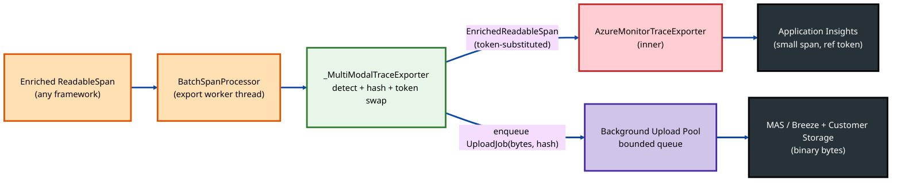
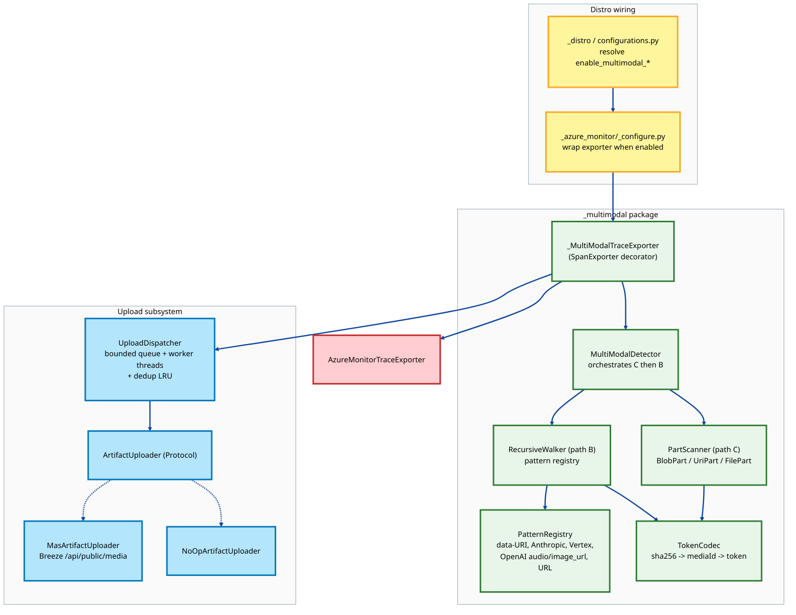
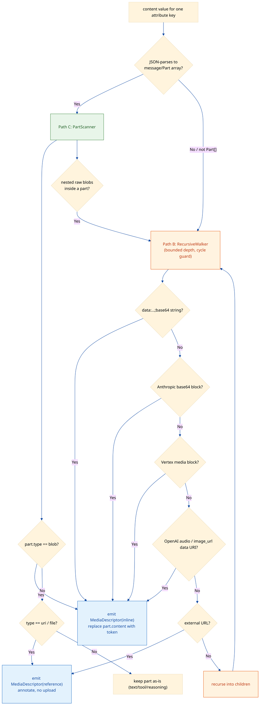

# Multi-Modal Content Detection — Detailed Design

> **Companion documents**
>
> - [hld-multi-modality-detection.md](hld-multi-modality-detection.md) — high-level approach exploration; selects the **normalize-first (C) + recursive-walk (B)** hybrid detector. This document turns that recommendation into an implementable design.
> - [app-insights-multi-modal-store.md](app-insights-multi-modal-store.md) — the Multi-Modal Artifact Store (MAS) / Breeze upload contract, reference-token format, dedup scheme, and storage model that this SDK design produces references for.
> - [AzureMonitor_Integration-Design.md](AzureMonitor_Integration-Design.md) — the Azure Monitor trace pipeline this design plugs into.
> - [Gen_AI_Integration-Design.md](Gen_AI_Integration-Design.md) — how every supported agent framework converges onto a single `gen_ai.*` span stream.
> - [otel-gen-ai-semantic-conventions.md](otel-gen-ai-semantic-conventions.md) — the `Part[]` data model and the sensitive-content recording hook this design implements.

This document specifies how the Microsoft OpenTelemetry Distro for Python detects non-text media (image, audio, video, PDF) inside GenAI span content, replaces inline binary with a reference token, and hands the bytes to the Multi-Modal Artifact Store — **primarily on the Azure Monitor / Application Insights export path**, and **uniformly across every supported agent framework** (Microsoft Agent Framework, Semantic Kernel, LangChain, OpenAI Agents SDK, the raw OpenAI v2 client, and the manual A365 Scope API).

---

## Table of Contents

1. [Scope and Goals](#1-scope-and-goals)
2. [Design Decisions (Confirmed)](#2-design-decisions-confirmed)
3. [Where Detection Attaches on the Azure Monitor Path](#3-where-detection-attaches-on-the-azure-monitor-path)
4. [Component Architecture](#4-component-architecture)
5. [Content Targets — What the Detector Scans](#5-content-targets--what-the-detector-scans)
6. [The Detector Core — Normalize-First with Recursive-Walk Fallback](#6-the-detector-core--normalize-first-with-recursive-walk-fallback)
7. [Media Descriptor and Reference Token](#7-media-descriptor-and-reference-token)
8. [The Exporter Decorator — Sync Detection, Async Upload](#8-the-exporter-decorator--sync-detection-async-upload)
9. [The Artifact Uploader Interface](#9-the-artifact-uploader-interface)
10. [Framework Coverage — Why a Single Component Works for All](#10-framework-coverage--why-a-single-component-works-for-all)
11. [Configuration Surface](#11-configuration-surface)
12. [Concurrency, Performance, and Failure Modes](#12-concurrency-performance-and-failure-modes)
13. [Privacy and Security](#13-privacy-and-security)
14. [Module Layout and File Plan](#14-module-layout-and-file-plan)
15. [Implementation Phases](#15-implementation-phases)
16. [Testing Strategy](#16-testing-strategy)
17. [Open Questions](#17-open-questions)
18. [References](#18-references)

---

## 1. Scope and Goals

### Goals

- **Detect** inline binary media and external media references inside the GenAI content attributes of every span on the Azure Monitor export path.
- **Extract, hash (SHA-256), and enqueue** inline binaries for out-of-band upload to the Multi-Modal Artifact Store, replacing the inline bytes with a stable reference token so the span stays small.
- **Record** external references (URLs, provider file IDs) on the span without uploading.
- Work **identically for all supported agent frameworks** by attaching at a single framework-agnostic point in the pipeline.
- Run **independently of the content-capture opt-in flag** (`enable_sensitive_data` / `OTEL_INSTRUMENTATION_GENAI_CAPTURE_MESSAGE_CONTENT`), per the OTel GenAI sensitive-content hook contract, while remaining **off by default** behind its own opt-in.
- Keep the agent request thread unaffected — detection and hashing run on the export worker thread; network upload runs on a dedicated background pool.
- Never block or fail span export: any detector or uploader error degrades to forwarding the original span unchanged.

### Non-Goals (v1)

- Server-side concerns (MAS, Breeze, storage provisioning, portal rendering) — owned by [app-insights-multi-modal-store.md](app-insights-multi-modal-store.md).
- Transcoding, thumbnailing, content moderation, or PII redaction of media.
- Detection on the metrics or live-metrics pipelines.
- Detection inside GenAI **events / log records** (e.g. the LangChain event logger). The architecture leaves a clean seam for this (see [§17](#17-open-questions)) but v1 covers **span attributes only**, per the confirmed scope.
- Replacing the A365 export path's existing enricher behavior. A365 reuse is described as a follow-up in [§10.3](#103-a365-and-other-export-paths).

---

## 2. Design Decisions (Confirmed)

| # | Decision | Choice |
|---|---|---|
| D1 | Detector strategy | Normalize-first (`Part[]`) primary path + Langfuse-style recursive walk fallback — the [HLD](hld-multi-modality-detection.md) recommendation. |
| D2 | AM integration mechanism | **Exporter decorator** wrapping `AzureMonitorTraceExporter`. Single point of control, framework-agnostic, runs off the app thread. |
| D3 | Signal scope (v1) | **Span attributes only** — `gen_ai.input.messages`, `gen_ai.output.messages`, `gen_ai.system_instructions`, `gen_ai.tool.call.arguments`, `gen_ai.tool.call.result`, plus the legacy flattened `gen_ai.prompt.*` / `gen_ai.completion.*` content keys. |
| D4 | Azure Monitor view transform | **Strip bytes + substitute reference token** for inline binaries. External URLs / file IDs recorded as-is, no upload. |
| D5 | Activation | New opt-in kwarg `enable_multimodal_artifact_store` (+ env var), **default OFF**. Requires `enable_azure_monitor=True`. Independent of content-capture flags. |
| D6 | Artifact store contract | Pluggable `ArtifactUploader` protocol. v1 ships a concrete `MasArtifactUploader` against the Breeze `/api/public/media` contract and a `NoOpArtifactUploader` for dev/tests. Reference tokens are computed synchronously from the content hash; byte upload is asynchronous. |
| D7 | Deliverable | This design document. No code changes in this pass. |

---

## 3. Where Detection Attaches on the Azure Monitor Path

The Azure Monitor trace pipeline is built in [`_setup_tracing`](src/microsoft/opentelemetry/_azure_monitor/_configure.py#L154). The relevant tail today is:

```python
# src/microsoft/opentelemetry/_azure_monitor/_configure.py  (current)
trace_exporter = AzureMonitorTraceExporter(**configurations)
bsp = BatchSpanProcessor(trace_exporter)
tracer_provider.add_span_processor(bsp)
```

Spans reach this point already carrying canonical `gen_ai.*` attributes, because:

- `GenAIMainAgentSpanProcessor` and any user/OTLP/A365 processors are registered earlier in `configurations[SPAN_PROCESSORS_ARG]` (see [_distro.py](src/microsoft/opentelemetry/_distro.py)).
- Every framework's instrumentor + enricher has already normalized its content onto the shared `gen_ai.*` schema (see [Gen_AI_Integration-Design.md §5](Gen_AI_Integration-Design.md)).

The detector wraps **the exporter**, not the processor, so it sees the fully-enriched `ReadableSpan` just before it is serialized to the wire:

```python
# proposed
trace_exporter = AzureMonitorTraceExporter(**configurations)
if multimodal_enabled:
    trace_exporter = _MultiModalTraceExporter(
        inner=trace_exporter,
        detector=detector,
        uploader=uploader,
        config=mm_config,
    )
bsp = BatchSpanProcessor(trace_exporter)
tracer_provider.add_span_processor(bsp)
```

**Why the exporter decorator (D2):**

- `BatchSpanProcessor.export()` runs on its **own background worker thread**, not the agent request thread — so detection + hashing cost is already off the hot path without any extra threading.
- It is the *last* mutation point before the AM wire format, so the token replacement is guaranteed to be what Application Insights stores.
- A `ReadableSpan` is immutable after end; the decorator produces an `EnrichedReadableSpan` overlay (already used by the A365 enricher path — see [enriched_span.py](src/microsoft/opentelemetry/a365/core/exporters/enriched_span.py)) that **overrides** the content attribute keys with the token-substituted JSON, without mutating the original object. Other exporters in the fan-out (OTLP, Console, A365) keep their own view.
- A single decorator covers every framework because all content has already converged onto `gen_ai.*`.



---

## 4. Component Architecture

Detection is delivered as a self-contained subsystem under `src/microsoft/opentelemetry/_multimodal/`, deliberately decoupled from any single framework or exporter.



| Component | Responsibility |
|---|---|
| `_MultiModalTraceExporter` | `SpanExporter` decorator. For each span: select content attributes, run the detector, build the token-substituted `EnrichedReadableSpan`, enqueue upload jobs, delegate to the inner exporter. Owns `shutdown()`/`force_flush()` fan-out. |
| `MultiModalDetector` | Pure, stateless orchestrator. Given one content value, returns a `DetectionResult` (rewritten content + list of `MediaDescriptor`). Tries path C, then path B. No I/O. |
| `PartScanner` (path C) | Scans a parsed `Part[]` array for `BlobPart` / `UriPart` / `FilePart`. The fast, provider-agnostic primary path. |
| `RecursiveWalker` (path B) | Bounded-depth, cycle-guarded walk of arbitrary dict/list/str payloads, applying the ordered `PatternRegistry`. Fallback when content is not normalized `Part[]` (raw provider shapes, legacy flattened keys, tool-call JSON). |
| `PatternRegistry` | Ordered, extensible list of structural matchers (data-URI string, Anthropic base64 block, Vertex media block, OpenAI `input_audio`/`image_url` data URI, external URL). New providers add a pattern entry, not a parser. |
| `TokenCodec` | Computes `sha256`, derives `mediaId = base64url(sha256)[:22]`, and formats/parses the `@@@artifact:...@@@` reference token. |
| `ArtifactUploader` | Protocol: `register_and_upload(MediaDescriptor) -> None`. Decouples the SDK from the wire contract. |
| `UploadDispatcher` | Bounded queue + worker thread pool. Per-process dedup LRU keyed by `sha256`. Backoff, circuit-breaker, drop-oldest-on-overflow with metrics. |

---

## 5. Content Targets — What the Detector Scans

For each span, the decorator inspects a fixed set of attribute keys. Two attribute families coexist because the distro spans a transitional convention surface (see [Gen_AI_Integration-Design.md §6](Gen_AI_Integration-Design.md) and [otel-gen-ai-semantic-conventions.md](otel-gen-ai-semantic-conventions.md)):

### 5.1 Structured convention (primary — path C eligible)

These carry a JSON-serialized `Part[]`/message array and are emitted by Agent Framework, Semantic Kernel, LangChain, OpenAI Agents (A365 mode), and the A365 Scope API:

| Attribute key | Constant | Shape |
|---|---|---|
| `gen_ai.input.messages` | `GEN_AI_INPUT_MESSAGES_KEY` | `ChatMessage[]` with `parts[]` |
| `gen_ai.output.messages` | `GEN_AI_OUTPUT_MESSAGES_KEY` | `OutputMessage[]` with `parts[]` |
| `gen_ai.system_instructions` | `GEN_AI_SYSTEM_INSTRUCTIONS_KEY` | `Part[]` |
| `gen_ai.tool.call.arguments` | `GEN_AI_TOOL_ARGS_KEY` | arbitrary JSON (path B only) |
| `gen_ai.tool.call.result` | `GEN_AI_TOOL_CALL_RESULT_KEY` | arbitrary JSON (path B only) |

The `Part[]` dataclasses already exist in the codebase at [a365/core/models/messages.py](src/microsoft/opentelemetry/a365/core/models/messages.py) (`BlobPart`, `UriPart`, `FilePart`, `Modality`, …). The detector reuses these definitions as the path-C target schema rather than redefining them.

### 5.2 Legacy flattened convention (fallback — path B only)

The upstream `opentelemetry-instrumentation-openai-v2` instrumentation (used when no higher-level framework is active) emits indexed string attributes. Inline data URIs can appear verbatim in these strings:

| Attribute key pattern | Notes |
|---|---|
| `gen_ai.prompt.{i}.content` | String; may contain a `data:` URI or a stringified provider block. |
| `gen_ai.completion.{i}.content` | Same. |

These are matched by prefix scan and routed straight to path B.

### 5.3 Tool-call content

`gen_ai.tool.call.arguments` and `gen_ai.tool.call.result` are arbitrary JSON, not `Part[]`. A tool returning a base64 image embeds it in a structure no normalizer covers, so these always use path B (recursive walk). This is exactly the gap the HLD identifies and the fallback closes.

---

## 6. The Detector Core — Normalize-First with Recursive-Walk Fallback

The detector is a pure function over a single content value. It never performs I/O; it returns the rewritten value and a list of descriptors that the decorator acts on.



### 6.1 Path C — `PartScanner` (primary)

1. Attempt `json.loads` of the attribute value. If it is a list of message objects each carrying a `parts` array (or a bare `Part[]` for `system_instructions`), path C applies.
2. For each part, branch on `type`:
   - `blob` → inline binary. Read `content` (base64), `modality`, optional `mime_type`. Emit an **inline** `MediaDescriptor`. Replace the part's `content` field with the reference token; retain `modality`/`mime_type`.
   - `uri` → external reference. Emit a **reference** descriptor (record-only). Leave the part untouched (URL preserved for portal rendering); optionally add indexed `microsoft.artifact.ref.*` attributes.
   - `file` → provider file reference. Emit a **reference** descriptor keyed by `file_id`. Record-only.
   - any other (`text`, `reasoning`, `tool_call`, …) → skipped, **except** a defensive nested-walk: if a part contains a raw nested blob the SDK did not normalize, fall through to path B for that part subtree.
3. Re-serialize the rewritten array back to a JSON string for the overridden attribute value.

Path C is trivial, fast, and provider-agnostic — exactly three shapes to match.

### 6.2 Path B — `RecursiveWalker` (fallback)

Triggered when (a) the value is not JSON, (b) it is JSON but not a `Part[]`/message array (raw provider shape, legacy flattened string, arbitrary tool JSON), or (c) a path-C part contained an un-normalized nested blob.

Mirrors the Langfuse-proven model: bounded depth (default 10), circular-reference guard (visited-id set), ordered first-match-wins pattern list. The initial `PatternRegistry`:

| Order | Pattern | Classification | MIME source |
|---|---|---|---|
| 1 | `data:{mime};base64,{...}` string | inline | data-URI prefix |
| 2 | `{"type":"base64","media_type":...,"data":...}` (Anthropic) | inline | `media_type` |
| 3 | `{"type":"media","mime_type":...,"data":...}` (Vertex/Gemini) | inline | `mime_type` |
| 4 | `{"type":"image_url","image_url":{"url":"data:..."}}` (OpenAI vision) | inline | data-URI prefix |
| 5 | `{"type":"input_audio","input_audio":{"data":...,"format":...}}` / response `audio.data` (OpenAI audio) | inline | `format` → MIME |
| 6 | string/dict carrying `https://…` or `gs://…` or provider `file_id` | reference | URL extension / declared |

On an inline match, the matched node's data field is replaced **in place** in the (deep-copied) structure with the reference token; the original walk subtree is otherwise preserved. New providers are added as new entries — no new parser, no new hook. This keeps the provider-extensibility cost at "one pattern" as the HLD scores it.

### 6.3 Detector output

```text
DetectionResult = {
    rewritten_value: str | None,        # token-substituted JSON; None if unchanged
    descriptors: list[MediaDescriptor], # one per detected media node
}
```

`rewritten_value is None` is the fast no-media path — the decorator forwards the original attribute untouched.

---

## 7. Media Descriptor and Reference Token

### 7.1 MediaDescriptor

```text
MediaDescriptor = {
    kind: "inline" | "reference",
    # inline only:
    raw_bytes: bytes | None,            # decoded payload (kept only until enqueued)
    sha256: str | None,
    media_id: str | None,              # base64url(sha256)[:22]
    # both:
    modality: "image" | "audio" | "video" | None,
    mime_type: str | None,             # e.g. image/png
    content_length: int | None,
    # reference only:
    uri: str | None,                   # external URL / gs:// / file_id
    # provenance (for indexed span attrs + MAS junction):
    attribute_key: str,                # which gen_ai.* attribute it came from
    field_index: int,                  # ordinal within that attribute
}
```

### 7.2 Reference token

Matches the format mandated by the artifact store HLD ([app-insights-multi-modal-store.md](app-insights-multi-modal-store.md)):

```text
@@@artifact:{namespace}/{mediaId}/{sha256}/{contentType}@@@
```

- `namespace` — `azmon` for the Azure Monitor path (allows future per-backend namespaces).
- `mediaId` — `base64url(sha256)[:22]`, the same dedup key MAS uses.
- The token is **opaque to non-AI consumers**; the Application Insights blade detects and resolves it.

The token is computed **synchronously** in the decorator from the content hash — it does **not** depend on the upload completing. The portal shows "pending" until the byte upload lands, exactly as the store HLD's failure-mode table describes.

### 7.3 Optional indexed reference attributes

To let the portal extract references without re-parsing message JSON, the decorator may also stamp (configurable, off by default to conserve the span attribute budget):

| Attribute | Example |
|---|---|
| `microsoft.artifact.ref.{n}.media_id` | `7f3e…` |
| `microsoft.artifact.ref.{n}.content_type` | `image/png` |
| `microsoft.artifact.ref.{n}.content_length` | `124380` |
| `microsoft.artifact.ref.{n}.sha256` | `9b3a…` |
| `microsoft.artifact.ref.{n}.modality` | `image` |

Per open question §9 in the store HLD, these may later be aggregated into a single `microsoft.artifact.refs` JSON attribute; the descriptor model already carries everything needed for either layout.

---

## 8. The Exporter Decorator — Sync Detection, Async Upload

`_MultiModalTraceExporter` implements `opentelemetry.sdk.trace.export.SpanExporter`.

```text
def export(self, spans):
    out = []
    for span in spans:
        attrs = span.attributes or {}
        overrides = {}          # attribute_key -> rewritten JSON
        index_attrs = {}        # optional microsoft.artifact.ref.* attrs
        for key in self._target_keys_present(attrs):
            result = self._detector.detect(key, attrs[key])
            if result.rewritten_value is not None:
                overrides[key] = result.rewritten_value
            for d in result.descriptors:
                if d.kind == "inline":
                    self._dispatcher.enqueue(d, trace_ctx=span.context)
                index_attrs.update(self._index_attrs_for(d))
        if overrides or index_attrs:
            span = EnrichedReadableSpan(
                span,
                extra_attributes={**overrides, **index_attrs},
            )
        out.append(span)
    return self._inner.export(out)
```

Key properties:

- **Wrap, never mutate** — reuses the existing `EnrichedReadableSpan` ([enriched_span.py](src/microsoft/opentelemetry/a365/core/exporters/enriched_span.py)); `extra_attributes` override the original content keys via its `attributes` merge. The original span is untouched for any other exporter in the fan-out.
- **Detection + hashing are synchronous** but run on the `BatchSpanProcessor` worker thread, never on the agent request thread — satisfying the latency goal without an extra hashing thread.
- **Upload is asynchronous** — `enqueue()` is non-blocking; on a full queue it drops the oldest job and increments a metric. The span still carries the token regardless of upload outcome.
- **Never breaks export** — the entire per-span body is wrapped in try/except; on any error the original span is appended unchanged, mirroring the enricher's existing "enrichment never blocks export" guarantee.
- **`shutdown()` / `force_flush()`** drain the dispatcher (bounded by a timeout) and then delegate to the inner exporter.

### 8.1 Inline-size bypass

Before extraction, the decoded byte length is compared to `multimodal_max_inline_bytes` (default 4096). Payloads at or below the threshold are left inline (no hash, no upload, no token) — tiny icons and short audio clips skip the artifact pipeline entirely, matching the store HLD's performance guidance.

---

## 9. The Artifact Uploader Interface

The SDK is decoupled from the wire contract by a protocol so the MAS implementation, tests, and future stores are interchangeable (D6).

```text
class ArtifactUploader(Protocol):
    def register_and_upload(self, descriptor: MediaDescriptor) -> None: ...
    def shutdown(self, timeout_millis: int = 30000) -> bool: ...
```

### 9.1 `MasArtifactUploader`

Implements the upload path from [app-insights-multi-modal-store.md](app-insights-multi-modal-store.md):

1. `POST /api/public/media` with `{sha256, contentType, contentLength, traceId, field}` and the AM auth (connection string / iKey / AAD bearer — reuse the resolved Azure Monitor credential).
2. On `200 {mediaId, uploadUrl}` with a non-null `uploadUrl`: `PUT` the bytes to the returned user-delegation SAS URL with `x-ms-blob-content-type` and `Content-Length`.
3. `PATCH /api/public/media/{mediaId}` with `{uploadedAt, status: Uploaded, ms}`.
4. On dedup hit (`uploadUrl: null`): skip the PUT; the span reference already resolves.
5. On `404 ArtifactStoreNotEnabled`: drop the job, log once, increment `multimodal.upload.dropped`, and (per config) fall back to truncated inline on future spans.

Connection-string parsing, endpoint resolution, and credential acquisition reuse the exporter stack already wired in [AzureMonitor_Integration-Design.md §5](AzureMonitor_Integration-Design.md); the uploader does not re-implement auth.

### 9.2 `NoOpArtifactUploader`

Computes nothing on the wire; used in unit tests and when the feature is enabled without a reachable MAS (still performs token substitution so span-shape tests are deterministic).

### 9.3 `UploadDispatcher`

| Concern | Mechanism |
|---|---|
| Non-blocking enqueue | Bounded `queue.Queue(maxsize=multimodal_upload_queue_size)`; `put_nowait`, drop-oldest on `Full`. |
| Worker pool | `multimodal_upload_workers` daemon threads draining the queue. |
| Dedup | Per-process LRU keyed by `sha256`; a hash already seen this process is not re-enqueued. |
| Backoff | Exponential (1s, 2s, 4s, max 3 retries) + jitter; circuit-breaker on `429`/`503`. |
| Metrics | `multimodal.upload.succeeded` / `.failed` / `.dropped` / `.dedup_hit` counters and an `multimodal.upload.latency` histogram. |
| Lifecycle | `shutdown()` stops accepting, drains within timeout, joins workers. |

---

## 10. Framework Coverage — Why a Single Component Works for All

### 10.1 Convergence guarantees coverage

By the time a span reaches the exporter decorator, every supported framework has already mapped its content onto the shared `gen_ai.*` attributes (the "convergence" property documented in [Gen_AI_Integration-Design.md §2 and §5](Gen_AI_Integration-Design.md)). The decorator therefore needs **zero per-framework code** — it reads the same attribute keys regardless of origin.

| Framework | How content arrives at the decorator | Detector path |
|---|---|---|
| Microsoft Agent Framework | AF SDK emits `gen_ai.input.messages` / `gen_ai.output.messages` (`Part[]`), enriched by [`_span_enricher.py`](src/microsoft/opentelemetry/_agent_framework/_span_enricher.py). | C (B for tool JSON) |
| Semantic Kernel | `SemanticKernelSpanProcessor` + enricher emit the same structured keys. | C (B for tool JSON) |
| LangChain | `LangChainTracer` emits structured input/output messages. | C, with B fallback for provider-native blocks LangChain passes through. |
| OpenAI Agents SDK (A365 mode) | A365 processor emits structured per-message attributes. | C / B |
| OpenAI client v2 (raw) | Upstream instrumentor emits **legacy flattened** `gen_ai.prompt.*` / `gen_ai.completion.*` strings. | B (data-URI / provider-block patterns) |
| A365 Scope API (manual) | `InvokeAgentScope` / `InferenceScope` emit the same `gen_ai.*` keys. | C / B |

This is the central payoff of attaching at the export boundary rather than inside instrumentations: provider/framework diversity is absorbed upstream, and detection is uniform downstream — matching the HLD's "single component, not distributed across instrumentations" decision for Phase 2.

### 10.2 Provider shapes covered by the fallback

The `PatternRegistry` ([§6.2](#62-path-b--recursivewalker-fallback)) covers OpenAI vision/audio, Anthropic base64 blocks, Vertex/Gemini inline data, raw data-URI strings, and external URLs / file IDs — the same matrix the HLD coverage table enumerates. Foundry file-search file refs and video-generation job handles are added as new pattern entries when those surfaces ship.

### 10.3 A365 and other export paths

The decorator is exporter-agnostic by construction. Although v1 wires it only into the Azure Monitor exporter (per the confirmed primary scope), the same `_MultiModalTraceExporter` can later wrap the OTLP exporter, and the detector can be invoked from inside `_EnrichingBatchSpanProcessor` for the A365 path so the A365 view also carries reference tokens. No detector changes are required — only additional wiring. This is called out as a follow-up, not v1.

---

## 11. Configuration Surface

New public kwargs on `use_microsoft_opentelemetry(...)`, each with an environment-variable fallback (kwargs win), threaded through `_get_configurations` ([configurations.py](src/microsoft/opentelemetry/_azure_monitor/_utils/configurations.py)) and consumed in [`_setup_tracing`](src/microsoft/opentelemetry/_azure_monitor/_configure.py#L154). All are **off / defaulted** so existing behavior is unchanged.

| Kwarg | Env var | Default | Effect |
|---|---|---|---|
| `enable_multimodal_artifact_store` | `ENABLE_MULTIMODAL_ARTIFACT_STORE` | `False` | Master switch. No-op unless `enable_azure_monitor=True`. Independent of `enable_sensitive_data`. |
| `multimodal_max_inline_bytes` | `MULTIMODAL_MAX_INLINE_BYTES` | `4096` | Payloads ≤ this stay inline (no upload). |
| `multimodal_supported_types` | `MULTIMODAL_SUPPORTED_TYPES` | `["image/*","audio/*","video/*","application/pdf"]` | MIME allow-list; other types are left inline. |
| `multimodal_upload_workers` | `MULTIMODAL_UPLOAD_WORKERS` | `2` | Background upload thread count. |
| `multimodal_upload_queue_size` | `MULTIMODAL_UPLOAD_QUEUE_SIZE` | `512` | Bounded queue capacity (drop-oldest on overflow). |
| `multimodal_max_artifact_bytes` | `MULTIMODAL_MAX_ARTIFACT_BYTES` | `26214400` (25 MB) | Upper bound per artifact (v1 single PUT); larger is left inline-truncated or dropped per `multimodal_oversize_policy`. |
| `multimodal_emit_index_attributes` | `MULTIMODAL_EMIT_INDEX_ATTRIBUTES` | `False` | Emit `microsoft.artifact.ref.*` indexed attributes ([§7.3](#73-optional-indexed-reference-attributes)). |
| `multimodal_disabled_store_policy` | `MULTIMODAL_DISABLED_STORE_POLICY` | `"truncate"` | When MAS returns 404 / store off: `truncate` \| `drop` \| `inline`. |
| `multimodal_artifact_uploader` | — | `MasArtifactUploader` | Advanced: inject a custom `ArtifactUploader` (e.g. `NoOpArtifactUploader` in tests). |

Wiring follows the established `_AZURE_MONITOR_KWARG_MAP` / `_get_configurations` precedence pattern already used for every other distro kwarg, so resolution and override semantics are consistent with the rest of the surface.

---

## 12. Concurrency, Performance, and Failure Modes

### 12.1 Threading model

| Stage | Thread | Cost profile |
|---|---|---|
| Agent request | app thread | **Zero** added cost — detection happens later at export. |
| Detect + hash + token swap | `BatchSpanProcessor` export worker | O(payload size) for base64 decode + SHA-256; bypassed for sub-threshold and no-media spans. |
| Register + PUT + PATCH | `UploadDispatcher` worker pool | Network-bound; fully decoupled from trace export SLA. |

### 12.2 Failure handling (degradation ladder)

| Failure | Behavior |
|---|---|
| Detector raises | Per-span try/except → forward original span unchanged. |
| JSON parse fails on a structured key | Fall back to path B on the raw string; if still no match, leave untouched. |
| Queue full | Drop-oldest, increment `multimodal.upload.dropped`; span keeps the token (portal shows pending/failed). |
| MAS `POST` 5xx | Backoff + retry; on exhaustion, mark failed, increment `multimodal.upload.failed`. Span already exported with token. |
| Storage SAS expired/403 | Re-request SAS once; else `PATCH status=SasExpired`. |
| Store not enabled (404) | Apply `multimodal_disabled_store_policy`; log once. |
| Hash collision (theoretical) | SHA-256 + `contentLength` check at MAS; negligible. |

The invariant: **the trace always exports**; artifact availability is best-effort and asynchronous.

### 12.3 Performance safeguards

- Inline-size bypass ([§8.1](#81-inline-size-bypass)) avoids hashing tiny payloads.
- Per-process dedup LRU avoids re-uploading and re-hashing the same content seen across many spans (e.g. a system image repeated every turn). An object-identity cache short-circuits repeated parts before hashing.
- Lazy imports of the crypto and HTTP client keep cold-start cost out of the common (feature-off) path.
- The decorator only constructs an `EnrichedReadableSpan` when something actually changed — no-media spans pass through with no allocation.

---

## 13. Privacy and Security

- **Opt-in and decoupled.** The feature is off by default and gated by its own flag. It runs **independently** of `enable_sensitive_data`, honoring the OTel GenAI contract that the upload hook "runs independently of the opt-in flags" ([otel-gen-ai-semantic-conventions.md — recording sensitive multimodal content](otel-gen-ai-semantic-conventions.md)). Enabling it is a deliberate operator choice.
- **Data sovereignty.** Bytes go to the **customer-owned** storage account in the customer subscription/region via MAS; only a small reference token transits the trace pipeline to Application Insights ([app-insights-multi-modal-store.md](app-insights-multi-modal-store.md)).
- **No content inspection beyond detection.** The SDK does not classify or redact PII; redaction remains the customer's responsibility, identical to today's text behavior.
- **Tool-call content.** Because tool arguments/results can carry media, they are scanned too — but the same token-substitution applies, so raw binaries never sit inline on the AM span.
- **Injection awareness.** The detector treats all payload content as untrusted data: pattern matching is structural (type/field shape), bytes are never executed or interpolated into commands, and the reference token is a fixed, parser-anchored format that cannot smuggle attributes (it replaces a value, never an attribute key).
- **Bounded resource use.** Depth limit, cycle guard, bounded queue, size caps, and worker-pool limits prevent a malicious or pathological payload from exhausting memory or threads.

---

## 14. Module Layout and File Plan

New package, isolated from framework code so it can be unit-tested without any provider SDK:

```text
src/microsoft/opentelemetry/_multimodal/
    __init__.py
    _config.py            # MultiModalConfig dataclass + resolution helpers
    _constants.py         # attribute key sets, token namespace, defaults
    _detector.py          # MultiModalDetector (orchestrates C then B)
    _part_scanner.py      # path C — Part[] scan (reuses a365.core.models.messages)
    _walker.py            # path B — RecursiveWalker (depth + cycle guard)
    _patterns.py          # PatternRegistry + built-in provider patterns
    _descriptor.py        # MediaDescriptor dataclass
    _token.py             # TokenCodec (sha256 -> mediaId -> token; parse)
    _exporter.py          # _MultiModalTraceExporter (SpanExporter decorator)
    _uploader.py          # ArtifactUploader protocol, MasArtifactUploader, NoOpArtifactUploader
    _dispatcher.py        # UploadDispatcher (queue + workers + dedup + backoff)
```

Touch points in existing files:

| File | Change |
|---|---|
| [_constants.py](src/microsoft/opentelemetry/_constants.py) | Add `ENABLE_MULTIMODAL_ARTIFACT_STORE_ARG` and the `multimodal_*` kwarg/env constants. |
| [_azure_monitor/_utils/configurations.py](src/microsoft/opentelemetry/_azure_monitor/_utils/configurations.py) | Resolve the new kwargs/env into `configurations`. |
| [_azure_monitor/_configure.py](src/microsoft/opentelemetry/_azure_monitor/_configure.py#L154) | In `_setup_tracing`, wrap `AzureMonitorTraceExporter` with `_MultiModalTraceExporter` when enabled. |
| [_distro.py](src/microsoft/opentelemetry/_distro.py) | Pop/forward the new kwargs; document them in the `use_microsoft_opentelemetry` docstring. |

No changes to any framework instrumentor, enricher, or span processor — coverage is inherited from convergence.

---

## 15. Implementation Phases

| Phase | Deliverable | Exit criteria |
|---|---|---|
| **P1 — Detector core** | `_detector`, `_part_scanner`, `_walker`, `_patterns`, `_descriptor`, `_token`. Pure, no I/O. | Unit tests pass for every shape in the [HLD coverage matrix](hld-multi-modality-detection.md); deterministic tokens. |
| **P2 — Exporter decorator + NoOp** | `_exporter`, `_uploader` (protocol + NoOp), `_dispatcher`. | AM spans carry tokens with `NoOpArtifactUploader`; original bytes stripped; non-media spans untouched; export never breaks. |
| **P3 — Config wiring** | `_config`, constants, `configurations.py`, `_configure.py`, `_distro.py` docstring. | `enable_multimodal_artifact_store=True` end-to-end with NoOp; all flags resolve via kwarg/env precedence. |
| **P4 — MAS uploader** | `MasArtifactUploader` against Breeze `/api/public/media` (+ PUT + PATCH), dedup, backoff, metrics. | Integration test against a MAS stub: register → upload → patch → dedup-hit; failure ladder verified. |
| **P5 — Hardening & follow-ups** | Size caps, oversize policy, index attributes, metrics dashboards. A365/OTLP wiring tracked separately. | Performance budget met; failure-mode tests green. |

---

## 16. Testing Strategy

- **Detector unit tests** (`tests/multimodal/test_detector.py`): one case per pattern and per `Part` type; nested tool-call media; legacy flattened keys; cycle/depth guards; no-media fast path; deterministic token/`mediaId`.
- **Exporter tests** (`test_exporter.py`): assert the inner exporter receives an `EnrichedReadableSpan` whose `gen_ai.*` content has tokens and no base64; assert the original span object is unmutated (fan-out safety); assert detector/uploader exceptions never drop the span.
- **Dispatcher tests** (`test_dispatcher.py`): queue overflow drop-oldest + metric; dedup LRU; backoff/circuit-breaker; shutdown drain.
- **MAS uploader tests** (`test_uploader.py`): mocked Breeze for register/PUT/PATCH, dedup `uploadUrl: null`, 404 store-disabled policy, SAS-expired re-request.
- **Per-framework integration** (extend existing suites such as [test_agent_framework_integration.py](tests/test_agent_framework_integration.py), [test_langchain_integration.py](tests/test_langchain_integration.py), [test_openai_integration.py](tests/test_openai_integration.py)): feed a multimodal payload through each framework with the feature on and a NoOp uploader; assert the AM-bound span carries a reference token and no inline binary, proving convergence coverage.
- **Privacy regression**: feature off → spans byte-for-byte identical to today; feature on but `enable_sensitive_data` off → detection still runs (decoupling verified).

---

## 17. Open Questions

1. **Events / log records (v2 scope).** LangChain and the inference-details event emit content as log records, not span attributes. v1 covers spans only; should v2 add a `LogRecordProcessor` decorator that reuses the same `MultiModalDetector`? (Architecture already allows it — `_detector` is signal-agnostic.)
2. **A365 view tokens.** Should the A365 export path also carry reference tokens (invoke the detector inside `_EnrichingBatchSpanProcessor`), or keep A365 on its current enricher-only behavior? Affects whether binaries are stripped on the A365 wire too.
3. **Cross-tenant agents.** Foundry / A365 agents may run in a different tenant than the AI resource. Which credential mints the SAS — calling tenant or resource tenant? Aligns with the `a365_token_resolver` model and store HLD open question §3.
4. **Oversize media (>25 MB).** v1 leaves oversize payloads inline-truncated or dropped. Block-blob multi-part upload (streaming `UploadJob`) is deferred — confirm v1 ceiling.
5. **Index attribute layout.** Per-ref indexed attributes vs. a single aggregated `microsoft.artifact.refs` JSON attribute (store HLD open question §9). The descriptor model supports both; pick one before GA.
6. **Token versioning.** Adopt `@@@artifact:v2:...@@@` from day one to allow signed/encrypted references later (store HLD open question §8)?
7. **Disabled-store fallback default.** `truncate` vs `drop` vs `inline` when the artifact store is not provisioned (store HLD open question §2) — confirm the default `truncate`.

---

## 18. References

- [hld-multi-modality-detection.md](hld-multi-modality-detection.md) — approach exploration and recommendation (C + B hybrid).
- [app-insights-multi-modal-store.md](app-insights-multi-modal-store.md) — MAS upload contract, token format, dedup, storage model, failure modes.
- [otel-gen-ai-semantic-conventions.md](otel-gen-ai-semantic-conventions.md) — `Part[]` model and sensitive-content recording hook.
- [Gen_AI_Integration-Design.md](Gen_AI_Integration-Design.md) — framework convergence onto `gen_ai.*`; enricher/overlay pipeline.
- [AzureMonitor_Integration-Design.md](AzureMonitor_Integration-Design.md) — AM trace pipeline, exporter construction, credentials.
- Source touch points:
  - [src/microsoft/opentelemetry/_azure_monitor/_configure.py](src/microsoft/opentelemetry/_azure_monitor/_configure.py#L154) — `_setup_tracing` (exporter wrap site).
  - [src/microsoft/opentelemetry/a365/core/exporters/enriched_span.py](src/microsoft/opentelemetry/a365/core/exporters/enriched_span.py) — `EnrichedReadableSpan` overlay.
  - [src/microsoft/opentelemetry/a365/core/models/messages.py](src/microsoft/opentelemetry/a365/core/models/messages.py) — reused `Part[]` data model.
  - [src/microsoft/opentelemetry/a365/constants.py](src/microsoft/opentelemetry/a365/constants.py) — `gen_ai.*` content attribute keys.
  - [src/microsoft/opentelemetry/_constants.py](src/microsoft/opentelemetry/_constants.py) — distro kwarg/env constants.
