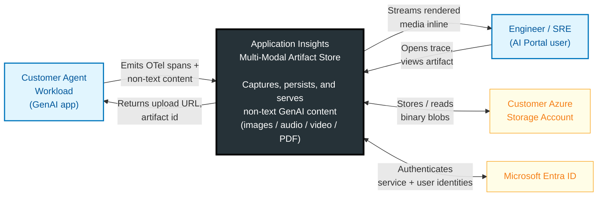
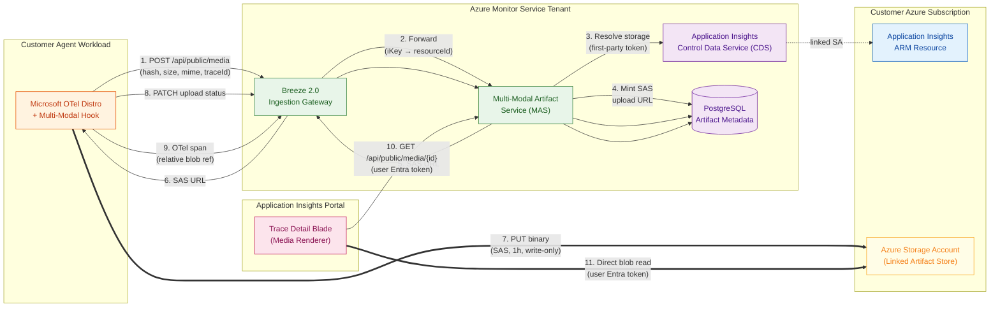
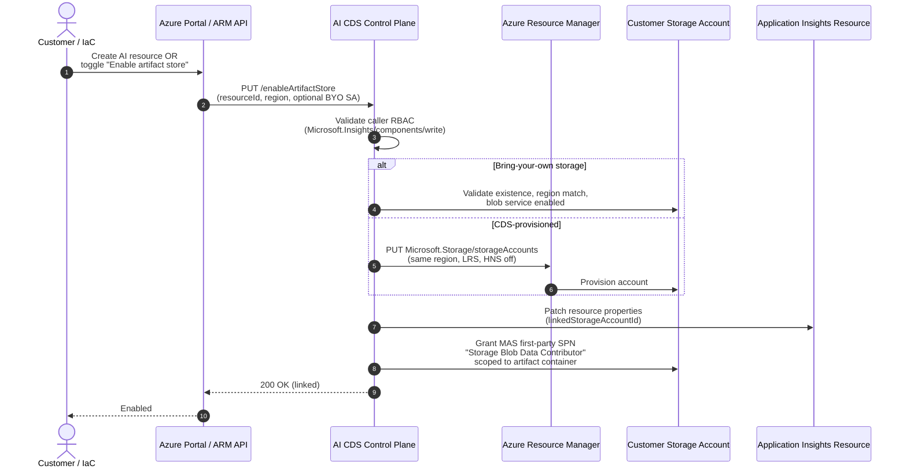
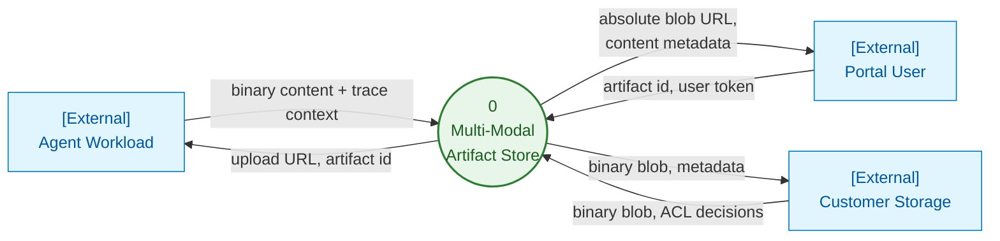
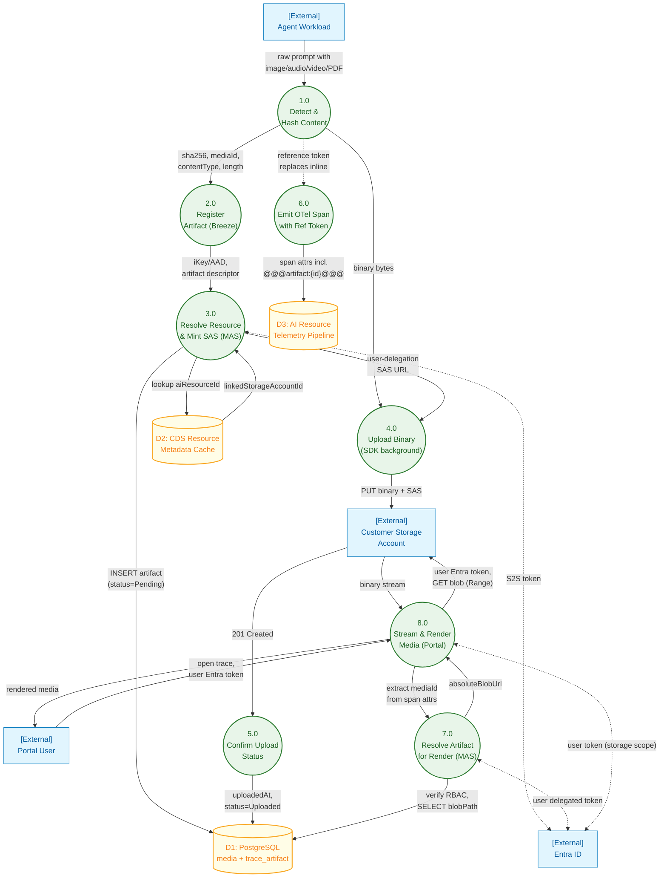
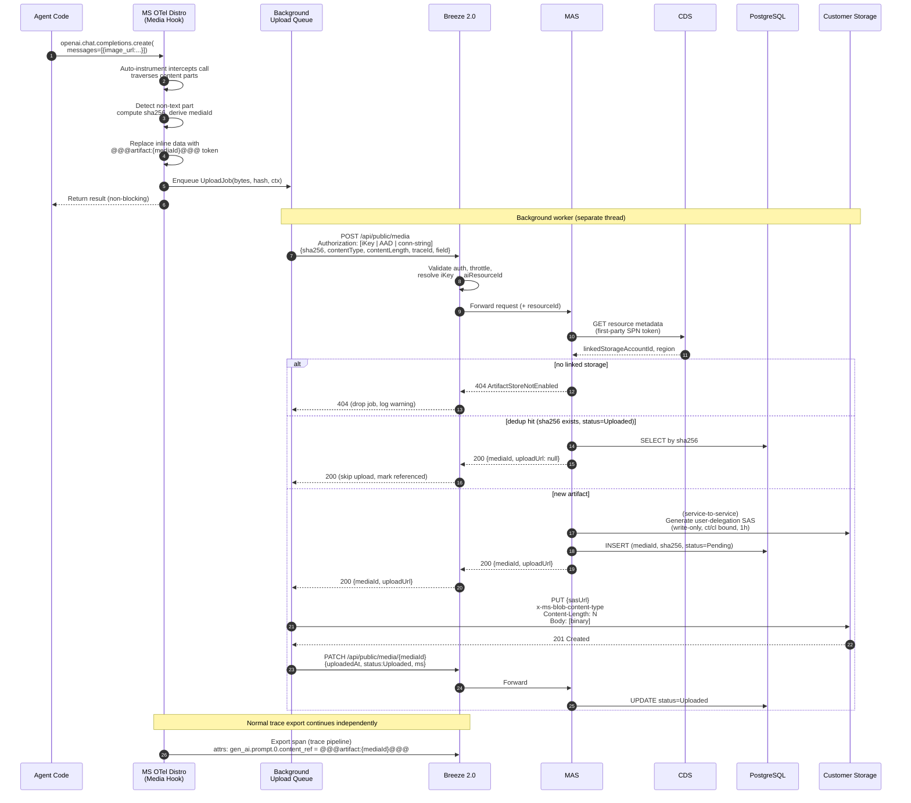
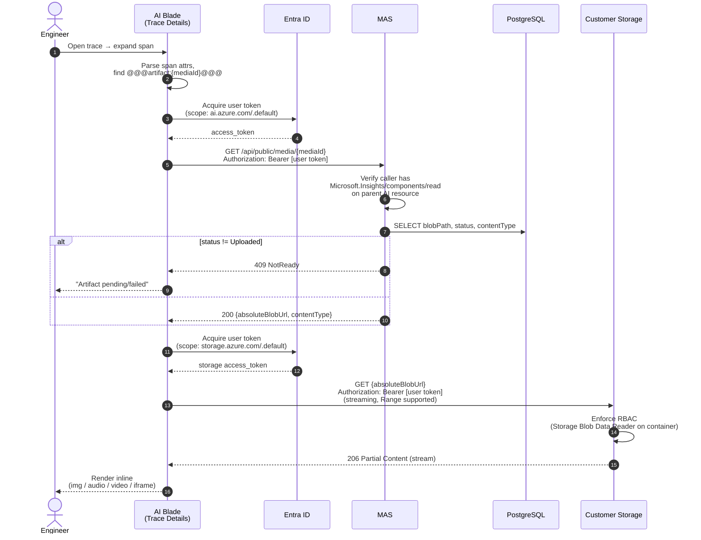
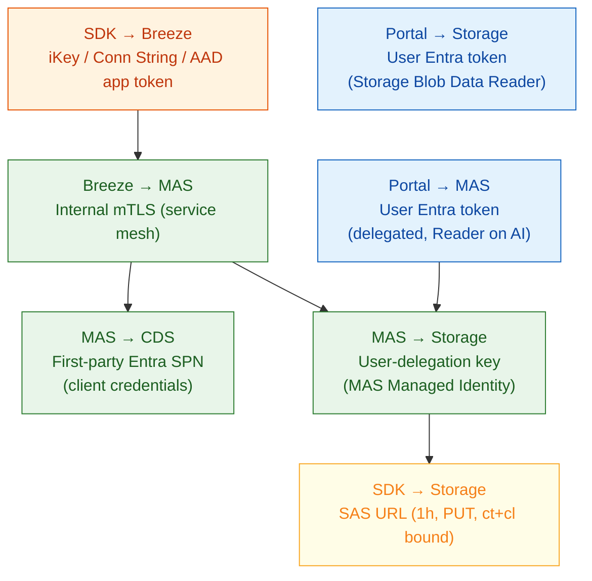

## Overview

Azure Monitor Application Insights today captures GenAI traces with text-only prompts and responses. As agentic workloads increasingly process **images, audio, video, and PDFs**, the existing trace pipeline cannot durably store or render this content — payload size limits, PII concerns, and cost of carrying binary blobs through the trace path make inline ingestion impractical.

This document describes the **Multi-Modal Artifact Store**: a side-channel that captures non-text GenAI content into a **customer-owned Azure Storage account** linked to an Application Insights resource. The SDK uploads the binary out-of-band and embeds only a relative blob reference in the OpenTelemetry span, preserving trace integrity and keeping binary data within the customer's data boundary.

The design draws on the patterns proven by Langfuse (see [E2E-LangFuse-Multi-Modal-Implementation.md](E2E-LangFuse-Multi-Modal-Implementation.md)) but adapts them to:

- **Azure ARM** provisioning and tenant model
- **Breeze 2.0** as the existing Application Insights ingestion front door
- The **[Microsoft OpenTelemetry Distro for Python](https://github.com/microsoft/opentelemetry-distro-python)** as the SDK surface
- **Customer-subscription storage** (vs. service-owned object storage)
- **Entra ID** as the unified identity plane

## Goals and Non-Goals

### Goals

- Detect and capture multi-modal GenAI inputs/outputs (image, audio, video, PDF) emitted by SDK auto-instrumentation (`openai`, `agent_framework`, `langchain`, `semantic_kernel`).
- Persist binary content in the **customer's own Azure Storage account** to keep data sovereignty, billing, and lifecycle under customer control.
- Keep the OpenTelemetry trace payload small — only a **relative blob reference** travels through Breeze.
- Render content in the Application Insights blade using the end-user's **Entra token** against customer storage.
- Deduplicate by content hash (SHA-256) so the same image referenced across many spans uploads once.
- Provide a non-blocking SDK upload path so agent latency is unaffected.

### Non-Goals (v1)

- Server-side transcoding, thumbnail generation, or content moderation.
- Cross-region replication or geo-redundant artifact replay.
- Storage of training-grade datasets (this is observability, not data lake).
- Inline rendering of arbitrary MIME types beyond image/audio/video/PDF.
- Embeddings / vector search over artifact content (tracked separately in [OTEL-Prompt-Embeddings.md](../docs/OTEL-Prompt-Embeddings.md)).

## System Context (Black-Box View)

At the highest level, the Multi-Modal Artifact Store is a single logical capability that sits between three external actors — the **customer agent workload**, the **Azure Monitor service**, and the **engineer using the Application Insights portal**. Everything inside the dashed boundary is a black box from the customer's perspective: a single feature called "Application Insights — Multi-Modal Artifact Store".



### External Interfaces (Black-Box Contract)

| Interface | Direction | Protocol | Purpose |
|-----------|-----------|----------|---------|
| Agent SDK → MMAS | inbound | HTTPS (Breeze public endpoints) | Register and confirm artifact uploads |
| Agent SDK → Storage | inbound (to customer SA) | HTTPS PUT (SAS) | Direct binary upload (bypasses MMAS data plane) |
| MMAS → Customer Storage | outbound | HTTPS (Entra MI) | Mint user-delegation SAS, audit reads |
| Portal → MMAS | inbound | HTTPS (Entra user token) | Resolve artifact ids to download URLs |
| Portal → Storage | inbound (to customer SA) | HTTPS GET (Entra user token) | Stream media for inline rendering |
| MMAS → Entra ID | outbound | OAuth 2.0 | Acquire S2S and user-delegation tokens |

## High-Level Architecture

Opening the black box reveals six internal subsystems: the **SDK media hook** running in-process with the agent, the **Breeze ingestion gateway**, the **Multi-Modal Artifact Service (MAS)**, the **Control Data Service (CDS)** that owns the AI-resource ↔ storage link, the **PostgreSQL metadata store**, and the **portal trace-detail blade** that renders artifacts.



### Component Responsibilities

| Component | Responsibility |
|-----------|---------------|
| **Microsoft OTel Distro (SDK)** | Auto-instrument GenAI calls, detect non-text content parts, compute SHA-256, enqueue upload, replace inline binary with reference token, emit OTel span. |
| **Breeze 2.0** | Existing ingestion gateway. Adds `/api/public/media` and `/api/public/media/{id}` routes. Performs auth, throttling, quota, iKey → resource resolution. Forwards to MAS. |
| **MAS (Multi-Modal Artifact Service)** | New service. Resolves resource → linked storage via CDS, mints SAS URLs, tracks artifact lifecycle (Pending → Uploaded → Failed/Expired) in PostgreSQL, deduplicates by hash. |
| **CDS (Control Data Service)** | Existing Application Insights control plane. Owns the link between AI resource and customer storage account; provides resource metadata to MAS via first-party Entra app. |
| **Customer Storage Account** | Provisioned in the same region/subscription as the AI resource. Holds container `appinsights-artifacts/{ai-resource-guid}/{yyyy}/{mm}/{dd}/{sha256}.{ext}`. |
| **Application Insights Blade** | Detects reference tokens in span attributes, calls MAS for download URL or downloads directly via user Entra token, renders inline. |
| **PostgreSQL (MAS DB)** | Stores artifact metadata: `mediaId`, `aiResourceId`, `sha256`, `contentType`, `contentLength`, `blobPath`, `uploadStatus`, `uploadedAt`, `traceId`, `spanId`. |

## Storage Account Provisioning



### Provisioning Notes

- The storage account is **always in the customer subscription** — billing, encryption keys (CMK), private endpoints, and lifecycle policies stay under customer control.
- Region pinning matches the AI resource to avoid cross-region egress and to satisfy data residency.
- MAS is granted **container-scoped** `Storage Blob Data Contributor` (not account-wide) to mint SAS tokens. The grant is per-resource, not tenant-wide.
- Public network access on the storage account can be restricted; MAS reaches it through a service-side allowlist or via the customer's storage firewall trusted-services bypass.

## Data Flow Diagram (DFD)

This is a classic data-flow view (processes, data stores, external entities, data flows) that complements the architecture diagram. It shows **what data moves where** rather than which boxes talk to which.

### Level 0 — Context



### Level 1 — Decomposed Processes and Stores



### Data Stores

| Store | Holds | Lifetime |
|-------|-------|----------|
| **D1: PostgreSQL** (`media`, `trace_artifact`) | mediaId, sha256, aiResourceId, blobPath, contentType, contentLength, uploadStatus, uploadedAt, traceId/spanId junctions | Retained per AI resource retention policy (default 90d hot, archived to cold table) |
| **D2: Resource Metadata Cache** (in-memory + Redis) | aiResourceId → linkedStorageAccountId, region, tenant | TTL 5 min, invalidated on CDS change events |
| **D3: AI Telemetry Pipeline** (existing Breeze → Kusto) | OTel spans with reference tokens (no binary) | Per AI resource retention |
| **Customer Storage** (external) | Binary artifacts at `appinsights-artifacts/{ai-resource-guid}/{yyyy}/{mm}/{dd}/{sha256}.{ext}` | Customer lifecycle policy (default Hot 30d → Cool 90d → Archive 365d) |

### Data Flows in Detail

| Flow | Producer → Consumer | Payload Shape | Sensitivity |
|------|--------------------|---------------|-------------|
| F1 | Agent → P1 (SDK hook) | `{role, contentParts:[{type, data|url}]}` | High — raw prompt |
| F2 | P1 → P2 | `{sha256, mediaId, contentType, contentLength, traceId, field, fieldIndex}` (metadata only) | Low — metadata |
| F3 | P1 → P4 | raw bytes (in-process queue) | High |
| F4 | P3 → D1 | INSERT row (status=Pending) | Low |
| F5 | P3 → P4 (via Breeze) | `{mediaId, uploadUrl}` | Medium — SAS embeds signature |
| F6 | P4 → Customer Storage | binary PUT with SAS | High — bytes encrypted in transit |
| F7 | P5 → D1 | UPDATE (status, uploadedAt, ms) | Low |
| F8 | P6 → D3 | OTel span with `gen_ai.*` attributes and `@@@artifact:{id}@@@` token | Medium — text prompt only |
| F9 | P7 → D1 | SELECT by mediaId | Low |
| F10 | P8 → Customer Storage | GET with user Entra token | High — bytes streamed to authenticated browser |

## End-to-End Data Flow

### Upload Path (Agent → Storage)



### Download / Render Path (Portal → Storage)



## End-to-End Authentication

This is the highest-risk surface in the design, so it gets its own section. There are **five distinct trust boundaries**, and credentials never cross them.



### Auth Matrix

| Hop | Credential | Issuer | Validator | Lifetime | Scope |
|-----|-----------|--------|-----------|----------|-------|
| SDK → Breeze | Instrumentation Key, Connection String, **or** AAD bearer (preferred) | Customer / Entra | Breeze auth layer | iKey: long-lived, AAD: ~1h | Ingest to one AI resource |
| Breeze → MAS | Service-internal mTLS or signed S2S header | Azure Monitor service tenant | MAS | Per request | Internal only |
| MAS → CDS | First-party Microsoft Entra app (client credentials) | Entra (1P) | CDS | ~1h | Read AI resource metadata |
| MAS → Storage (SAS minting) | **User-delegation key** obtained via MAS Managed Identity holding container-scoped `Storage Blob Delegator` + `Storage Blob Data Contributor` | Entra → Storage | Storage | 7-day key, SAS 1h | Per-blob write, ct/cl bound |
| SDK → Storage (PUT) | SAS URL issued in previous step | MAS (via user-delegation key) | Storage | 1h | Single blob, PUT only, exact ct/cl |
| Portal → MAS (GET ref) | User Entra delegated token (`Microsoft.Insights` resource provider scope) | Entra | MAS | ~1h | Per user; RBAC checked against parent AI resource |
| Portal → Storage (GET blob) | User Entra delegated token (`https://storage.azure.com/.default`) | Entra | Storage | ~1h | RBAC `Storage Blob Data Reader` on container (granted via AI resource role inheritance or explicit assignment) |

### Why User-Delegation SAS (not Account-Key SAS)

- Account keys cannot be rotated without breaking outstanding SAS tokens and require key-vault custody.
- User-delegation SAS is **signed with an Entra-issued key**, scoped to MAS's Managed Identity. Revoking the MI assignment instantly invalidates all outstanding SAS URLs.
- All issued SAS URLs are auditable in storage diagnostic logs via the signing OID.

### Authorization Model for the Portal

Reading a trace artifact requires `Microsoft.Insights/components/read` on the parent AI resource (same as reading any other telemetry). The download from storage additionally requires `Storage Blob Data Reader` on the container.

**Open question (see §Open Questions):** should the Portal's MAS read endpoint return a short-lived **read SAS** so the user doesn't need a direct RBAC grant on the storage account? This trades least-privilege for simpler customer onboarding.

## OpenTelemetry Span Schema

The SDK emits standard OTel GenAI semantic-convention spans. Multi-modal content is referenced (not embedded) via a stable token convention compatible with the [Microsoft OpenTelemetry Distro](https://github.com/microsoft/opentelemetry-distro-python) message-format alignment.

| Attribute | Example | Notes |
|-----------|---------|-------|
| `gen_ai.system` | `openai` | Standard OTel |
| `gen_ai.operation.name` | `chat` | Standard OTel |
| `gen_ai.prompt.0.role` | `user` | Standard OTel |
| `gen_ai.prompt.0.content` | `"What is in this image? @@@artifact:azmon/{mediaId}/{sha256}/image/png@@@"` | Reference token replaces inline data URI |
| `gen_ai.completion.0.role` | `assistant` | Standard OTel |
| `microsoft.artifact.ref.0.media_id` | `7f3e...` | (Optional) explicit index for fast portal extraction |
| `microsoft.artifact.ref.0.content_type` | `image/png` | |
| `microsoft.artifact.ref.0.content_length` | `124380` | |
| `microsoft.artifact.ref.0.sha256` | `9b3a...` | Enables client-side dedup verification |

Reference token format: `@@@artifact:{namespace}/{mediaId}/{sha256}/{contentType}@@@` (Langfuse-inspired, parser-friendly, opaque to non-AI consumers).

## Deduplication

- The SDK computes SHA-256 client-side and derives `mediaId = base64url(sha256)[:22]` (same scheme as Langfuse).
- The MAS upload registration is **idempotent on (`aiResourceId`, `sha256`)** — duplicate POSTs return the existing `mediaId` and a `null` `uploadUrl`.
- The SDK skips the PUT when `uploadUrl` is null; it still emits the span reference, so the artifact is reachable.
- A trace-level junction table (`trace_artifact` in PostgreSQL) records `(traceId, mediaId, field, fieldIndex)` for portal indexing without scanning span attributes.

## SDK Integration with Microsoft OTel Distro

The Microsoft Distro already exposes a pluggable instrumentation surface and an `enable_sensitive_data` flag that controls capture of GenAI prompt content. The multi-modal hook plugs into the same processor:

```python
from microsoft.opentelemetry import use_microsoft_opentelemetry

use_microsoft_opentelemetry(
    enable_azure_monitor=True,
    enable_sensitive_data=True,
    azure_monitor_connection_string="InstrumentationKey=...;IngestionEndpoint=...",
    # New in this design:
    enable_multimodal_artifact_store=True,
    multimodal_max_inline_bytes=4096,        # below this, send inline as base64
    multimodal_supported_types=["image/*", "audio/*", "video/*", "application/pdf"],
    multimodal_upload_workers=2,
    multimodal_upload_queue_size=512,
)
```

### Hook Placement

- Inserts a `SpanProcessor` that runs **before** the Azure Monitor exporter in the BatchSpanProcessor chain.
- For each span with `gen_ai.system` set, walks `gen_ai.prompt.*.content` and `gen_ai.completion.*.content` for content parts matching:
  - OpenAI vision (`{"type": "image_url", "image_url": {"url": "data:..."}}`)
  - Anthropic (`{"type": "image", "source": {"data": "..."}}`)
  - Vertex / Gemini inline data
  - Raw base64 data URIs
- Replaces matches with reference tokens **in place** before the span leaves the SDK.
- Queues the binary on a separate thread; failures **never block** span export (the span retains the reference; the portal shows "pending/failed" if the upload doesn't complete).

## Performance and Scale Concerns

### SDK Side

| Concern | Mitigation |
|---------|-----------|
| Hashing large blobs on the request thread | Hash on a worker thread; only the lightweight regex/structural detect runs on the calling thread. |
| Memory pressure from queued uploads | Bounded queue (`multimodal_upload_queue_size`); on overflow drop oldest with a metric counter `multimodal.upload.dropped`. |
| Retry storms against Breeze | Exponential backoff (1s, 2s, 4s, max 3 retries) + jitter; circuit-breaker on `429`/`503`. |
| Duplicate hashing across spans | Per-process LRU cache keyed on object identity for already-seen content parts. |
| Cold-start tax | Lazy import of crypto and HTTP client; first call may pay one-time cost (~5–20 ms). |
| Inline base64 still bloats spans before processing | Configurable `multimodal_max_inline_bytes`; smaller payloads bypass the artifact pipeline entirely. |

### Breeze / MAS Side

| Concern | Mitigation |
|---------|-----------|
| MAS write amplification per chat turn (one POST + one PATCH per artifact) | Batch endpoint `POST /api/public/media:batch` accepting up to N media descriptors in one round-trip. |
| Hot AI resources monopolizing MAS | Per-`aiResourceId` token bucket (e.g., 200 mediaId issuances/sec, burst 500) returned as `429` with `Retry-After`. |
| CDS lookups on every POST | Cache `aiResourceId → linkedStorageAccountId` in MAS in-memory + Redis (TTL 5 min, invalidate on CDS resource-changed events). |
| PostgreSQL write amplification | Partition `media` table by `aiResourceId` hash and by month; archive >90d to cold table. |
| SAS minting latency | User-delegation key cached per storage account for ~6 days (7-day max); SAS construction is then pure crypto, sub-millisecond. |
| Tail latency on the trace path | Trace export is **decoupled** from artifact upload; trace SLO unaffected by artifact backlog. |

### Storage Side

| Concern | Mitigation |
|---------|-----------|
| Blob naming hot-spotting | Path includes `{yyyy}/{mm}/{dd}/{sha256-first-4}/{sha256}.{ext}` to spread partition keys. |
| Unbounded growth / cost | Storage account lifecycle policy installed at provision time: Hot → Cool @ 30d, Cool → Archive @ 90d, Delete @ retention setting (default 365d, configurable). |
| Same blob re-uploaded after archive | Dedup check returns existing `mediaId`; PATCH "rehydrate" only when portal requests an archived artifact. |
| Egress on portal render | Streamed `Range` reads from same-region browser if possible; image/video thumbnails generated client-side. |
| Concurrent PUTs of the same SHA | Storage `If-None-Match: *` header on PUT; second writer gets 409 and skips. |

### Capacity Targets (initial)

| Metric | Target |
|--------|--------|
| MAS POST p99 latency | < 150 ms (excluding storage PUT) |
| MAS throughput | 10k mediaId issuances/sec per region, horizontally scalable |
| End-to-end artifact availability after span emit | < 30 s p99 (upload + PATCH + index) |
| Max artifact size (v1) | 25 MB (single PUT); larger requires block-blob multi-part — deferred |
| Per-AI-resource quota (v1) | 100 GB/day soft cap, alertable |

## Failure Modes and Degradation

| Failure | SDK Behavior | Portal Behavior |
|--------|------------|----------------|
| Breeze 5xx on `/media` POST | Retry with backoff; after exhaust, emit span without artifact ref and increment `multimodal.upload.failed` metric. | Span shows no artifact. |
| Storage PUT 403/expired SAS | Re-request SAS once; if still fails, mark job failed, PATCH status=`SasExpired`. | Portal shows "artifact unavailable". |
| MAS down | Breeze returns 503; SDK queues and retries; spans still flow. | Portal shows artifacts as "metadata unavailable" and disables inline render but trace text remains. |
| Customer storage firewall blocks SDK | PUT fails 403; SDK reports back; MAS records `NetworkBlocked`. | Portal shows actionable error with link to networking docs. |
| Artifact store not enabled | MAS returns 404; SDK falls back to truncated inline (first 4 KB) or drops content per config. | Portal shows truncated text + "enable artifact store" CTA. |
| Hash collision (theoretical) | Negligible (SHA-256); MAS additionally checks `contentLength` mismatch and rejects with 409. | N/A |

## Data Governance, PII, and Compliance

- **Data residency:** binary stays in customer subscription + region.
- **Encryption at rest:** customer storage account encryption (SSE), CMK if customer enables it.
- **Encryption in transit:** TLS 1.2+ on every hop including SAS PUT.
- **Right to be forgotten:** deleting the AI resource cascades to a CDS job that detaches the storage link and (opt-in) deletes the `appinsights-artifacts/{ai-resource-guid}/` prefix.
- **Audit:** every MAS read returns an `x-ms-correlation-id` traceable to a storage diagnostic log entry (signing OID = MAS MI).
- **PII:** the SDK does not inspect content. PII-aware redaction is the customer's responsibility, identical to today's text-prompt behavior. A future enhancement could integrate the Distro's `ApplyGuardrailScope`.

## Open Questions

1. **Read SAS vs. user-RBAC on storage for portal download.** Current design assumes the end user has `Storage Blob Data Reader` on the container. Should MAS instead mint a short-lived read SAS so the portal works without per-user storage RBAC? Trade-off: simpler onboarding vs. weaker auditability of who saw which artifact.
2. **Inline fallback policy when artifact store is disabled.** Drop, truncate, or send as base64 (subject to existing 64 KB span attribute cap)? Needs PM decision.
3. **Cross-tenant agents.** Foundry / A365 agents may run in a different tenant than the customer's AI resource. Does MAS use the calling tenant or the resource tenant for SAS minting? Aligns with the A365 `a365_token_resolver` model in the Microsoft Distro.
4. **Video / large file ceiling.** Should v1 support >25 MB via block-blob multi-part upload, or defer to a follow-up? Affects SDK API shape (`UploadJob` becomes a streaming iterator).
5. **Bring-your-own storage prerequisites.** What is the minimum storage SKU/feature set MAS requires (HNS off? Versioning?)? Need a precise CDS validation matrix.
6. **Private endpoint topology.** Customers with `publicNetworkAccess=Disabled` on storage cannot accept SDK PUTs unless MAS proxies. Do we ship a proxy mode, require Azure-trusted-service bypass, or document a private-link gateway pattern?
7. **Quota model and billing surface.** Is multi-modal ingestion metered separately from text telemetry? How is overage signaled — 429s, capping, or soft alerts?
8. **Schema evolution.** Should the reference token format be versioned (`@@@artifact:v2:...@@@`) from day one to allow future signed/encrypted references?
9. **Span attribute size budget.** Reference tokens are small but multi-modal turns may carry many. Should the SDK aggregate refs into a single JSON-encoded attribute (`microsoft.artifact.refs`)?
10. **Replay for evaluation pipelines.** Foundry evals will want to fetch artifacts by `traceId`. Should MAS expose `GET /api/public/traces/{traceId}/media` as a first-class API?

## Future Enhancements (Out of Scope for v1)

- Thumbnail/preview generation on first portal read (cached back to storage).
- Embedding-based search over visual content (ties to [OTEL-Prompt-Embeddings.md](../docs/OTEL-Prompt-Embeddings.md)).
- Cross-resource artifact sharing for multi-agent traces.
- Live-tail rendering of streaming audio in the AI Blade.
- Server-side content moderation pre-write hook.

## References

- [Application-Insights-Multi-Modal-Store-Prompt.md](Application-Insights-Multi-Modal-Store-Prompt.md) — source prompt for this design
- [E2E-LangFuse-Multi-Modal-Implementation.md](E2E-LangFuse-Multi-Modal-Implementation.md) — competitor reference implementation
- [destination-store-options.md](../docs/destination-store-options.md) — destination store trade-offs
- [Multi-model-non-text-content.md](../docs/Multi-model-non-text-content.md) — problem framing
- [OTEL-Prompt-Embeddings.md](../docs/OTEL-Prompt-Embeddings.md) — adjacent embeddings design
- [microsoft/opentelemetry-distro-python](https://github.com/microsoft/opentelemetry-distro-python) — SDK surface
- [Azure Monitor Application Insights overview](https://learn.microsoft.com/azure/azure-monitor/app/app-insights-overview)
- [OpenTelemetry GenAI semantic conventions](https://opentelemetry.io/docs/specs/semconv/gen-ai/)
- [Azure Storage user-delegation SAS](https://learn.microsoft.com/azure/storage/common/storage-sas-overview#user-delegation-sas)
