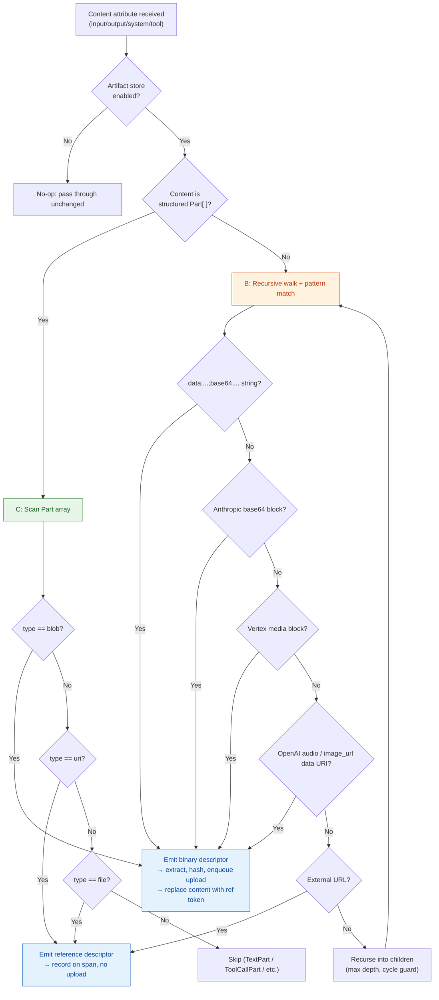

## Problem Framing

"Detect media" at the SDK layer means inspecting the structured content of `gen_ai.input.messages`, `gen_ai.output.messages`, `gen_ai.system_instructions`, `gen_ai.tool.call.arguments`, `gen_ai.tool.call.result`, and event bodies — as defined by the [OTel GenAI semantic conventions](otel-gen-ai-semantic-conventions.md) — and classifying each content node as one of:

- **Inline binary** (upload-eligible): the node carries raw bytes (base64-encoded or as a byte buffer) that must be extracted, hashed, uploaded to the [Multi-Modal Artifact Store](app-insights-multi-modal-store.md), and replaced with a reference token before the span leaves the SDK.
- **External reference** (record-only): the node contains a URL, file ID, or provider-specific handle pointing to media hosted elsewhere. The reference is preserved on the span for portal rendering but no binary is extracted or uploaded. This matches the Langfuse behavior documented in [langfuse-multi-modality-media-detection.md](langfuse-multi-modality-media-detection.md).

The detector must handle payloads from multiple providers (OpenAI, Anthropic, Vertex AI, Microsoft Foundry), multiple agent frameworks (LangChain, Semantic Kernel, Microsoft Agent Framework), and the normalized OTel `Part[]` model — all of which encode media differently.

## Prior Art Summary

Five existing systems address this problem to varying degrees. This section summarizes the approach each embodies; for Langfuse-specific detection logic, see [langfuse-multi-modality-media-detection.md](langfuse-multi-modality-media-detection.md).

| System | Approach | Detection strategy | Media coverage | MIME resolution | License |
|---|---|---|---|---|---|
| **Langfuse** (v3 SDK) | B (recursive walk + pattern matching) with a provider shim for OpenAI audio (Pattern 5) | Five hard-coded patterns: `LangfuseMedia` object, data-URI string, Anthropic block, Vertex block, OpenAI audio. Recursive traversal of input/output/metadata, max depth 10, circular-reference guard. | Images, audio, PDF — base64 inline only. External URLs rendered from source, not extracted. Streaming and video not detected. | Extracted from data-URI prefix or provider `media_type`/`mime_type` field. No magic-bytes sniffing. | MIT |
| **OpenLLMetry / Traceloop** | D (hook-into-instrumentation) | Per-provider instrumentation wrapper captures typed SDK objects and serializes them onto OTel span attributes. Content is text-serialized (JSON string) onto `gen_ai.prompt.*.content`; no binary detection, extraction, or upload. Images sent as data URIs are captured verbatim as strings, bloating span payloads. | Text only for practical purposes. Base64 data URIs pass through as strings but are not recognized as media. No upload, no reference-token replacement. | None — no MIME resolution. | Apache-2.0 |
| **Arize Phoenix / OpenInference** | D (hook-into-instrumentation) | Per-provider OpenInference instrumentations normalize provider responses into OpenInference semantic convention attributes. Image URLs are captured as `message.contents.[].image.url`; base64 data URIs are stored verbatim. Phoenix server renders images from URLs client-side but does not extract or upload inline binary. | Image URLs rendered in UI. Base64 images stored inline on spans (no extraction). Audio, video, PDF not handled. | None — relies on URL file extension or user-supplied content type for UI rendering. | ELv2 (server), Apache-2.0 (instrumentations) |
| **LangSmith** | A (schema-aware per-provider) | LangChain's callback system captures typed `HumanMessage`/`AIMessage` objects with provider-normalized content blocks. LangSmith server-side detects image URLs and base64 data URIs in `image_url` content parts and renders them inline. Detection is tightly coupled to LangChain's message schema. | Image URLs and base64 images within LangChain content blocks. Audio, video, PDF not explicitly handled. No binary extraction or upload — stored inline or rendered from URL. | Inferred from LangChain content part type or URL. | Proprietary (server), MIT (LangChain client) |
| **Microsoft OTel Distro for Python** | D (hook-into-instrumentation) — partial | Existing `openai` and `azure.ai.inference` instrumentations capture prompt/completion text onto `gen_ai.*` attributes. `enable_sensitive_data` flag gates content capture. No multi-modal detection, no binary extraction, no upload side-channel. | Text only. No media detection. | N/A | MIT |

**Key takeaway:** No existing system performs end-to-end media detection, extraction, upload, and reference-token replacement across multiple providers within an OTel pipeline. Langfuse comes closest but uses a custom attribute namespace and is limited to five hard-coded patterns without OTel GenAI `Part[]` awareness.

## Candidate Approaches

### A. Schema-Aware Per-Provider Parsing

Register one parser per provider payload shape: OpenAI Chat Completions content parts, Anthropic message blocks, Vertex AI inline data, LangChain content blocks, Semantic Kernel content items, Microsoft Agent Framework message parts, and the OTel GenAI `Part[]` model.

**How it works:** The detector inspects `gen_ai.provider.name` (or an equivalent discriminator) on the span, selects the matching parser, and walks the payload using the provider's known schema to locate media fields by name and position.

**Worked example — OpenAI vision input:**

1. Parser selected: `openai`.
2. Walk `gen_ai.input.messages[*].parts[*]`.
3. Match: part with `type == "image_url"` and `image_url.url` starting with `data:`.
4. Extract MIME from `data:image/png;base64,` prefix, decode base64, emit binary descriptor.
5. Replace `image_url.url` value with `@@@artifact:...@@@` token.

**Pros:**

- Highest detection accuracy — trusts the provider's declared structure, no false positives.
- Can leverage typed SDK objects for validation.
- Clear per-provider ownership for maintenance.

**Cons:**

- O(N) parsers for N providers — each new provider or schema change requires a new or updated parser.
- Fragile under schema evolution (e.g., OpenAI adding new content-part types).
- Frameworks (LangChain, SK, MAF) normalize provider shapes differently, so framework parsers are needed in addition to provider parsers.
- Does not handle raw/unstructured payloads (e.g., a user passing a data URI in a plain string field).

### B. Generic Recursive Walk + Pattern Matching

Walk the entire payload tree (dicts, lists, strings) and match a small set of structural patterns regardless of provider. This is the Langfuse model.

**How it works:** Starting from each content attribute (`gen_ai.input.messages`, `gen_ai.output.messages`, `gen_ai.system_instructions`, `gen_ai.tool.call.arguments`, `gen_ai.tool.call.result`), recursively visit every node up to a bounded depth. At each node, test against an ordered list of patterns:

1. Pre-wrapped media object (explicit declaration).
2. String matching `data:{mime};base64,{...}`.
3. Dict matching `{"type": "base64", "media_type": ..., "data": ...}` (Anthropic shape).
4. Dict matching `{"type": "media", "mime_type": ..., "data": ...}` (Vertex shape).
5. Dict with `image_url.url` starting with `data:` (OpenAI nested data URI).

**Worked example — Anthropic image in tool call result:**

1. Traverse `gen_ai.tool.call.result` → dict → list → dict.
2. Match pattern 3: `{"type": "base64", "media_type": "image/jpeg", "data": "/9j/4AAQ..."}`.
3. Reconstruct data URI, decode, emit binary descriptor.
4. Replace `data` field with reference token.

**Pros:**

- Provider-agnostic — works on raw dicts without knowing the provider.
- Catches media in unexpected locations (metadata, nested tool results).
- Low maintenance — adding a new provider shape means adding one pattern, not a full parser.
- Proven at scale by Langfuse.

**Cons:**

- Pattern list grows over time and ordering matters (first match wins).
- Cannot validate structural correctness — a dict that happens to match the Anthropic shape in non-Anthropic context triggers a false positive (low risk in practice).
- Sync-path cost scales with payload depth and breadth.
- No awareness of which fields are media versus text — relies on shape heuristics.

### C. Normalize-First

Convert every provider payload to the OTel GenAI semantic-convention `Part[]` model (`BlobPart`, `UriPart`, `FilePart`, `TextPart`) before detection runs. Detection then operates on exactly three shapes.

**How it works:** Each provider instrumentation (or a post-instrumentation normalizer) converts raw provider payloads into the `Part[]` schema. The detector only needs to check:

1. `type == "blob"` → inline binary. Extract `content` (base64), `modality`, `mime_type`.
2. `type == "uri"` → external reference. Record `uri`, `modality`, `mime_type`.
3. `type == "file"` → provider file reference. Record `file_id`, `modality`, `mime_type`.

**Worked example — Vertex AI image converted to BlobPart:**

1. Vertex instrumentation converts `{"type": "media", "mime_type": "image/png", "data": "iVBOR..."}` to `{"type": "blob", "modality": "image", "mime_type": "image/png", "content": "iVBOR..."}`.
2. Detector matches `type == "blob"`, decodes `content`, emits binary descriptor.
3. Replaces `content` with reference token.

**Pros:**

- Simplest detector — three shapes, no provider-specific logic in the detection layer.
- Aligned with the OTel GenAI standard, future-proof as the ecosystem converges.
- Normalization is already mandated by the OTel GenAI spec for instrumentations emitting `gen_ai.input.messages` and `gen_ai.output.messages`.
- Cleanest separation of concerns: normalization is the instrumentation's job, detection is the distro's job.

**Cons:**

- Depends on every instrumentation performing correct normalization. If an instrumentation emits raw provider shapes (or serializes to JSON strings) instead of normalized `Part[]`, the detector misses media.
- The OTel GenAI semantic conventions are still in `Development` status — adoption is incomplete across instrumentations.
- Pre-normalization payloads (e.g., raw `openai` SDK objects, LangChain message objects) are invisible to the detector.
- Tool call arguments and results (`gen_ai.tool.call.arguments`, `gen_ai.tool.call.result`) do not use the `Part[]` model — they are arbitrary JSON. Media inside tool results (e.g., a tool returning a base64 image) requires a fallback strategy.

### D. Hook-Into-Instrumentation

Push detection into each per-provider instrumentation wrapper so it runs against typed SDK objects (e.g., `openai.types.ChatCompletionMessageParam`, `anthropic.types.ContentBlock`) before serialization to span attributes.

**How it works:** Each instrumentation wrapper (OpenAI, Anthropic, Vertex, etc.) includes a detection hook that inspects the typed response/request objects, identifies media fields by attribute name and type, and emits media descriptors. The hook runs before the content is serialized to `gen_ai.*` span attributes.

**Worked example — OpenAI audio response:**

1. OpenAI instrumentation intercepts `ChatCompletion` response object.
2. Hook checks `choice.message.audio` — finds `audio.data` (base64 PCM/WAV).
3. Emits binary descriptor with `modality=audio`, `mime_type=audio/wav`.
4. Replaces `audio.data` with reference token in the object before serialization.

**Pros:**

- Type-safe detection — works with the actual SDK objects, not serialized dicts.
- Earliest interception point — detects media before any serialization overhead.
- Naturally co-located with provider-specific logic already in the instrumentation.

**Cons:**

- Detection logic is scattered across N instrumentations — no single point of control.
- Each instrumentation must implement the detection contract correctly, increasing the maintenance surface.
- Instrumentations owned by third parties (OpenLLMetry, OpenInference) may not support the hook.
- Framework instrumentations (LangChain, SK) already normalize provider shapes, so media detection in the raw provider instrumentation may fire before the framework has a chance to process the content, causing double-detection.
- Not portable — switching instrumentations requires re-implementing detection.

## Coverage Matrix Per Approach

Legend: **Y** = covered cleanly, **W** = covered with a workaround, **N** = not covered.

| Payload shape | A. Schema-aware | B. Recursive walk | C. Normalize-first | D. Hook-into-instrumentation |
|---|---|---|---|---|
| OTel `BlobPart` | Y | Y (matches dict with `type=blob` + `content`) | Y (primary target) | W (only if instrumentation emits `Part[]`) |
| OTel `UriPart` / `FilePart` | Y | Y (matches dict with `type=uri`/`file`) | Y | W |
| `data:{mime};base64,{...}` string | Y | Y (pattern 2) | W (requires normalizer to convert to `BlobPart` first) | Y |
| OpenAI `image_url.url` data URI | Y | Y (pattern 5 variant) | W (requires normalizer) | Y |
| OpenAI `input_audio` / response `audio` | Y | W (needs dedicated pattern) | W (requires normalizer) | Y |
| Anthropic `{"type":"base64","media_type":..,"data":..}` | Y | Y (pattern 3) | W (requires normalizer) | Y |
| Vertex AI `{"type":"media","mime_type":..,"data":..}` | Y | Y (pattern 4) | W (requires normalizer) | Y |
| Foundry Agent file-search file refs | Y | W (needs new pattern for `file_id`) | Y (maps to `FilePart`) | Y |
| Image generation response (`gpt-image-*`, `Stable*`) | Y | Y (data URI or URL match) | W (requires normalizer) | Y |
| Video generation response (`sora-*`) | Y | W (URL or job handle — needs pattern) | W (requires normalizer) | Y |
| Inline Claude image output | Y | W (needs new pattern) | Y (if normalized to `BlobPart`) | Y |
| LangChain `HumanMessage` / `AIMessage` content blocks | Y (needs LangChain parser) | Y (provider-normalized blocks match existing patterns) | W (requires LangChain normalizer) | W (LangChain instrumentation must add hook) |
| Semantic Kernel `ChatMessageContent` items | Y (needs SK parser) | W (SK objects are not plain dicts) | W (requires SK normalizer) | W (SK instrumentation must add hook) |
| Microsoft Agent Framework `ChatMessage` parts | Y (needs MAF parser) | W (MAF objects are not plain dicts) | W (requires MAF normalizer) | W (MAF instrumentation must add hook) |
| External URL (`https://...`) | Y | Y (URL detection, no extraction) | Y (maps to `UriPart`) | Y |

## Evaluation Criteria

Each approach is scored on a 1–5 scale (5 = best).

| Criterion | A. Schema-aware | B. Recursive walk | C. Normalize-first | D. Hook-into |
|---|---|---|---|---|
| **Payload coverage** (breadth of media types detected out of the box) | 5 | 4 | 3 | 4 |
| **Framework portability** (works across OpenAI, Anthropic, LangChain, SK, MAF without per-framework changes) | 2 | 4 | 5 | 2 |
| **Provider-extensibility cost** (effort to support a new provider) | 2 — new parser per provider | 4 — new pattern entry | 4 — normalizer is the instrumentation's job | 2 — new hook per instrumentation |
| **Sync-path latency** (overhead on the application thread) | 3 — full schema parse | 3 — full tree walk | 5 — detector itself is trivial; normalization cost is already paid | 4 — runs on typed objects, no tree walk |
| **Privacy-gate compatibility** (works independently of content-capture flag per OTel spec) | 4 | 4 | 5 — detection is decoupled from content serialization | 3 — hook is inside the instrumentation, may be gated by content flag |
| **Dependency footprint** (external libraries needed) | 3 — may need provider SDK types | 5 — pure Python, no dependencies | 5 — pure Python | 2 — coupled to provider SDKs |
| **Forward compatibility** (new modalities like Claude inline images, server-side tool calls) | 3 — schema update per provider | 3 — pattern addition | 5 — handled automatically if normalization is done | 3 — hook update per instrumentation |
| **Total** | **22** | **27** | **32** | **20** |

## Recommendation

**Primary approach: C (Normalize-first) with B (recursive walk + pattern matching) as a fallback.**

### Rationale

The normalize-first strategy (C) provides the cleanest architecture because it aligns with the direction the OTel GenAI semantic conventions are already heading: instrumentations are expected to emit structured `Part[]` arrays on `gen_ai.input.messages` and `gen_ai.output.messages`. When payloads arrive in normalized form, the detector has exactly three shapes to match (`BlobPart`, `UriPart`, `FilePart`), keeping the detection layer trivial, fast, and provider-agnostic.

However, the real world is messier than the spec. Two gaps make a pure normalize-first approach insufficient today:

1. **Incomplete normalization.** Not all instrumentations emit normalized `Part[]` today. Some serialize provider-native shapes as JSON strings. Third-party instrumentations (OpenLLMetry, OpenInference) may lag behind the spec.
2. **Tool call content.** `gen_ai.tool.call.arguments` and `gen_ai.tool.call.result` are arbitrary JSON, not `Part[]`. A tool that returns a base64 image embeds it in a structure that no normalizer covers.

The recursive walk fallback (B) closes both gaps. When the detector encounters content that is not already in `Part[]` form — either because the instrumentation did not normalize it, or because the content lives in a tool-call field — it falls back to the Langfuse-proven pattern-matching walk. This hybrid gives the detector broad coverage today while converging on the pure normalize-first path as instrumentations mature.

### Detection flow

### Rejected approaches

| Approach | Rejection reason |
|---|---|
| **A. Schema-aware per-provider** | O(N) maintenance cost for N providers, duplicates logic already handled by instrumentations, and does not work on unstructured payloads. |
| **D. Hook-into-instrumentation** | Scatters detection across N instrumentations with no single point of control. Not viable for third-party instrumentations the distro does not own. Privacy-gate coupling risk. |

### What this recommendation decides for Phase 2

- The detector is a **single component** in the Microsoft OTel Distro, not distributed across instrumentations.
- It attaches at the **content-hook** point defined by the OTel GenAI spec (see [recording sensitive multimodal content](otel-gen-ai-semantic-conventions.md#recording-sensitive-multimodal-content)), operating independently of the content-capture opt-in flag.
- The primary detection path inspects normalized `Part[]` arrays (three shapes). The fallback path runs Langfuse-style pattern matching on raw payloads.
- The fallback pattern registry is extensible: new provider shapes are added as pattern entries, not new parsers or hooks.

## References

- [OTel GenAI semantic conventions — multimodal parts and sensitive content](otel-gen-ai-semantic-conventions.md)
- [Langfuse multi-modal media detection reference](langfuse-multi-modality-media-detection.md)
- [Application Insights Multi-Modal Artifact Store HLD](app-insights-multi-modal-store.md)
- [LLM multimodal exchange matrix (Foundry catalog)](multi-modality-content.md)
- [OpenLLMetry / Traceloop](https://github.com/traceloop/openllmetry) — Apache-2.0
- [Arize Phoenix / OpenInference](https://github.com/Arize-ai/phoenix) — ELv2 (server), Apache-2.0 (instrumentations)
- [OTel GenAI semantic conventions — upstream spec](https://opentelemetry.io/docs/specs/semconv/gen-ai/gen-ai-spans/)
